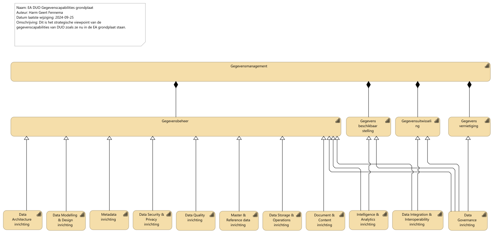
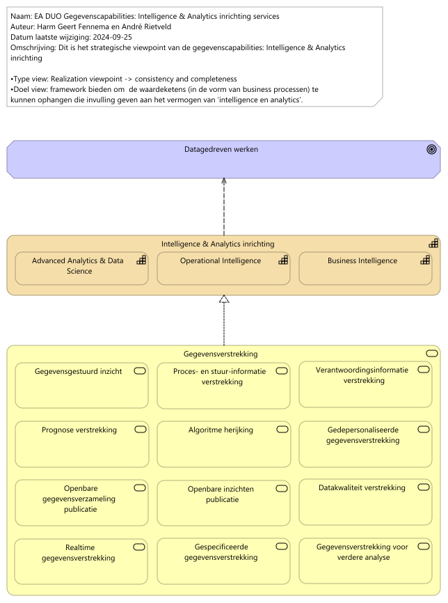

# Rapportage  capabilities

Report generated at: 2024-10-20  20:30:26

---
## Inhoudsopgave

* [Inleiding](#inleiding)
* [Hoofdstuk 1.  Overzicht](#hoofdstuk-1-overzicht)
  * [EA DUO Gegevenscapabilities grondplaat](#ea-duo-gegevenscapabilities-grondplaat)
* [Hoofdstuk 2.  Capabiities Gegevensmanagent](#hoofdstuk-2-capabiities-gegevensmanagent)
  * [2.1  Intelligence en Analyse](#21-intelligence-en-analyse)
    * [EA DUO Gegevenscapabilities Intelligence en Analytics inrichting services](#ea-duo-gegevenscapabilities-intelligence-en-analytics-inrichting-services)
  * [2.2  en verder...](#22-en-verder)

---

## Inleiding

> Hier vrij in te vullen  tekst voor rapportagesectie (in group.documentation).  Eventueel opgemaakt met Markdown: highlights, bullits, tables, links, etcetera.

---

## Hoofdstuk 1.  Overzicht

> Hier vrij in te vullen  tekst voor rapportagesectie (in group.documentation).  Eventueel opgemaakt met Markdown: highlights, bullits, tables, links, etcetera.
### EA DUO Gegevenscapabilities grondplaat

Zie properties.
<figure align="center">
  
  <figcaption><i>EA DUO Gegevenscapabilities grondplaat</i></figcaption>
</figure>

<table>
  <thead>
    <tr>
      <th colspan="1" width="20%">Element</th>
      <th rowspan="2" width="40%">Definitie</th>
      <th rowspan="2" width="40%">Omschrijving</th>
    </tr>
  </thead>
  <tbody>
    <tr><td></td><td></td></tr>
    <tr valign="top")>
      <td colspan="1">Gegevensmanagement 
(capability)</td>
      <td>
Gegevensmanagement betreft het geheel aan activiteiten dat DUO uitvoert om gegevens te verzamelen, vast te leggen, te beheren en ter beschikking te stellen. De functie staat voor het garanderen van de juistheid, tijdigheid en volledigheid en transparantie van alle gegevensleveringen aan alle klanten van DUO, ze vormt de grondslag voor de processen waarmee DUO haar klanten van informatie voorziet.
bron: Gegevensmanagement inrichtingsvoorstel eindrapport v1.0
</td>
      <td>
DUO heeft het vermogen de ontwikkeling, uitvoering en supervisie van plannen, beleid, programma's en praktijken die de waarde van gegevens en informatiemiddelen gedurende hun levenscyclus opleveren, controleren, beschermen en vergroten.
Hiermee:
•    begrijpen en ondersteunen wij de informatiebehoefte van DUO en haar klanten, medewerkers en ketenpartners
•    kunnen we onze data assets vastleggen, beschermen en de integriteit daarvan waarborgen
•    kunnen we de kwaliteit van onze gegevens en informatie waarborgen
•    kunnen we de privacy en vertrouwelijkheid van gegevens over onze stakholders waarborgen
•    kunnen we de ongeautoriseerde of ongepaste toegang, manipulatie of gebruik van gegevens en informatie voorkokmen
•    kunnen we waarborgen dat gegevens effectief binnen DUO gebruikt worden wat de waarde van onze gegevens vergroot.
</td>
    </tr>
    <tr valign="top")>
      <td colspan="1">Gegevensbeheer 
(capability)</td>
      <td>
DUO heeft het vermogen of gegevens efficiënt en effectief te verzamelen, op te slaan, te organiseren, te beveiligen en te beheren gedurende hun levenscyclus. Het omvat alle processen, procedures, technologieën en middelen die worden ingezet om gegevens te beheren en ervoor te zorgen dat ze nauwkeurig, toegankelijk en bruikbaar blijven.

Bron: DUO EA Capability Grondplaat
</td>
    </tr>
    <tr valign="top")>
      <td colspan="1">Gegevens beschikbaar stelling 
(capability)</td>
      <td>
DUO heeft het vermogen om gegevens op een gestructureerde en toegankelijke manier beschikbaar te stellen voor gebruikers of systemen die deze gegevens nodig hebben. Het omvat het proces van het verstrekken van gegevens aan de juiste partijen op het juiste moment en in een geschikte vorm, zodat zij de gegevens kunnen raadplegen, gebruiken, analyseren of integreren in hun eigen werkprocessen of systemen.

Bron: DUO EA Capability Grondplaat
</td>
    </tr>
    <tr valign="top")>
      <td colspan="1">Gegevensuitwisseling 
(capability)</td>
      <td>
DUO heeft het vermogenom gegevens effectief en efficiënt te delen tussen verschillende systemen, applicaties, organisaties of entiteiten. Het omvat het proces van het overdragen, uitwisselen of delen van gegevens met het doel informatie te delen, samenwerking te vergemakkelijken, besluitvorming te ondersteunen of naadloze interoperabiliteit mogelijk te maken.

Bron: DUO EA Capability Grondplaat
</td>
    </tr>
    <tr valign="top")>
      <td colspan="1">Gegevens vernietiging 
(capability)</td>
      <td>
DUO heeft het vermogen om gegevens op een gestructureerde en juiste manier te vernietigen. Het omvat het proces van Lifecyclemanagement voor gegevens.

Bron: DUO EA Capability Grondplaat
</td>
    </tr>
    <tr valign="top")>
      <td colspan="1">Data Architecture inrichting 
(capability)</td>
      <td>
DUO heeft het vermogen om een consistent geheel van principes en modellen op te stellen dat richting geeft aan ontwerp en realisatie van de processen, organisatorische inrichting, informatievoorziening en technische infrastructuur van het gegevensmanagement van DUO.
Data architectuur is aspect binnen DUO's Enterprise Architectuur
Bron: DUO Architectuur wiki

In de data architectuur vindt de vertaling plaats van ambitie naar realisatie.
</td>
      <td>
Bron: DAMA BMBOK2
</td>
    </tr>
    <tr valign="top")>
      <td colspan="1">Data Modelling & Design inrichting 
(capability)</td>
      <td>
DUO heeft het vermogen het proces uit te voeren waarbij datavereisten ontdekt, geanalyseerd en in kaart gebracht wordt en vervolgens te representeren en communiceren in een precieze vorm die het gegevensmodel wordt genoemd. Datamodellering en ontwerp betreft het analyseren, ontwerpen, bouwen, testen en onderhouden van (conceptuele, logische en fysieke) gegevensmodellen.

Bron: DAMA DMBOK2:
</td>
      <td>
Gegevensmodellen zijn van cruciaal belang voor effectief gegevensbeheer. Met een gegevensmodel kan DUO:
• Zorgen voor een gemeenschappelijk vocabulaire rond gegevens.
• Expliciete kennis vastleggen en documenteren over de gegevens en systemen van een organisatie.
• Laten fungeren als primair communicatiemiddel tijdens projecten.
• Bieden van het startpunt voor maatwerk, integratie of zelfs vervanging van een applicatie.

Modellen hebben een relatie met metadata en bevatten metagegevens zoals: betekenis, de structuur, de compliancy op het gebied van archivering,  BIV, , eigenaar, locatie e.d).
</td>
    </tr>
    <tr valign="top")>
      <td colspan="1">Metadata inrichting 
(capability)</td>
      <td>
DUO heeft het vermogen beschrijvende gegevens over de gegevens (metagegevens) enkelvoudig te beheren en meervoudig te gebruiken, zodat niet elk team van verwekers moet zoeken naar of opnieuw nadenken over de bruikbaarheid van de gegevens. Dit is vergelijkbaar met de bijsluiter van een medicijn.
</td>
      <td>
Met goed beheerde metadata kan DUO:

<ul>
<li>Door context te bieden het vertrouwen geven in de gegevens</li>
<li>Het meten van datakwaliteit mogelijk te maken</li>
<li>De waarde van strategische informatie (bijvoorbeeld Master Data) door meerdere toepassingen mogelijk te maken</li>
<li>De operationele efficiëntie verbeteren door redundante gegevens en processen te identificeren</li>
<li>Voorkomen van het gebruik van verouderde of onjuiste gegevens</li>
<li>Verkorten van gegevensgerichte onderzoekstijd</li>
<li>Verbeteren van de communicatie tussen gegevensconsumenten en IT-professionals</li>
<li>Nauwkeurigere impactanalyses maken en zo verkleinen van het risico op projectmislukking</li>
<li>Verbeteren van de time-to-market door de levenscyclustijd van systeemontwikkeling te verkorten</li>
<li>Verlagen van de trainingskosten en verminderen van de impact van personeelsverloop door grondige documentatie van de gegevenscontext, -geschiedenis en -oorsprong</li>
<li>Ondersteuning bieden van naleving van regelgeving</li>
</ul>

Metagegevens bevinden zich in 

<ul>
<li>Modellen ( betekenis, de structuur, de compliancy, eigenaar, locatie e.d) . Dit punt heeft overlap met de Capability Gegevensmodellering (Data Modelling en Design).</li>
<li>Standaard attributen in de database (herkomst, datum ontvangst, logging e.d.). Dit wordt standaard aan de database toegevoegd o.b.v.  metadatapatronen.</li>
</ul></td>
    </tr>
    <tr valign="top")>
      <td colspan="1">Data Security & Privacy  inrichting 
(capability)</td>
      <td>
Data Security betreft het vermogen om op een veilige manier met gegevens om te gaan conform wettelijke kaders en richtlijnen.

Privacy betreft het vermogen om op een veilige manier met persoonsgegevens om te gaan conform wettelijke kaders en richtlijnen.
</td>
      <td>
Bron: DAMA DMBOK2
</td>
    </tr>
    <tr valign="top")>
      <td colspan="1">Data Quality inrichting 
(capability)</td>
      <td>
Het vermogen om de kwaliteit van gegevens inzichtelijk en daarmee geschikt te maken voor verschillende toepassingen.
</td>
      <td>
Gegevenskwaliteit is het definiëren, valideren (tegen normen) en onderhouden van gegevens langs een aantal dimensies om de kwaliteit, fit-for-purpose, inzichtelijk te maken en te verbeteren.DUO heeft het vermogen om langs een aantal dimensies de kwaliteit van gegevens te definiëren, monitoren en onderhouden om zo de fit-for-purpose van de gegevens te verbeteren. Het beheren van de gegevenskwaliteit maakt dat DUO:
• De waarde vergroot van gegevens en de mogelijkheden om deze te gebruiken
• De risico’s en kosten vermindert die gepaard gaan met gegevens van slechte kwaliteit
• De efficiëntie en productiviteit verbetert van de organisatie
• De reputatie op gebied van gegevens en informatie van DUO beschermt en verbetert
</td>
    </tr>
    <tr valign="top")>
      <td colspan="1">Master & Reference data inrichting 
(capability)</td>
      <td>
Het vermogen om over domeinen heen kerngegevens te gebruiken als referentie -en materdata te identificeren, eenduidig te beheren en breed beschikbaar te stellen. 

Bron: DAMA DMBOK2
</td>
      <td>
DUO heeft het vermogen om kerngegevens (masterdata) en referentiegegevens te identificeren, golden records te realiseren, enkelvoudig te beheren en breed beschikbaar te maken. Het managen van het golden record voor de kerngegevens geldt voor de gehele levenscylcus.

Zo kan DUO: 
•    Vertrouwen geven in de compleetheid, actualiteit en consistentie van gedeelde kerngegevens over de verschillende organisatie onderdelen heen
•    Beter de gegevenskwaliteit van herbruikbare kerngegevens beheren
•    Data redundantie en onnodige (en onnodig complexe ) gegevensintegratie voorkomen
•    Risico’s verminderen geassocieerd met inconsistente gegevens
</td>
    </tr>
    <tr valign="top")>
      <td colspan="1">Data Storage & Operations inrichting 
(capability)</td>
      <td>
DUO heeft het vermogen op gegevensopslag te ontwerpen, implementeren en beheren zodat de waarde van gegevens gemaximaliseerd wordt. 
Bron: DAMA DMBOK2
</td>
      <td>
Zo kan DUO:
•    De beschikbaarheid van gegevens gedurende de gegevenslevenscyclus beheren
•    Zorgen voor de integriteit van de data assets
•    Beheren van de prestaties van gegevenstransacties.
</td>
    </tr>
    <tr valign="top")>
      <td colspan="1">Document & Content inrichting 
(capability)</td>
      <td>
DUO heeft het vermogen documenten en andere content te archiveren, op te slaan en toegankelijk te maken in ongestructureerde en gestructureerde gegevensopslag.

Bron: DAMA DMBOK2
</td>
      <td>
Zo kan DUO:
•    (On)gestructureerde gegevens eenvoudig vinden en gebruiken
•    Integratie tussen gestructureerde en ongestructureerde gegevens bevorderen
•    Voldoen aan wettelijke verplichtingen en verwachtingen van de klant.
</td>
    </tr>
    <tr valign="top")>
      <td colspan="1">Intelligence & Analytics inrichting 
(capability)</td>
      <td>
DUO heeft het vermogen om met intelligence- (OI en BI) en analyseprocessen (bv. data science technieken) het gevraagde gegevens- of  informatieproduct te ontwerpen, ontwikkelen, te beheren en te leveren zodat DUO, ketenpartners en andere interne en externe afnemers met het verkregen inzicht besluitvorming kunnen ondersteunen.
De gegevensverwerkingen die nodig zijn om uiteindelijk tot de gewenste informatie te komen is onderdeel van de gegevensmanagement functie.

Bron: DAMA DMBOK2 Dataware-housing en Business, Intelligence, Big Data en Data Science.
</td>
    </tr>
    <tr valign="top")>
      <td colspan="1">Data Integration & Interoperability inrichting 
(capability)</td>
      <td>
Het vermogen om de flow en consolidatie van gegevens tussen eenheden systemen en partijen te managen. 
Interoperabiliteit is het vermogen om samen te werken. Dit gebeurt typisch langs de lijn van standaarden als de samenwerkende partners er voor kiezen of toe worden aangezet om een standaard te volgen.
</td>
      <td>
Bron: DAMA DMBOK2
Doel is om 
1)    Gegevens veilig (compliant) en binnen het gestelde tijdsframe door de organisatie te laten stromen. 
2)    Kosten en complexiteit en het aantal te beheren oplossingen te reduceren door gedeelde modellen en interfaces te ontwikkelen en toe te wijzen
3)    Ondersteunen van onder andere: Analytics, BI, Master data management en operationele efficiency
</td>
    </tr>
    <tr valign="top")>
      <td colspan="1">Data Governance inrichting 
(capability)</td>
      <td>
Datagovernance betreft de planning, het overzicht en de controle over gegevensmanagement. Bij DUO wordt de term gegevensmanagement gebruikt voor het hele vakgebied, waarbinnen datagovernance over de verschillende onderdelen de regie voert.

De ontwikkeling kent een fasering en vraagt om een balans tussen:
Strategie en Doelen
Besturing en Organisatie
Leiderschap en Gedrag
</td>
      <td>
Ensuring data is managed
Bron: DAMA DMBOK2
</td>
    </tr>
  </tbody>
</table>

---

## Hoofdstuk 2.  Capabiities Gegevensmanagent

> Hier vrij in te vullen  tekst voor rapportagesectie (in group.documentation).  Eventueel opgemaakt met Markdown: highlights, bullits, tables, links, etcetera.
### 2.1  Intelligence en Analyse

> Hier vrij in te vullen  tekst voor rapportagesectie (in group.documentation).  Eventueel opgemaakt met Markdown: highlights, bullits, tables, links, etcetera.
#### EA DUO Gegevenscapabilities Intelligence en Analytics inrichting services

Zie properties.
<figure align="center">
  
  <figcaption><i>EA DUO Gegevenscapabilities Intelligence en Analytics inrichting services</i></figcaption>
</figure>

<table>
  <thead>
    <tr>
      <th colspan="2" width="20%">Element</th>
      <th rowspan="2" width="40%">Definitie</th>
      <th rowspan="2" width="40%">Omschrijving</th>
    </tr>
  </thead>
  <tbody>
    <tr><td></td><td></td><td></td></tr>
    <tr valign="top")>
      <td colspan="2">Datagedreven werken 
(goal)</td>
      <td>
DUO heeft de ambitie om 'meer te doen met data' en meer datagedreven te gaan werken. 
</td>
    </tr>
    <tr valign="top")>
      <td colspan="2">Intelligence & Analytics inrichting 
(capability)</td>
      <td>
DUO heeft het vermogen om met intelligence- (OI en BI) en analyseprocessen (bv. data science technieken) het gevraagde gegevens- of  informatieproduct te ontwerpen, ontwikkelen, te beheren en te leveren zodat DUO, ketenpartners en andere interne en externe afnemers met het verkregen inzicht besluitvorming kunnen ondersteunen.
De gegevensverwerkingen die nodig zijn om uiteindelijk tot de gewenste informatie te komen is onderdeel van de gegevensmanagement functie.

Bron: DAMA DMBOK2 Dataware-housing en Business, Intelligence, Big Data en Data Science.
</td>
    </tr>
    <tr valign="top")>
      <td colspan="1"></td>
      <td colspan="1">Advanced Analytics & Data Science  
(capability)</td>
      <td>
DUO heeft het vermogen aan de hand van geavanceerde technieken complexe gegevensverzamelingen te verwerken tot inzichten en/of voorspellende/-schrijvende algoritmische modellen waarmee gegevensgestuurde/-onderbouwde besluiten genomen kunnen worden op strategisch, tactisch of operationeel niveau.
</td>
      <td>
Deze capability omvat een breed scala aan functies en activiteiten die nodig zijn om geavanceerde analyses en datagedreven modellering uit te voeren.

Binnen deze overkoepelende capability bevinden zich verschillende subcapabilities en competenties.

Gegevensverzameling en -opslag: Het verzamelen, opslaan en beheren van grote hoeveelheden gegevens, inclusief gestructureerde en ongestructureerde gegevens, die nodig zijn voor data science-projecten.

Gegevensvoorbereiding en -opschoning: Het proces van het voorbereiden en opschonen van ruwe gegevens om ze geschikt te maken voor analyse en modellering.

Gegevensexploratie en -visualisatie: Het verkennen van gegevens en het gebruik van visualisaties om inzichten te krijgen en patronen te identificeren.

Statistische Analyse: Het uitvoeren van statistische analyses om de gegevens te begrijpen en te karakteriseren.

Machine Learning en Algoritme-ontwikkeling: Het ontwikkelen van machine learning-modellen en algoritmen om voorspellingen te doen, patronen te ontdekken en besluitvorming te automatiseren.

Deep Learning en Neurale Netwerken: Het gebruik van diepe leermodellen en neurale netwerken voor complexe taken zoals beeldherkenning en natuurlijke taalverwerking.

Big Data-technologieën: Het werken met big data-technologieën en -platforms voor de verwerking en analyse van grote hoeveelheden gegevens.

Experimentontwerp en A/B-testing: Het ontwerpen en uitvoeren van gecontroleerde experimenten om hypotheses te testen en de impact van veranderingen te meten.

Model Evaluatie en Validatie: Het beoordelen en valideren van de prestaties van modellen en algoritmen om ervoor te zorgen dat ze betrouwbaar zijn.

Opschaling en Implementatie: Het schalen en implementeren van data science-modellen in productieomgevingen.

Ethiek en Privacy: Het waarborgen van ethische en wettelijke overwegingen met betrekking tot gegevensgebruik en privacy.

De overkoepelende capability voor Advanced Analytics and Data Science is cruciaal omdat het de organisatie in staat stelt om geavanceerde technieken en modellen te gebruiken om waardevolle inzichten uit data te halen. Data science maakt gebruik van deze capability om complexe analyses uit te voeren, voorspellingen te doen en besluitvorming te ondersteunen op basis van gegevens. Het speelt een essentiële rol bij het omzetten van gegevens in zakelijke waarde en innovatie.
</td>
    </tr>
    <tr valign="top")>
      <td colspan="1"></td>
      <td colspan="1">Operational Intelligence 
(capability)</td>
      <td>
DUO heeft het vermogen om ((near) real-time) gegevens te analyseren van specifieke events of individuele business processen/functies om verbeteringen of mogelijkheden te identificeren vanuit een operationeel oogpunt, waardoor besluiten ten behoeve van verbeteringen of optimalisatie van het operationele proces genomen kunnen worden.
</td>
      <td>
Operational Intelligence hanteert een proactieve activiteit-centrische aanpak waar een constante stroom van (near) real-time operationele data vanuit een bron direct in een analytisch platform wordt geladen zonder te worden opgeslagen in een datawarehouse. Operational Intelligence pas je toe wanneer je accurate en actuele situationele inzicht wil hebben op een specifiek business proces/functie waar je snel op wilt reageren.

Operational Intelligence gebruikt technologie die ook voor traditionele BI worden ingezet, maar voegt daar tooling en technieken aan toe voor snelle data cleansing (detecteren en repareren of verwijderen van (corrupte) data) en het snel kunnen verwerken van data zodat medewerkers die werken binnen een proces beter de voortdurende real-time stroom aan data kunnen analyseren of op kunnen reageren. Operational Intelligence kan ook gaan over voorspellende modellen en ML algoritmes die real-time feedback geven binnen het primaire proces. De dynamische operationele data worden in een analytisch platform geïntegreerd met meer statische data of normen (bijvoorbeeld drempelwaarden) om tot het inzicht te komen.
</td>
    </tr>
    <tr valign="top")>
      <td colspan="1"></td>
      <td colspan="1">Business Intelligence 
(capability)</td>
      <td>
DUO heeft het vermogen om aan de hand van (gestructureerde) gegevensverzamelingen en tools analyses en onderzoeken uit te voeren zoals oorzaak-gevolg relaties tussen ogenschijnlijk ongerelateerde macro-trends over verschillende bedrijfsprocessen heen. Hierdoor kan het een belangrijke waarde leveren aan bedrijfsbrede lange termijn tactische en strategische doelen.
</td>
      <td>
BI volgt de reactieve aanpak “onderzoek het verleden om de huidige situatie te begrijpen en verwachtingspatronen te ontwikkelen”. Er worden binnen het BI-proces over de jaren heen historische data verzamelt vanuit diverse processen die volgens business logica getransformeerd worden en tot slot worden opgeslagen in een data warehouse zodat hieruit later inzichten uit kunnen worden gehaald. 
 Het wordt voornamelijk gebruikt om onderliggende dynamieken/patronen te analyseren van bepaalde trends.

BI heeft technologie nodig die medewerkers in staat stelt om grote datasets te extraheren, te transformeren, integreren, op te slaan en te kunnen analyseren. Dit bevat data integratie oplossingen, ETL-systemen, algoritme gebaseerde data modelleer software om relaties of patronen te herkennen in de data en datavisualisatie oplossingen om de data inzichten te kunnen delen. De gebruikerslaag voor BI bestaat doorgaans uit dimensioneel gemodelleerde datamarts (zogeheten stermodellen met een business focus) gekoppeld aan een presentatielaag in de vorm van een rapportagetool.
</td>
    </tr>
    <tr valign="top")>
      <td colspan="2">Gegevensverstrekking 
(business-service)</td>
      <td>
Gegevensverstrekking is de overkoepelde DUO dienst die staat voor alles wat DUO inricht om gegevensproducten te ontwikkelen en beschikbaar te stellen voor klanten zowel binnen als buiten DUO.

We maken geen onderscheid tussen gegevens en informatie. Gegevens zonder context hebben geen waarde en gegevens met context zou informatie zijn. Gegevensverzamelingen die worden bewaard hebben een beschrijving en zijn dus geen gegevensverzamelingen, maar een informatiebank. Dit is basis voor veel verwarring en het gaat om de mate van raffinage en verwerking van de grondstof. De grens is diffuus en daarom geen onderscheid.

Gegevensverstrekking vindt plaats op basis van een verzoek van een klant. Op basis van een leveringsovereenkomst vindt verstrekking plaats waar naast de realisatie van het product ook de service en ondersteuning rondom de verstrekking van de producten geborgd is.

De service beslaat de gehele levencyclus en hier moeten dus (raam)afspraken over gemaakt worden.

Het bestaat dus zowel uit de aanvraag, de realisatie, de toegang, het beheer van het leverkanaal, de ondersteuning bij het gebruik als de uitfasering.
</td>
    </tr>
    <tr valign="top")>
      <td colspan="1"></td>
      <td colspan="1">Gegevensgestuurd inzicht 
(business-service)</td>
      <td>
De DUO dienst gegevensgestuurd inzicht levert op verzoek van klanten een onderzoeksresultaat /  adviesrapport, storytelling met DUO gegevensverzameling(en) als onderbouwing.

Deze dienst heeft domeinkennis van het onderwerp waar de klantvraag over gaat en gebruikt deze tijdens gegevensanalyse en productontwikkeling. Het inzicht / advies wordt verwerkt in het product. 

Dit kan een onderzoek zijn, managementondersteuning, advies maar ook een beantwoording van een kamervraag .
Welk gegevensproduct als onderbouwing gebruikt wordt, of welke vorm van self service kan verschillen.
</td>
    </tr>
    <tr valign="top")>
      <td colspan="1"></td>
      <td colspan="1">Proces- en stuur-informatie verstrekking 
(business-service)</td>
      <td>
De DUO dienst Proces- en Stuurinformatie Verstrekking verstrekken rapporten / dashboards met procesinzicht of stuur informatie enerzijds voor managers, of gelegeerde en ondersteunende medewerkers voor sturing en coördinatie van de business en beheerders anderzijds voor ondersteuning van de techniek en taken ondersteunend aan de business.

Dit laatste een overzicht veelal gebaseerd op metadata van 'scheduling' of van de tooling waar het platform operationeel op is.
</td>
    </tr>
    <tr valign="top")>
      <td colspan="1"></td>
      <td colspan="1">Verantwoordingsinformatie verstrekking 
(business-service)</td>
      <td>
De DUO dienst Verantwoordingsinformatie vertrekt rapporten aan managers, of gelegeerde en ondersteunende medewerkers ten behoeve van de af te leggen verantwoording voor de evaluatie van hun business. Dit is veelal gerelateerd aan een planning en control cyclus.
</td>
    </tr>
    <tr valign="top")>
      <td colspan="1"></td>
      <td colspan="1">Prognose verstrekking 
(business-service)</td>
      <td>
De DUO dienst Prognose Verstrekking verstrekt gegevensproducten die op basis van gegevensverzamelingen en statistische, wiskundige en/of op AI-technieken gebaseerde modellen een voorspelling beschrijft.
</td>
    </tr>
    <tr valign="top")>
      <td colspan="1"></td>
      <td colspan="1">Algoritme herijking 
(business-service)</td>
      <td>
De DUO dienst Algoritme Herijking verzorgt het opnieuw trainen van een bestaand algoritme nadat de gegevensverzameling waarop het algoritme getraind is niet meer representatief is voor de actualiteit zodat het algoritme weer betrouwbaar wordt.

Dit gaat vooral om algoritmen die zijn gemaakt met Machine Learning. Ze kunnen worden gebruikt voor algoritmen in de operatie, onderzoek, en om algoritmen te verifieren die zijn getraind met synthetische data.
</td>
    </tr>
    <tr valign="top")>
      <td colspan="1"></td>
      <td colspan="1">Gedepersonaliseerde gegevensverstrekking 
(business-service)</td>
      <td>
De DUO dienst Gedepersonaliseerde Gegevensverstrekking verstrekt gegevensverzamelingen die geen tot op de persoon herleidbare gegevens bevatten gebruik makend van Privacy Enhancement Techniques waaronder anonimisering, pseudonimisering en synthetisering.
</td>
    </tr>
    <tr valign="top")>
      <td colspan="1"></td>
      <td colspan="1">Openbare gegevensverzameling publicatie 
(business-service)</td>
      <td>
De DUO dienst Openbare Gegevensverzameling Publicatie faciliteert het publiceren van openbare gegevensverzamelingen.
</td>
    </tr>
    <tr valign="top")>
      <td colspan="1"></td>
      <td colspan="1">Openbare inzichten publicatie 
(business-service)</td>
      <td>
De DUO dienst Openbare Inzichten Publicatie faciliteert de publicatie van door DUO ontwikkelde openbare inzichten met betrekking tot het Nederlandse onderwijs.

Het gaat hier op openbare inzichten ondersteunt door een (grafisch)gegevensproduct om de maatschappij en/of het onderwijsveld te informeren.
</td>
    </tr>
    <tr valign="top")>
      <td colspan="1"></td>
      <td colspan="1">Datakwaliteit verstrekking 
(business-service)</td>
      <td>
De DUO dienst Datakwaliteit Verstrekking betreft de terugkoppeling van de kwaliteit van de aangeleverde of verwerkte gegevens aan de eigenaar van de gegevensbron.
De verstrekking kan op verschillende wijzen (Bijvoorbeeld een dashboard of een bestand met detailgegevens). 

Dit gaat bijvoorbeeld over controle op aangeleverde gegevens van een instelling die DUO heeft ontvangen. Op basis hier van kan de kwaliteit aan de bron worden verbeterd. In dit voorbeeld gaat het vooral over functionele controles op basis van business rules die in use cases zijn beschreven.

Andere voorbeelden zijn:
Tellingen in en uit een datawarehouse
Controles op de technische en logische modellen
</td>
    </tr>
    <tr valign="top")>
      <td colspan="1"></td>
      <td colspan="1">Realtime gegevensverstrekking 
(business-service)</td>
      <td>
De DUO dienst Realtime Gegevensvertrekking faciliteert het, op aanvraag/afspraak, verstrekken van actuele gegevens van een bronsysteem (registratie) aan een primair systeem.

Het gaat hier om M2M aanvragen / API calls volgens vaste definities die een applicatie in staat stelt realtime gegevens op transactie niveau te verwerken zonder dat het de gegevens op voorhand hoeft te kopieëren.

Te denken valt aan een API platform in de vorm van het DUO gegevensmagazijn.
</td>
    </tr>
    <tr valign="top")>
      <td colspan="1"></td>
      <td colspan="1">Gespecificeerde gegevensverstrekking 
(business-service)</td>
      <td>
De DUO dienst Gespecificeerde Gegevensvertrekking faciliteert de verstrekking van een gegevensverzameling welke verderop in de keten weer (geautomatiseerd) verwerkt wordt.

Deze gegevensverzameling wordt volgens een klantspecifieke definitie opgeleverd volgens een afgesproken frequentie. Dit kan zowel binnen als buiten DUO zijn. 
Extern kan dit ook een afnemer specifieke variant op opendata zijn als er klantspecifieke wensen zijn.

Het kan hier ook gaan om halffabrikaten voor intern gebruik.
</td>
    </tr>
    <tr valign="top")>
      <td colspan="1"></td>
      <td colspan="1">Gegevensverstrekking voor verdere analyse 
(business-service)</td>
      <td>
De DUO dienst Gegevensvertrekking tbv Analyse faciliteert het beschikbaar stellen van gegevensverzamelingen voor verdere analyse / onderzoek.

Het gaat hier er om dat er in de keten iemand een gegevensproduct gebruikt mogelijk in een self service omgeving of een analytische werklaats, om er zelf een afleiding van te maken en tot inzicht te komen.
</td>
    </tr>
  </tbody>
</table>

### 2.2  en verder...

> Hier vrij in te vullen  tekst voor rapportagesectie (in group.documentation).  Eventueel opgemaakt met Markdown: highlights, bullits, tables, links, etcetera.
