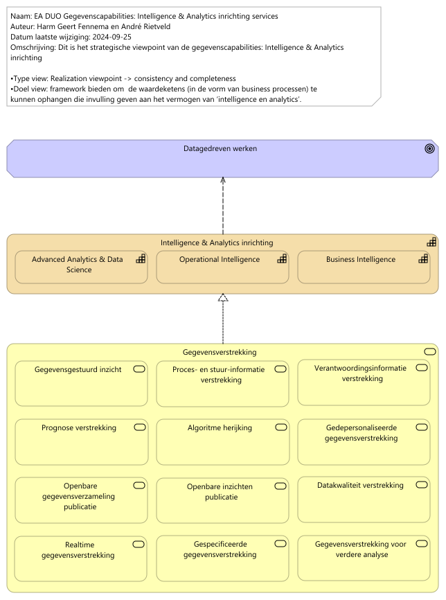

# Rapportage  capabilities

Report generated at: 2024-10-21  10:02:45

---
## Inhoudsopgave

* [Inleiding](#inleiding)
* [Hoofdstuk 1.  Overzicht](#hoofdstuk-1-overzicht)
  * [EA DUO Gegevenscapabilities grondplaat](#ea-duo-gegevenscapabilities-grondplaat)
* [Hoofdstuk 2.  Capabilities Gegevensmanagement](#hoofdstuk-2-capabilities-gegevensmanagement)
  * [2.1  Intelligence en Analyse](#21-intelligence-en-analyse)
    * [EA DUO Gegevenscapabilities Intelligence en Analytics inrichting services](#ea-duo-gegevenscapabilities-intelligence-en-analytics-inrichting-services)
  * [2.2  Gegevenskwaliteit](#22-gegevenskwaliteit)
    * [Capability Data Quality - Business Architecture (versimpelde weergave)](#capability-data-quality--business-architecture-versimpelde-weergave)

---

## Inleiding

> Hier vrij in te vullen  tekst voor rapportagesectie (in group.documentation).  Eventueel opgemaakt met Markdown: highlights, bullits, tables, links, etcetera.

---

## Hoofdstuk 1.  Overzicht

> Hier vrij in te vullen  tekst voor rapportagesectie (in group.documentation).  Eventueel opgemaakt met Markdown: highlights, bullits, tables, links, etcetera.
### EA DUO Gegevenscapabilities grondplaat

Zie properties.
<figure align="center">
  
  <figcaption><i>EA DUO Gegevenscapabilities grondplaat</i></figcaption>
</figure>

<table>
  <thead>
    <tr>
      <th colspan="1" width="20%">Element</th>
      <th rowspan="2" width="40%">Definitie</th>
      <th rowspan="2" width="40%">Omschrijving</th>
    </tr>
  </thead>
  <tbody>
    <tr><td></td><td></td></tr>
    <tr valign="top")>
      <td colspan="1">Gegevensmanagement 
(capability)</td>
      <td>
Gegevensmanagement betreft het geheel aan activiteiten dat DUO uitvoert om gegevens te verzamelen, vast te leggen, te beheren en ter beschikking te stellen. De functie staat voor het garanderen van de juistheid, tijdigheid en volledigheid en transparantie van alle gegevensleveringen aan alle klanten van DUO, ze vormt de grondslag voor de processen waarmee DUO haar klanten van informatie voorziet.
bron: Gegevensmanagement inrichtingsvoorstel eindrapport v1.0
</td>
      <td>
DUO heeft het vermogen de ontwikkeling, uitvoering en supervisie van plannen, beleid, programma's en praktijken die de waarde van gegevens en informatiemiddelen gedurende hun levenscyclus opleveren, controleren, beschermen en vergroten.
Hiermee:
•    begrijpen en ondersteunen wij de informatiebehoefte van DUO en haar klanten, medewerkers en ketenpartners
•    kunnen we onze data assets vastleggen, beschermen en de integriteit daarvan waarborgen
•    kunnen we de kwaliteit van onze gegevens en informatie waarborgen
•    kunnen we de privacy en vertrouwelijkheid van gegevens over onze stakholders waarborgen
•    kunnen we de ongeautoriseerde of ongepaste toegang, manipulatie of gebruik van gegevens en informatie voorkokmen
•    kunnen we waarborgen dat gegevens effectief binnen DUO gebruikt worden wat de waarde van onze gegevens vergroot.
</td>
    </tr>
    <tr valign="top")>
      <td colspan="1">Gegevensbeheer 
(capability)</td>
      <td>
DUO heeft het vermogen of gegevens efficiënt en effectief te verzamelen, op te slaan, te organiseren, te beveiligen en te beheren gedurende hun levenscyclus. Het omvat alle processen, procedures, technologieën en middelen die worden ingezet om gegevens te beheren en ervoor te zorgen dat ze nauwkeurig, toegankelijk en bruikbaar blijven.

Bron: DUO EA Capability Grondplaat
</td>
    </tr>
    <tr valign="top")>
      <td colspan="1">Gegevens beschikbaar stelling 
(capability)</td>
      <td>
DUO heeft het vermogen om gegevens op een gestructureerde en toegankelijke manier beschikbaar te stellen voor gebruikers of systemen die deze gegevens nodig hebben. Het omvat het proces van het verstrekken van gegevens aan de juiste partijen op het juiste moment en in een geschikte vorm, zodat zij de gegevens kunnen raadplegen, gebruiken, analyseren of integreren in hun eigen werkprocessen of systemen.

Bron: DUO EA Capability Grondplaat
</td>
    </tr>
    <tr valign="top")>
      <td colspan="1">Gegevensuitwisseling 
(capability)</td>
      <td>
DUO heeft het vermogenom gegevens effectief en efficiënt te delen tussen verschillende systemen, applicaties, organisaties of entiteiten. Het omvat het proces van het overdragen, uitwisselen of delen van gegevens met het doel informatie te delen, samenwerking te vergemakkelijken, besluitvorming te ondersteunen of naadloze interoperabiliteit mogelijk te maken.

Bron: DUO EA Capability Grondplaat
</td>
    </tr>
    <tr valign="top")>
      <td colspan="1">Gegevens vernietiging 
(capability)</td>
      <td>
DUO heeft het vermogen om gegevens op een gestructureerde en juiste manier te vernietigen. Het omvat het proces van Lifecyclemanagement voor gegevens.

Bron: DUO EA Capability Grondplaat
</td>
    </tr>
    <tr valign="top")>
      <td colspan="1">Data Architecture inrichting 
(capability)</td>
      <td>
DUO heeft het vermogen om een consistent geheel van principes en modellen op te stellen dat richting geeft aan ontwerp en realisatie van de processen, organisatorische inrichting, informatievoorziening en technische infrastructuur van het gegevensmanagement van DUO.
Data architectuur is aspect binnen DUO's Enterprise Architectuur
Bron: DUO Architectuur wiki

In de data architectuur vindt de vertaling plaats van ambitie naar realisatie.
</td>
      <td>
Bron: DAMA BMBOK2
</td>
    </tr>
    <tr valign="top")>
      <td colspan="1">Data Modelling & Design inrichting 
(capability)</td>
      <td>
DUO heeft het vermogen het proces uit te voeren waarbij datavereisten ontdekt, geanalyseerd en in kaart gebracht wordt en vervolgens te representeren en communiceren in een precieze vorm die het gegevensmodel wordt genoemd. Datamodellering en ontwerp betreft het analyseren, ontwerpen, bouwen, testen en onderhouden van (conceptuele, logische en fysieke) gegevensmodellen.

Bron: DAMA DMBOK2:
</td>
      <td>
Gegevensmodellen zijn van cruciaal belang voor effectief gegevensbeheer. Met een gegevensmodel kan DUO:
• Zorgen voor een gemeenschappelijk vocabulaire rond gegevens.
• Expliciete kennis vastleggen en documenteren over de gegevens en systemen van een organisatie.
• Laten fungeren als primair communicatiemiddel tijdens projecten.
• Bieden van het startpunt voor maatwerk, integratie of zelfs vervanging van een applicatie.

Modellen hebben een relatie met metadata en bevatten metagegevens zoals: betekenis, de structuur, de compliancy op het gebied van archivering,  BIV, , eigenaar, locatie e.d).
</td>
    </tr>
    <tr valign="top")>
      <td colspan="1">Metadata inrichting 
(capability)</td>
      <td>
DUO heeft het vermogen beschrijvende gegevens over de gegevens (metagegevens) enkelvoudig te beheren en meervoudig te gebruiken, zodat niet elk team van verwekers moet zoeken naar of opnieuw nadenken over de bruikbaarheid van de gegevens. Dit is vergelijkbaar met de bijsluiter van een medicijn.
</td>
      <td>
Met goed beheerde metadata kan DUO:

<ul>
<li>Door context te bieden het vertrouwen geven in de gegevens</li>
<li>Het meten van datakwaliteit mogelijk te maken</li>
<li>De waarde van strategische informatie (bijvoorbeeld Master Data) door meerdere toepassingen mogelijk te maken</li>
<li>De operationele efficiëntie verbeteren door redundante gegevens en processen te identificeren</li>
<li>Voorkomen van het gebruik van verouderde of onjuiste gegevens</li>
<li>Verkorten van gegevensgerichte onderzoekstijd</li>
<li>Verbeteren van de communicatie tussen gegevensconsumenten en IT-professionals</li>
<li>Nauwkeurigere impactanalyses maken en zo verkleinen van het risico op projectmislukking</li>
<li>Verbeteren van de time-to-market door de levenscyclustijd van systeemontwikkeling te verkorten</li>
<li>Verlagen van de trainingskosten en verminderen van de impact van personeelsverloop door grondige documentatie van de gegevenscontext, -geschiedenis en -oorsprong</li>
<li>Ondersteuning bieden van naleving van regelgeving</li>
</ul>

Metagegevens bevinden zich in 

<ul>
<li>Modellen ( betekenis, de structuur, de compliancy, eigenaar, locatie e.d) . Dit punt heeft overlap met de Capability Gegevensmodellering (Data Modelling en Design).</li>
<li>Standaard attributen in de database (herkomst, datum ontvangst, logging e.d.). Dit wordt standaard aan de database toegevoegd o.b.v.  metadatapatronen.</li>
</ul></td>
    </tr>
    <tr valign="top")>
      <td colspan="1">Data Security & Privacy  inrichting 
(capability)</td>
      <td>
Data Security betreft het vermogen om op een veilige manier met gegevens om te gaan conform wettelijke kaders en richtlijnen.

Privacy betreft het vermogen om op een veilige manier met persoonsgegevens om te gaan conform wettelijke kaders en richtlijnen.
</td>
      <td>
Bron: DAMA DMBOK2
</td>
    </tr>
    <tr valign="top")>
      <td colspan="1">Data Quality inrichting 
(capability)</td>
      <td>
Het vermogen om de kwaliteit van gegevens inzichtelijk en daarmee geschikt te maken voor verschillende toepassingen.
</td>
      <td>
Gegevenskwaliteit is het definiëren, valideren (tegen normen) en onderhouden van gegevens langs een aantal dimensies om de kwaliteit, fit-for-purpose, inzichtelijk te maken en te verbeteren.DUO heeft het vermogen om langs een aantal dimensies de kwaliteit van gegevens te definiëren, monitoren en onderhouden om zo de fit-for-purpose van de gegevens te verbeteren. Het beheren van de gegevenskwaliteit maakt dat DUO:
• De waarde vergroot van gegevens en de mogelijkheden om deze te gebruiken
• De risico’s en kosten vermindert die gepaard gaan met gegevens van slechte kwaliteit
• De efficiëntie en productiviteit verbetert van de organisatie
• De reputatie op gebied van gegevens en informatie van DUO beschermt en verbetert
</td>
    </tr>
    <tr valign="top")>
      <td colspan="1">Master & Reference data inrichting 
(capability)</td>
      <td>
Het vermogen om over domeinen heen kerngegevens te gebruiken als referentie -en materdata te identificeren, eenduidig te beheren en breed beschikbaar te stellen. 

Bron: DAMA DMBOK2
</td>
      <td>
DUO heeft het vermogen om kerngegevens (masterdata) en referentiegegevens te identificeren, golden records te realiseren, enkelvoudig te beheren en breed beschikbaar te maken. Het managen van het golden record voor de kerngegevens geldt voor de gehele levenscylcus.

Zo kan DUO: 
•    Vertrouwen geven in de compleetheid, actualiteit en consistentie van gedeelde kerngegevens over de verschillende organisatie onderdelen heen
•    Beter de gegevenskwaliteit van herbruikbare kerngegevens beheren
•    Data redundantie en onnodige (en onnodig complexe ) gegevensintegratie voorkomen
•    Risico’s verminderen geassocieerd met inconsistente gegevens
</td>
    </tr>
    <tr valign="top")>
      <td colspan="1">Data Storage & Operations inrichting 
(capability)</td>
      <td>
DUO heeft het vermogen op gegevensopslag te ontwerpen, implementeren en beheren zodat de waarde van gegevens gemaximaliseerd wordt. 
Bron: DAMA DMBOK2
</td>
      <td>
Zo kan DUO:
•    De beschikbaarheid van gegevens gedurende de gegevenslevenscyclus beheren
•    Zorgen voor de integriteit van de data assets
•    Beheren van de prestaties van gegevenstransacties.
</td>
    </tr>
    <tr valign="top")>
      <td colspan="1">Document & Content inrichting 
(capability)</td>
      <td>
DUO heeft het vermogen documenten en andere content te archiveren, op te slaan en toegankelijk te maken in ongestructureerde en gestructureerde gegevensopslag.

Bron: DAMA DMBOK2
</td>
      <td>
Zo kan DUO:
•    (On)gestructureerde gegevens eenvoudig vinden en gebruiken
•    Integratie tussen gestructureerde en ongestructureerde gegevens bevorderen
•    Voldoen aan wettelijke verplichtingen en verwachtingen van de klant.
</td>
    </tr>
    <tr valign="top")>
      <td colspan="1">Intelligence & Analytics inrichting 
(capability)</td>
      <td>
DUO heeft het vermogen om met intelligence- (OI en BI) en analyseprocessen (bv. data science technieken) het gevraagde gegevens- of  informatieproduct te ontwerpen, ontwikkelen, te beheren en te leveren zodat DUO, ketenpartners en andere interne en externe afnemers met het verkregen inzicht besluitvorming kunnen ondersteunen.
De gegevensverwerkingen die nodig zijn om uiteindelijk tot de gewenste informatie te komen is onderdeel van de gegevensmanagement functie.

Bron: DAMA DMBOK2 Dataware-housing en Business, Intelligence, Big Data en Data Science.
</td>
    </tr>
    <tr valign="top")>
      <td colspan="1">Data Integration & Interoperability inrichting 
(capability)</td>
      <td>
Het vermogen om de flow en consolidatie van gegevens tussen eenheden systemen en partijen te managen. 
Interoperabiliteit is het vermogen om samen te werken. Dit gebeurt typisch langs de lijn van standaarden als de samenwerkende partners er voor kiezen of toe worden aangezet om een standaard te volgen.
</td>
      <td>
Bron: DAMA DMBOK2
Doel is om 
1)    Gegevens veilig (compliant) en binnen het gestelde tijdsframe door de organisatie te laten stromen. 
2)    Kosten en complexiteit en het aantal te beheren oplossingen te reduceren door gedeelde modellen en interfaces te ontwikkelen en toe te wijzen
3)    Ondersteunen van onder andere: Analytics, BI, Master data management en operationele efficiency
</td>
    </tr>
    <tr valign="top")>
      <td colspan="1">Data Governance inrichting 
(capability)</td>
      <td>
Datagovernance betreft de planning, het overzicht en de controle over gegevensmanagement. Bij DUO wordt de term gegevensmanagement gebruikt voor het hele vakgebied, waarbinnen datagovernance over de verschillende onderdelen de regie voert.

De ontwikkeling kent een fasering en vraagt om een balans tussen:
Strategie en Doelen
Besturing en Organisatie
Leiderschap en Gedrag
</td>
      <td>
Ensuring data is managed
Bron: DAMA DMBOK2
</td>
    </tr>
  </tbody>
</table>

---

## Hoofdstuk 2.  Capabilities Gegevensmanagement

> Hier vrij in te vullen  tekst voor rapportagesectie (in group.documentation).  Eventueel opgemaakt met Markdown: highlights, bullits, tables, links, etcetera.
### 2.1  Intelligence en Analyse

> Hier vrij in te vullen  tekst voor rapportagesectie (in group.documentation).  Eventueel opgemaakt met Markdown: highlights, bullits, tables, links, etcetera.
#### EA DUO Gegevenscapabilities Intelligence en Analytics inrichting services

Zie properties.
<figure align="center">
  
  <figcaption><i>EA DUO Gegevenscapabilities Intelligence en Analytics inrichting services</i></figcaption>
</figure>

<table>
  <thead>
    <tr>
      <th colspan="2" width="20%">Element</th>
      <th rowspan="2" width="40%">Definitie</th>
      <th rowspan="2" width="40%">Omschrijving</th>
    </tr>
  </thead>
  <tbody>
    <tr><td></td><td></td><td></td></tr>
    <tr valign="top")>
      <td colspan="2">Datagedreven werken 
(goal)</td>
      <td>
DUO heeft de ambitie om 'meer te doen met data' en meer datagedreven te gaan werken. 
</td>
    </tr>
    <tr valign="top")>
      <td colspan="2">Intelligence & Analytics inrichting 
(capability)</td>
      <td>
DUO heeft het vermogen om met intelligence- (OI en BI) en analyseprocessen (bv. data science technieken) het gevraagde gegevens- of  informatieproduct te ontwerpen, ontwikkelen, te beheren en te leveren zodat DUO, ketenpartners en andere interne en externe afnemers met het verkregen inzicht besluitvorming kunnen ondersteunen.
De gegevensverwerkingen die nodig zijn om uiteindelijk tot de gewenste informatie te komen is onderdeel van de gegevensmanagement functie.

Bron: DAMA DMBOK2 Dataware-housing en Business, Intelligence, Big Data en Data Science.
</td>
    </tr>
    <tr valign="top")>
      <td colspan="1"></td>
      <td colspan="1">Advanced Analytics & Data Science  
(capability)</td>
      <td>
DUO heeft het vermogen aan de hand van geavanceerde technieken complexe gegevensverzamelingen te verwerken tot inzichten en/of voorspellende/-schrijvende algoritmische modellen waarmee gegevensgestuurde/-onderbouwde besluiten genomen kunnen worden op strategisch, tactisch of operationeel niveau.
</td>
      <td>
Deze capability omvat een breed scala aan functies en activiteiten die nodig zijn om geavanceerde analyses en datagedreven modellering uit te voeren.

Binnen deze overkoepelende capability bevinden zich verschillende subcapabilities en competenties.

Gegevensverzameling en -opslag: Het verzamelen, opslaan en beheren van grote hoeveelheden gegevens, inclusief gestructureerde en ongestructureerde gegevens, die nodig zijn voor data science-projecten.

Gegevensvoorbereiding en -opschoning: Het proces van het voorbereiden en opschonen van ruwe gegevens om ze geschikt te maken voor analyse en modellering.

Gegevensexploratie en -visualisatie: Het verkennen van gegevens en het gebruik van visualisaties om inzichten te krijgen en patronen te identificeren.

Statistische Analyse: Het uitvoeren van statistische analyses om de gegevens te begrijpen en te karakteriseren.

Machine Learning en Algoritme-ontwikkeling: Het ontwikkelen van machine learning-modellen en algoritmen om voorspellingen te doen, patronen te ontdekken en besluitvorming te automatiseren.

Deep Learning en Neurale Netwerken: Het gebruik van diepe leermodellen en neurale netwerken voor complexe taken zoals beeldherkenning en natuurlijke taalverwerking.

Big Data-technologieën: Het werken met big data-technologieën en -platforms voor de verwerking en analyse van grote hoeveelheden gegevens.

Experimentontwerp en A/B-testing: Het ontwerpen en uitvoeren van gecontroleerde experimenten om hypotheses te testen en de impact van veranderingen te meten.

Model Evaluatie en Validatie: Het beoordelen en valideren van de prestaties van modellen en algoritmen om ervoor te zorgen dat ze betrouwbaar zijn.

Opschaling en Implementatie: Het schalen en implementeren van data science-modellen in productieomgevingen.

Ethiek en Privacy: Het waarborgen van ethische en wettelijke overwegingen met betrekking tot gegevensgebruik en privacy.

De overkoepelende capability voor Advanced Analytics and Data Science is cruciaal omdat het de organisatie in staat stelt om geavanceerde technieken en modellen te gebruiken om waardevolle inzichten uit data te halen. Data science maakt gebruik van deze capability om complexe analyses uit te voeren, voorspellingen te doen en besluitvorming te ondersteunen op basis van gegevens. Het speelt een essentiële rol bij het omzetten van gegevens in zakelijke waarde en innovatie.
</td>
    </tr>
    <tr valign="top")>
      <td colspan="1"></td>
      <td colspan="1">Operational Intelligence 
(capability)</td>
      <td>
DUO heeft het vermogen om ((near) real-time) gegevens te analyseren van specifieke events of individuele business processen/functies om verbeteringen of mogelijkheden te identificeren vanuit een operationeel oogpunt, waardoor besluiten ten behoeve van verbeteringen of optimalisatie van het operationele proces genomen kunnen worden.
</td>
      <td>
Operational Intelligence hanteert een proactieve activiteit-centrische aanpak waar een constante stroom van (near) real-time operationele data vanuit een bron direct in een analytisch platform wordt geladen zonder te worden opgeslagen in een datawarehouse. Operational Intelligence pas je toe wanneer je accurate en actuele situationele inzicht wil hebben op een specifiek business proces/functie waar je snel op wilt reageren.

Operational Intelligence gebruikt technologie die ook voor traditionele BI worden ingezet, maar voegt daar tooling en technieken aan toe voor snelle data cleansing (detecteren en repareren of verwijderen van (corrupte) data) en het snel kunnen verwerken van data zodat medewerkers die werken binnen een proces beter de voortdurende real-time stroom aan data kunnen analyseren of op kunnen reageren. Operational Intelligence kan ook gaan over voorspellende modellen en ML algoritmes die real-time feedback geven binnen het primaire proces. De dynamische operationele data worden in een analytisch platform geïntegreerd met meer statische data of normen (bijvoorbeeld drempelwaarden) om tot het inzicht te komen.
</td>
    </tr>
    <tr valign="top")>
      <td colspan="1"></td>
      <td colspan="1">Business Intelligence 
(capability)</td>
      <td>
DUO heeft het vermogen om aan de hand van (gestructureerde) gegevensverzamelingen en tools analyses en onderzoeken uit te voeren zoals oorzaak-gevolg relaties tussen ogenschijnlijk ongerelateerde macro-trends over verschillende bedrijfsprocessen heen. Hierdoor kan het een belangrijke waarde leveren aan bedrijfsbrede lange termijn tactische en strategische doelen.
</td>
      <td>
BI volgt de reactieve aanpak “onderzoek het verleden om de huidige situatie te begrijpen en verwachtingspatronen te ontwikkelen”. Er worden binnen het BI-proces over de jaren heen historische data verzamelt vanuit diverse processen die volgens business logica getransformeerd worden en tot slot worden opgeslagen in een data warehouse zodat hieruit later inzichten uit kunnen worden gehaald. 
 Het wordt voornamelijk gebruikt om onderliggende dynamieken/patronen te analyseren van bepaalde trends.

BI heeft technologie nodig die medewerkers in staat stelt om grote datasets te extraheren, te transformeren, integreren, op te slaan en te kunnen analyseren. Dit bevat data integratie oplossingen, ETL-systemen, algoritme gebaseerde data modelleer software om relaties of patronen te herkennen in de data en datavisualisatie oplossingen om de data inzichten te kunnen delen. De gebruikerslaag voor BI bestaat doorgaans uit dimensioneel gemodelleerde datamarts (zogeheten stermodellen met een business focus) gekoppeld aan een presentatielaag in de vorm van een rapportagetool.
</td>
    </tr>
    <tr valign="top")>
      <td colspan="2">Gegevensverstrekking 
(business-service)</td>
      <td>
Gegevensverstrekking is de overkoepelde DUO dienst die staat voor alles wat DUO inricht om gegevensproducten te ontwikkelen en beschikbaar te stellen voor klanten zowel binnen als buiten DUO.

We maken geen onderscheid tussen gegevens en informatie. Gegevens zonder context hebben geen waarde en gegevens met context zou informatie zijn. Gegevensverzamelingen die worden bewaard hebben een beschrijving en zijn dus geen gegevensverzamelingen, maar een informatiebank. Dit is basis voor veel verwarring en het gaat om de mate van raffinage en verwerking van de grondstof. De grens is diffuus en daarom geen onderscheid.

Gegevensverstrekking vindt plaats op basis van een verzoek van een klant. Op basis van een leveringsovereenkomst vindt verstrekking plaats waar naast de realisatie van het product ook de service en ondersteuning rondom de verstrekking van de producten geborgd is.

De service beslaat de gehele levencyclus en hier moeten dus (raam)afspraken over gemaakt worden.

Het bestaat dus zowel uit de aanvraag, de realisatie, de toegang, het beheer van het leverkanaal, de ondersteuning bij het gebruik als de uitfasering.
</td>
    </tr>
    <tr valign="top")>
      <td colspan="1"></td>
      <td colspan="1">Gegevensgestuurd inzicht 
(business-service)</td>
      <td>
De DUO dienst gegevensgestuurd inzicht levert op verzoek van klanten een onderzoeksresultaat /  adviesrapport, storytelling met DUO gegevensverzameling(en) als onderbouwing.

Deze dienst heeft domeinkennis van het onderwerp waar de klantvraag over gaat en gebruikt deze tijdens gegevensanalyse en productontwikkeling. Het inzicht / advies wordt verwerkt in het product. 

Dit kan een onderzoek zijn, managementondersteuning, advies maar ook een beantwoording van een kamervraag .
Welk gegevensproduct als onderbouwing gebruikt wordt, of welke vorm van self service kan verschillen.
</td>
    </tr>
    <tr valign="top")>
      <td colspan="1"></td>
      <td colspan="1">Proces- en stuur-informatie verstrekking 
(business-service)</td>
      <td>
De DUO dienst Proces- en Stuurinformatie Verstrekking verstrekken rapporten / dashboards met procesinzicht of stuur informatie enerzijds voor managers, of gelegeerde en ondersteunende medewerkers voor sturing en coördinatie van de business en beheerders anderzijds voor ondersteuning van de techniek en taken ondersteunend aan de business.

Dit laatste een overzicht veelal gebaseerd op metadata van 'scheduling' of van de tooling waar het platform operationeel op is.
</td>
    </tr>
    <tr valign="top")>
      <td colspan="1"></td>
      <td colspan="1">Verantwoordingsinformatie verstrekking 
(business-service)</td>
      <td>
De DUO dienst Verantwoordingsinformatie vertrekt rapporten aan managers, of gelegeerde en ondersteunende medewerkers ten behoeve van de af te leggen verantwoording voor de evaluatie van hun business. Dit is veelal gerelateerd aan een planning en control cyclus.
</td>
    </tr>
    <tr valign="top")>
      <td colspan="1"></td>
      <td colspan="1">Prognose verstrekking 
(business-service)</td>
      <td>
De DUO dienst Prognose Verstrekking verstrekt gegevensproducten die op basis van gegevensverzamelingen en statistische, wiskundige en/of op AI-technieken gebaseerde modellen een voorspelling beschrijft.
</td>
    </tr>
    <tr valign="top")>
      <td colspan="1"></td>
      <td colspan="1">Algoritme herijking 
(business-service)</td>
      <td>
De DUO dienst Algoritme Herijking verzorgt het opnieuw trainen van een bestaand algoritme nadat de gegevensverzameling waarop het algoritme getraind is niet meer representatief is voor de actualiteit zodat het algoritme weer betrouwbaar wordt.

Dit gaat vooral om algoritmen die zijn gemaakt met Machine Learning. Ze kunnen worden gebruikt voor algoritmen in de operatie, onderzoek, en om algoritmen te verifieren die zijn getraind met synthetische data.
</td>
    </tr>
    <tr valign="top")>
      <td colspan="1"></td>
      <td colspan="1">Gedepersonaliseerde gegevensverstrekking 
(business-service)</td>
      <td>
De DUO dienst Gedepersonaliseerde Gegevensverstrekking verstrekt gegevensverzamelingen die geen tot op de persoon herleidbare gegevens bevatten gebruik makend van Privacy Enhancement Techniques waaronder anonimisering, pseudonimisering en synthetisering.
</td>
    </tr>
    <tr valign="top")>
      <td colspan="1"></td>
      <td colspan="1">Openbare gegevensverzameling publicatie 
(business-service)</td>
      <td>
De DUO dienst Openbare Gegevensverzameling Publicatie faciliteert het publiceren van openbare gegevensverzamelingen.
</td>
    </tr>
    <tr valign="top")>
      <td colspan="1"></td>
      <td colspan="1">Openbare inzichten publicatie 
(business-service)</td>
      <td>
De DUO dienst Openbare Inzichten Publicatie faciliteert de publicatie van door DUO ontwikkelde openbare inzichten met betrekking tot het Nederlandse onderwijs.

Het gaat hier op openbare inzichten ondersteunt door een (grafisch)gegevensproduct om de maatschappij en/of het onderwijsveld te informeren.
</td>
    </tr>
    <tr valign="top")>
      <td colspan="1"></td>
      <td colspan="1">Datakwaliteit verstrekking 
(business-service)</td>
      <td>
De DUO dienst Datakwaliteit Verstrekking betreft de terugkoppeling van de kwaliteit van de aangeleverde of verwerkte gegevens aan de eigenaar van de gegevensbron.
De verstrekking kan op verschillende wijzen (Bijvoorbeeld een dashboard of een bestand met detailgegevens). 

Dit gaat bijvoorbeeld over controle op aangeleverde gegevens van een instelling die DUO heeft ontvangen. Op basis hier van kan de kwaliteit aan de bron worden verbeterd. In dit voorbeeld gaat het vooral over functionele controles op basis van business rules die in use cases zijn beschreven.

Andere voorbeelden zijn:
Tellingen in en uit een datawarehouse
Controles op de technische en logische modellen
</td>
    </tr>
    <tr valign="top")>
      <td colspan="1"></td>
      <td colspan="1">Realtime gegevensverstrekking 
(business-service)</td>
      <td>
De DUO dienst Realtime Gegevensvertrekking faciliteert het, op aanvraag/afspraak, verstrekken van actuele gegevens van een bronsysteem (registratie) aan een primair systeem.

Het gaat hier om M2M aanvragen / API calls volgens vaste definities die een applicatie in staat stelt realtime gegevens op transactie niveau te verwerken zonder dat het de gegevens op voorhand hoeft te kopieëren.

Te denken valt aan een API platform in de vorm van het DUO gegevensmagazijn.
</td>
    </tr>
    <tr valign="top")>
      <td colspan="1"></td>
      <td colspan="1">Gespecificeerde gegevensverstrekking 
(business-service)</td>
      <td>
De DUO dienst Gespecificeerde Gegevensvertrekking faciliteert de verstrekking van een gegevensverzameling welke verderop in de keten weer (geautomatiseerd) verwerkt wordt.

Deze gegevensverzameling wordt volgens een klantspecifieke definitie opgeleverd volgens een afgesproken frequentie. Dit kan zowel binnen als buiten DUO zijn. 
Extern kan dit ook een afnemer specifieke variant op opendata zijn als er klantspecifieke wensen zijn.

Het kan hier ook gaan om halffabrikaten voor intern gebruik.
</td>
    </tr>
    <tr valign="top")>
      <td colspan="1"></td>
      <td colspan="1">Gegevensverstrekking voor verdere analyse 
(business-service)</td>
      <td>
De DUO dienst Gegevensvertrekking tbv Analyse faciliteert het beschikbaar stellen van gegevensverzamelingen voor verdere analyse / onderzoek.

Het gaat hier er om dat er in de keten iemand een gegevensproduct gebruikt mogelijk in een self service omgeving of een analytische werklaats, om er zelf een afleiding van te maken en tot inzicht te komen.
</td>
    </tr>
  </tbody>
</table>

### 2.2  Gegevenskwaliteit

> Hier vrij in te vullen  tekst voor rapportagesectie (in group.documentation).  Eventueel opgemaakt met Markdown: highlights, bullits, tables, links, etcetera.
#### Capability Data Quality - Business Architecture (versimpelde weergave)

DUO verwerkt gegevens ten behoeve van verschillende vormen van dienstverlening. Gegevens ingewonnen voor uitvoeren van een primaire taak, zoals verstrekken studiefinanciering, worden ook gebruikt voor het leveren van informatie aan het ministerie ten behoeve van het ontwikkelen van beleid. 

Gegevensverwerking door DUO is onderdeel van een keten die begint voordat de uitvoeringstaak van DUO begint (bijvoorbeeld bij onderwijsinstellingen) en ook vaak buiten DUO eindigt (bij bijvoorbeeld het ministerie van OCW of de Onderwijsraden).

Het beheersen en verbeteren van gegevenskwaliteit is een gezamenlijke verantwoordelijkheid van partijen binnen de keten. Binnen DUO is deze keten onder te verdelen in 3 stukken met elk een eigen verantwoordelijkheid:
•	Primaire dienstverlening – verwerken gegevens binnen verschillende bronnen
•	Gegevensdistributie – verwerken gegevens ten behoeve van distributie van gegevens
•	Informatieverstrekking – verwerken gegevens ten behoeve van het verstrekken van informatie

Elke partij binnen deze keten kent een eigen toepassing van de gegevens en heeft daarbij een eigen behoefte ten aanzien van de kwaliteit van die gegevens (Fit for Purpose). Maatregelen om de gegevenskwaliteit te realiseren, inzichtelijk en meetbaar te maken en daarover te communiceren worden op meerdere plekken in deze keten ingericht.

De capability Data Quality inrichting ondersteunt deze dienstverlening door middel van 2 services:
•	Het inrichten van gegevenskwaliteit bij nieuwe of gewijzigde dienstverlening 
•	Het beheersen van gegevenskwaliteit tijdens de dagelijkse operatie 

Binnen de capability Data Quality inrichting zijn 3 processen te herkennen: 
1.	Het inrichten van maatregelen om gegevenskwaliteit te realiseren en te verbeteren
2.	Het inrichten van maatregelen om gegevenskwaliteit te inzichtelijk en meetbaar te maken
3.	inrichten maatregelen om, aan de hand van terugkoppeling uit de keten, gegevenskwaliteit te verbeteren  en/of beter inzichtelijk te maken

Op deze ketenprocessen zijn de verschillende maatregelen geplot die een rol spelen in het meten en verbeteren van gegevenskwaliteit. Hierbij ligt de nadruk op het voortbrengingsproces (i.t.t. beheer)  omdat daar maatregelen gerealiseerd worden (en daarmee onderdeel worden van de inrichting), welke (zoals kwaliteitsmetingen) weer gebruikt worden in de operatie. 

In principe maak het qua aanpak niet uit of het interne of externe partijen in de keten betreft. In het geval van externe partijen zullen (contractuele) afspraken gemaakt worden over de relevante eisen en normen ten aanzien van gegevenskwaliteit en de manier waarop invulling gegevens wordt aan de capability. Hierbij kan gedacht worden aan standaarden in taal en protocollen.

Realiseren gegevenskwaliteit 
In eerste instantie wordt gegevenskwaliteit gerealiseerd als onderdeel van het ontwikkelen van een nieuwe dienst of systeem. Hierbij gaat de aandacht niet alleen naar de kwaliteit die nodig is ten behoeve van de fit for purpose van de eigen dienst, maar worden ook requirements van andere partijen uit de keten, voor zover op dat moment bekend, meegenomen. 

<figure align="center">
  
  <figcaption><i>Capability Data Quality - Business Architecture (versimpelde weergave)</i></figcaption>
</figure>

<table>
  <thead>
    <tr>
      <th colspan="4" width="20%">Element</th>
      <th rowspan="2" width="40%">Definitie</th>
      <th rowspan="2" width="40%">Omschrijving</th>
    </tr>
  </thead>
  <tbody>
    <tr><td></td><td></td><td></td><td></td><td></td></tr>
    <tr valign="top")>
      <td colspan="4">Gegevensverantwoordelijke 
(business-role)</td>
      <td>
De (generiek) rol Gegevensverantwoordelijke betreft iedereen die een verantwoordelijkheid heeft in het verantwoord verwerken van gegevens. 

Bronhouder, Distributeur en Afnemer, zowel binnen DUO als extern (in een keten), zijn gezamenlijk verantwoordelijk, waarbij elke rol weer specifieke taken, verantwoordelijkheden en bevoegdheden kent.
</td>
    </tr>
    <tr valign="top")>
      <td colspan="1"></td>
      <td colspan="3">Bronhouder 
(business-role)</td>
      <td>
Bron Informatiemanagement: rolbeschrijvingen gegevensmanagement 17-1-2017

Omschrijving 

De bronhouder is verantwoordelijk voor het inwinnen, actueel houden, opslaan en ter beschikking stellen van de juiste gegevens in een registratie. Onder meer naar aanleiding van ontvangen meldingen is de bronhouder verantwoordelijk voor het borgen van de kwaliteit van de gegevens.

Doel 

<pre><code>- Dubbele inwinning van bestaande bestanden voorkomen;
- Efficiënt gebruik van gegevensbestanden mogelijk maken
- Inzetten van moderne technieken;
- Werkpakketten optimaal in de keten zetten.
</code></pre>

Hoofdtaken 

<pre><code>- Ontwikkelen en beheren van de voorzieningen nodig om de gegevensmanagement taken uit te kunnen voeren;
- Assembleren van de bestanden tot een DUO dekkend geheel;
- Assembleren van de eigen objecten met die van andere bronhouders;
- Afhandelen van de meldingen van gerede twijfel volgens onderling afgesproken procedures. De bronhouder bepaalt of de twijfel aanleiding is om de dienstverlening op te schorten;
- Realiseren en bijhouden van de gegevensbestanden;
- Transitie van gesloten naar ontsloten gegevensbestanden uitvoeren;
- Aanleveren van gegevens aan afnemers;
- Inwinnen, verwerken, afhandelen en verwerken van terugmeldingen;
- Uitvoeren van kwaliteitscontroles
</code></pre>

Contact met

<pre><code>- Domeinarchitect
- Distributeur
- Gegevensmakelaar
- Afnemer
- Functionaris voor de gegevensbescherming
</code></pre>

Resultaten 

<pre><code>- Stabiele, betrouwbare, beheerde gegevensverzamelingen;
- In het geval van verrijking en toevoeging blijft de verantwoordelijkheid voor de kwaliteit van de toegevoegde gegevens bij de bronhouder van de toegevoegde gegevens;
- Gegarandeerde en vastgestelde kwaliteit van de gegevens op basis van BIR, Wbp en afgesproken service levels;
- Generalisatie, transformatie, selectie op de gegevens vinden uitsluitend plaats in overleg met de bronhouder.
</code></pre>

Competenties
</td>
    </tr>
    <tr valign="top")>
      <td colspan="1"></td>
      <td colspan="3">Distributeur 
(business-role)</td>
      <td>
Bron Informatiemanagement: rolbeschrijvingen gegevensmanagement 17-1-2017

Omschrijving 

De distributeur ontvangt gegevens van bronhouders en stuurt deze, direct of via generieke voorzieningen zoals gegevensknooppunten, door naar afnemers. De distributeur is verantwoordelijk voor de vastlegging van de feitelijke distributie van een gegeven, bijvoorbeeld ten behoeve van het werk van de auditor. 

Doel 

Het leveren van gegevens aan interne en externe afnemers conform het GLO. 

Hoofdtaken 

<pre><code>- Onderhouden van contacten  en het maken van afspraken met afnemers voor producten, diensten en incidenten;
- Beheren contracten met afnemers;
- Voorlichten over gebruiks- en terugmeld verplichtingen;
- Informatie verstrekken over de beschikbaarheid en kwaliteit van de gegevensset;
- Borgen kwaliteit proces van verstrekken van producten en diensten;
- Verstrekken van gegevens aan afnemers;
- Inlichten van de regisseur over het gebruik van gegevens uit de registraties;
- Onderhouden producten- en dienstencatalogus;
- Accepteren (functioneel) van nieuwe software en releases;
- Doorgeven wensen afnemers aan de registerbeheerder centraal en decentraal ;
- Ondersteunen afnemers
</code></pre>

Contact met

<pre><code>- Bronhouder
- Register beheerder centraal en decentraal  
- Afnemer
</code></pre>

Resultaten 

Volledig en juist en tijdig leveren van gegevens aan interne en externe afnemers.  

Competenties

De distributeur ontvangt gegevens van bronhouders en stuurt deze, direct of via generieke voorzieningen zoals gegevensknooppunten, door naar afnemers. De distributeur is verantwoordelijk voor de vastlegging van de feitelijke distributie van een gegeven, bijvoorbeeld ten behoeve van het werk van de auditor. 
</td>
    </tr>
    <tr valign="top")>
      <td colspan="1"></td>
      <td colspan="3">Afnemer 
(business-role)</td>
      <td>
Bron Informatiemanagement: rolbeschrijvingen gegevensmanagement 17-1-2017

Omschrijving
Een afnemer is een overheidsorganisatie of private partij die geautoriseerd is om gegevens van DUO af te nemen voor gebruik in de eigen processen. Afname vindt plaats via de distributeur. Bij gerede twijfel over de kwaliteit van de gegevens melden afnemers dit via de distributeur bij de bronhouder.

Doel
Het daadwerkelijk, correct gebruiken van gegevens uit de registraties van ketenpartners zodat invulling gegeven wordt aan het principe “eenmalig vastleggen, meermalen gebruiken”.

Hoofdtaken
 Het afnemen van gegevens en deze conform doelbinding aanwenden voor gebruik in de informatieverzorgende processen binnen de eigen organisatie.
 Bij de bronhouder terug melden van gerede twijfel aan de juistheid van de afgenomen gegevens.

Contact met
 Distributeur
 Functionaris voor de gegevensbescherming
 Gegevensmakelaar
 Bronhouder
 Domeinarchitect

Resultaten
Hergebruik van gegevens door deze herhaald toe te passen binnen de processen van de organisatie.

Competenties
Bij wet aangewezen organisatie die op basis van doelbinding gebruik kan maken van de specifieke gegevens die benodigd zijn om het (beleids) doel te realiseren.
</td>
    </tr>
    <tr valign="top")>
      <td colspan="4">Data Governance inrichting 
(capability)</td>
      <td>
Datagovernance betreft de planning, het overzicht en de controle over gegevensmanagement. Bij DUO wordt de term gegevensmanagement gebruikt voor het hele vakgebied, waarbinnen datagovernance over de verschillende onderdelen de regie voert.

De ontwikkeling kent een fasering en vraagt om een balans tussen:
Strategie en Doelen
Besturing en Organisatie
Leiderschap en Gedrag
</td>
      <td>
Ensuring data is managed
Bron: DAMA DMBOK2
</td>
    </tr>
    <tr valign="top")>
      <td colspan="4">Gegevensdiensten 
(business-actor)</td>
      <td>
Gegevensdiensten vervult de functie gegevensmanagement

Hierin worden gegevens  integraal en beheerst verwerkt binnen een organisatie, zowel op strategisch tactisch als operationeel niveau, met als doel de gewenste kwaliteit en beschikbaarheid te realiseren
(https://www.noraonline.nl/wiki/Gegevensmanagement_(begrip)#:~:text=Beschrijving%3A%20Gegevensmanagement%20betreft%20het%20integraal,kwaliteit%20en%20beschikbaarheid%20te%20realiseren.)

DUO ontleent haar afdeling Gegevensdiensten uit het 'inrichtingsvoorstel gegevensmanagement':
Het inrichtingsvoorstel ‘Gegevensmanagement’ voorziet in het vormen van een afdeling ‘gegevensmanagement’ zoals beschreven in dit document en de bijlagen. De afdeling heeft een DUO brede doelstelling en staat voor het managen van alle DUO gegevensleveringen aan zowel collega organisaties als interne gegevensafnemers (primair en secundair) uit zowel generieke registers als applicatiespecifieke gegevensverzamelingen. 
bron: Gegevensmanagement inrichtingsvoorstel eindrapport v1.0
Afdeling georganiseerd binnen
DUO - R&amp;E -SEG Services
</td>
    </tr>
    <tr valign="top")>
      <td colspan="4">Sturing op gegevens 
(business-service)</td>
      <td>
Sturing op gegevens betreft de inrichtin die nodig is om effectief en efficient te kunnen sturen op gegevens gedurende de gehele gegevenslevencyclus. Sturing vind plaats op strategisch, tactisch en operationeel niveau.
</td>
    </tr>
    <tr valign="top")>
      <td colspan="4">Business & Analyse Team (BAT) 
(business-actor)</td>
      <td>
Business &amp; AnalyseTeam (BAT)

Het BAT heeft één of meerdere diensten als aandachtsgebied, dit is de scope van het domein. Het BAT bepaalt WAT er nodig is om een dienst te kunnen leveren op alle aspecten van SCOMPAFIJTHE. Het ontwerpen, realiseren en beschikbaar stellen van het HOE kan in veel gevallen worden uitbesteed. Zo is de ontwikkeling en het beheer van de I en de T aspecten de verantwoordelijkheid van het DevOpsteam(s) binnen het domein. Het BAT zal zelf ook activiteiten uitvoeren voor het leveren van de dienst en hiervoor dus zelf het HOE bepalen en de ontwikkeling en beheer verzorgen (uitvoeringsverantwoordelijkheid)

In het BAT zitten in elk geval een Product Owner, één of meerdere analisten, één of meerdere functioneel beheerders en één of meerdere vertegenwoordigers vanuit het DevOpsteam(s). Het BAT is daarmee echt een team en niet alleen een overlegvorm. Het BAT kan permanent of periodiek worden uitgebreid met andere rollen als de situatie daarom vraagt. Denk bijvoorbeeld aan een medewerker uitvoering, communicatie, beleid, relatiebeheer of architectuur. Er ontstaat op die manier een BAT team geschikt voor de huidige situatie. Het is de verantwoording van BAT zelf om te zorgen dat er voor het uitvoeren van de opdracht voldoende kennis en inzicht aanwezig is. Eén van de leden van het BAT neemt de rol van Scrum Master op zich. Het BAT organiseert zijn werk zelf conform de DUO Way of Working. Ook de wijze waarop gecommuniceerd wordt met derden. Goede communicatie met vertegenwoordigers van andere partijen en de Businessmanager hoort daarbij.

Bron: DUO Way of Working
</td>
    </tr>
    <tr valign="top")>
      <td colspan="4">DevOps team 
(business-actor)</td>
      <td>
Een DevOpsteam is een multidisciplinair team verantwoordelijk voor het ontwikkelen ( Dev elopment) en beheren ( Op erations) van applicaties ondersteunend aan bedrijfsprocessen. Daar waar de business verantwoordelijk is voor het “WAT” draagt het DevOpsteam de verantwoordelijkheid voor het “HOE”. Het team organiseert zijn werk op een Agile werkwijze, is grotendeels zelforganiserend en realiseert wijzigingen met behulp van Continuous Delivery. De prioriteit van de werkzaamheden van het DevOpsteam worden bepaald op basis van een backlog die door een Product Owner wordt gemanaged. Voor meer achtergrond, bekijk hier een checklist van de belangrijkste zaken die een DevOpsteam op orde moet hebben en hier een document met diverse criteria voor high performance DevOpsteams.

Bron: DUO Way of Working
</td>
    </tr>
    <tr valign="top")>
      <td colspan="4">CDM 
(business-actor)</td>
      <td>
Centraal Data Management (CDM)  ondersteunt DUO met kennis en hulpmiddelen waarmee DUO invulling kan geven aan de gestelde eisen aan gegevensmodellen, metagegevens en datakwaliteit.

Hierbij is de afdeling verantwoordelijk voor het functioneel beheren van metagegevens waaronder gegevenswoordenboek en  gegevensmodellen. 

Het CDM  was voorheen het CMDA (en daarvoor Schakelpunt OCW) en daarmee tevens verantwoordelijk voor het toepassen van overheids- en onderwijsstandaarden binnen DUO.

Daarnaast beheert het serviceteam  de kennis die nodig is om datakwaliteit DUO breed te kunnen bewaken. 

Hiervoor bouwt het team kennis op over:

<ul>
<li>behoeften en wensen t.a.v. beheren datakwaliteit.</li>
<li>de hiervoor beschikbare methoden, technieken en middelen.</li>
<li>diensten die hiervoor beschikbaar zijn (binnen dit team of elders)</li>
<li>te maken afspraken binnen DUO en tussen DUO en ketenpartners t.a.v. datakwaliteit</li>
</ul></td>
    </tr>
    <tr valign="top")>
      <td colspan="4">Loket Datakwaliteit 
(business-actor)</td>
      <td>
Loket Datakwaliteit verzorgt het administreren en communiceren van  meldingen isuusues gegevenskwaliteit
</td>
    </tr>
    <tr valign="top")>
      <td colspan="4">BAT - DevOps - CDM samenwerking 
(business-collaboration)</td>
      <td></td>
    </tr>
    <tr valign="top")>
      <td colspan="4">Nieuwe of Gewijzigde gegevens verwerking 
(business-event)</td>
      <td></td>
    </tr>
    <tr valign="top")>
      <td colspan="4">Data Quality inrichting 
(diagram-model-group)</td>
      <td></td>
    </tr>
    <tr valign="top")>
      <td colspan="1"></td>
      <td colspan="3">Inrichting Gegevenskwaliteit 
(business-service)</td>
      <td>
Inrichten van validatie functies waarmee Datakwaliteit op een eenduidige manier gemeten, gemonitord en inzichtelijk gemaakt kan worden, zodat hierover gecommuniceerd kan worden in de keten.
</td>
    </tr>
    <tr valign="top")>
      <td colspan="1"></td>
      <td colspan="3">Beheersing Gegevenskwaliteit 
(business-service)</td>
      <td>
Uitvoeren van maatregelen om kwaliteit van gegevens inzichtelijk te maken en te verbeteren.
</td>
    </tr>
    <tr valign="top")>
      <td colspan="1"></td>
      <td colspan="3">Meten Gegevenskwaliteit 
(business-process)</td>
      <td>
Meten Gegevenskwaliteit betreft het geheel aan activiteiten dat uitgevoerd moet worden om de kwaliteit van gegevens te definieren, te valideren en te communiceren.
</td>
    </tr>
    <tr valign="top")>
      <td colspan="2"></td>
      <td colspan="2">Vaststellen Normen Gegevenskwaliteit 
(business-function)</td>
      <td>
Stel vast welke normen gesteld moeten worden waaraan de datakwaliteit, gedefinieerd a.d.h.v. kwaliteitsdimensiens en attributen en meetbaar gemaakt mbv meetinstructie, moet voldoen om te voldoen aan 'Fit for Purpose'

Normen worden vastgesteld of bijgesteld op verzoek van alle partijen in de voortbrengingsketen.

Normen kunnen geformaliseerd worden als kpi en vastgelegd in een contract.
</td>
    </tr>
    <tr valign="top")>
      <td colspan="2"></td>
      <td colspan="2">Bepalen Eisen Gegevenskwaliteit 
(business-function)</td>
      <td>
Bepaal welke kwaliteitsdimensie en attribuut relevant zijn voor de gevraagde dienstverlening. Wat is 'Fit for Purpose'? 

Kwaliteitsdimensies en attributen worden vastgesteld of bijgesteld op verzoek van alle partijen in de voortbrengingsketen
</td>
    </tr>
    <tr valign="top")>
      <td colspan="2"></td>
      <td colspan="2">Inrichten Meetfunctie 
(business-function)</td>
      <td>
Richt meetfunctie in voor een bepaalde  kwaliteitsdimensie en attribuut, zodat daarover gecommuniceerd kan worden in de keten.

Een meetfunctie kan betrekking hebben op een dataset, een gegevensobject of een specifieke waarde.

Hierbij worden gegevens, metagegevens, modellen of een combinatie hiervan gebruikt.

Een meetfunctie kent een procedure waarmee deze functie wordt uitgevoerd.  Meetfucties zullen vaak beschreven worden in de vorm van een (logische) regel, maar kan ook de vorm van een statische toets (profiling)  uitgevoerd worden.

Daarnaast kan toetsing handmatig/steekproefsgewijs plaatsvinden.
</td>
    </tr>
    <tr valign="top")>
      <td colspan="2"></td>
      <td colspan="2">Valideren Gegevenskwaliteit 
(business-function)</td>
      <td>
Valideren  beschrijft het periodiek toetsen van datakwaliteit van gegevens.

De uit te voeren validaties zijn vastgelegd in de vorm van meetfuncties.

Valideren vindt in principe plaats daar waar gegevens ontstaan of waar een bepaalde samenhang tussen gegevens ontstaat. Indien dat niet mogelijk is kan validatie op een andere plek in de keten plaatsvinden.
</td>
    </tr>
    <tr valign="top")>
      <td colspan="2"></td>
      <td colspan="2">Informeren Gegevenskwaliteit 
(business-function)</td>
      <td>
Partners in de keten worden geinformeerd over de kwaliteit van de data in de keten. 

Dit kan gaan over de kwaliteit van een specifiek product (in de vorm van metagegevens), de kwaliteit van gegevens uit bepaalde bronnen en de gevonden afwijkingen (in de vorm van dashboard of rapportage) of de activiteiten die ondernomen zijn om kwaliteit te verbeteren (in de vorm van rapportage).

Deze communcatie kan Machine-to-Machine (M2M) zijn (in de vorm van metadata) of richting mensen (in de vorm van rapportage of dashboard).
</td>
    </tr>
    <tr valign="top")>
      <td colspan="1"></td>
      <td colspan="3">Gegevenskwaliteit Meetfunctie 
(business-object)</td>
      <td>
Een meetfunctie is de uit te voeren toets om te bepalen of gegevens voldoen aan vastgestelde kwaliteitscriteria (1..n per kwaliteitsdimensie en attribuut).

Een meetfunctie kan gedefineerd zijn op verschillende niveau's:
dataset
gegevensobject
specifieke waarde.

Hierbij worden gegevens, metagegevens, modellen of een combinatie hiervan gebruikt uit één of meerdere bronnen.

Meetfucties zullen vaak beschreven zijn in de vorm van een (logische) regel, maar kan ook de vorm van een statische toets (profiling), die geautomatiseerd uitgevoerd wordt.

Daarnaast kan een meetfunctie handmatig/steekproefsgewijs plaatsvinden.
</td>
    </tr>
    <tr valign="top")>
      <td colspan="1"></td>
      <td colspan="3">Gegevenskwaliteit Meetresultaat 
(business-object)</td>
      <td>
Een meetresultaat is het resultaat van een meetfunctie dat aangeeft (per kwaliteitsdimensie en attribuut) in welke mate gegevens voldoen aan kwaliteitseisen en/of daaraan gerelateerde kwaliteitsregels.
</td>
    </tr>
    <tr valign="top")>
      <td colspan="1"></td>
      <td colspan="3">Realiseren Gegevenskwaliteit 
(business-function)</td>
      <td>
Het nemen van maatregelen om de kwaliteit van data op gewenst niveau te krijgen.

Dit zal meestal integraal bij het ontwikkelen van een nieuwe dienst of systeem gedaan worden.
</td>
    </tr>
    <tr valign="top")>
      <td colspan="1"></td>
      <td colspan="3">Verbeteren Gegevenskwaliteit 
(business-function)</td>
      <td>
Het nemen van maatregelen om de kwaliteit van data voor een stakeholder in de keten te verbeteren.
</td>
    </tr>
    <tr valign="top")>
      <td colspan="1"></td>
      <td colspan="3">Terugmelden Gegevenskwaliteit 
(business-process)</td>
      <td>
Het terugmelden van issues tav van de kwaliteit van de data of het vermoeden van kwaliteitsissues.

Zo kan bijvoorbeeld het vermoeden dat gegevens niet voldoende up-to-date zijn resulteren in

<ul>
<li>het inrichten van een meetfunctie: er worden een norm (max 24 uur) en een meetfunctie gedefinieerd voor de kwaliteitsdimensie Actualiteit en Attribuut Verheid gedefinieerd  </li>
<li>een oplossing: er worden één of meerdere maatregelen genomen om de doorloopsnelheid in de voortbrengingsketen te verhogen</li>
</ul>

Een bijzondere vorm van een terugmelding is een Audit rapport
</td>
    </tr>
    <tr valign="top")>
      <td colspan="2"></td>
      <td colspan="2">Informeren Gegevenskwaliteit 
(business-function)</td>
      <td>
Partners in de keten worden geinformeerd over de kwaliteit van de data in de keten. 

Dit kan gaan over de kwaliteit van een specifiek product (in de vorm van metagegevens), de kwaliteit van gegevens uit bepaalde bronnen en de gevonden afwijkingen (in de vorm van dashboard of rapportage) of de activiteiten die ondernomen zijn om kwaliteit te verbeteren (in de vorm van rapportage).

Deze communcatie kan Machine-to-Machine (M2M) zijn (in de vorm van metadata) of richting mensen (in de vorm van rapportage of dashboard).
</td>
    </tr>
    <tr valign="top")>
      <td colspan="2"></td>
      <td colspan="2">Analiseren Terugmelding 
(business-function)</td>
      <td>
Analiseren terugmelding bepaalt welke maatregelen het meest geschikt zijn om een issue te verduidelijken, te verminderen of op te lossen.

Analyse geeft duidelijkheid in de vorm van één of meerdere oplossingsalternatieven, waar deze geimplementeerd kunnen worden en waar dit issue en bijbehorende oplossingen besproken moet worden. 
</td>
    </tr>
    <tr valign="top")>
      <td colspan="2"></td>
      <td colspan="2">Registreren Issue 
(business-function)</td>
      <td>
Het vastleggen van gemelde issues tav datakwaliteit gemeld door een van de partijen in de keten.
</td>
    </tr>
    <tr valign="top")>
      <td colspan="1"></td>
      <td colspan="3">Gegevenskwaliteit Issue 
(business-object)</td>
      <td>
Registratie van een geconstateerd issue t.a.v. datakwaliteit of het vermoeden van een issue.
</td>
    </tr>
    <tr valign="top")>
      <td colspan="4">Constateren Issue 
(business-event)</td>
      <td></td>
    </tr>
    <tr valign="top")>
      <td colspan="4">Inrichten Registratie Brongegevens 
(business-process)</td>
      <td>
Inrichten Registratie Brongegevens beschrijft het geheel aan activiteiten dat nodig is om gegevens en bijbehorende metagegevens vast te leggen ten behoeve van die bron. 
</td>
    </tr>
    <tr valign="top")>
      <td colspan="4">Bron 
(business-object)</td>
      <td>
Een bron bevat alle gegevens die nodig zijn voor de uitvoer van een wettelijke taak
</td>
    </tr>
    <tr valign="top")>
      <td colspan="1"></td>
      <td colspan="3">business metadata 
(business-object)</td>
      <td>
Zie properties
</td>
      <td>
Business metadata focust grotendeels op inhoud en conditie van data. Zie DMBOK voor voorbeelden. Business metadata is gescheiden van operational and technical metadata en ontstaat in belangrijke mate tijdens de modelmatiege ontwikkeling van gegevens.
</td>
    </tr>
    <tr valign="top")>
      <td colspan="2"></td>
      <td colspan="2">Gegevensmodel 
(business-object)</td>
      <td>
betreft de realisatie van de gegevensmodellencyclus: Conceptueel, Logisch en Technisch model
</td>
    </tr>
    <tr valign="top")>
      <td colspan="3"></td>
      <td colspan="1">Begrippenkader 
(business-object)</td>
      <td>
Zie properties
</td>
      <td>
Het DUO-begrippenkader bevat de uniforme definities van de gehanteerde begrippen (termen en betekenis) binnen DUO en hun relaties tot elkaar in een bepaalde context. 
</td>
    </tr>
    <tr valign="top")>
      <td colspan="3"></td>
      <td colspan="1">Bedrijfs Objecten Model 
(business-object)</td>
      <td>
Een bedrijfsobject (BO) is een passief architectuurelement dat vanuit bedrijfsperspectief relevantie heeft (definitie Archimate). Het is conceptueel van aard, dat wil zeggen, bedrijfsobjecten zijn er om dingen waarover gegevens worden verwerkt (opgeslagen, geraadpleegd e.d) te identificeren en te definiëren. Onderdeel van de enterprise-architectuur van DUO is een bedrijfsobjectenmodel (BOM) waarin alle bedrijfsobjecten worden verzameld en zo nodig generiek gemaakt.

Bron: 20211019 Kader gegevensontwikkeling en beheer v1.0
</td>
    </tr>
    <tr valign="top")>
      <td colspan="3"></td>
      <td colspan="1">Conceptueel model 
(business-object)</td>
      <td>
Zie properties
</td>
      <td>
Een conceptueel model is een modellering van de werkelijkheid binnen het beschouwde domein, voor wat betreft informatie en communicatie. Het is onafhankelijk van ontwerp van en implementatie in systemen.
</td>
    </tr>
    <tr valign="top")>
      <td colspan="3"></td>
      <td colspan="1">Gegevens Objecten Model 
(business-object)</td>
      <td>
Een gegevensobject (GO) is een passief element uit de toepassingsarchitectuur (naar Archimate). Er kan een één-op-één relatie zijn tussen bedrijfsobject en gegevensobject en ze kunnen dezelfde naam hebben, maar dat is geen opgelegde regel. Onderdeel van de enterprise-architectuur van DUO is een gegevensobjectenmodel (GOM) waarin alle bedrijfsobjecten worden verzameld en zo nodig generiek gemaakt.
Een gegevensobject hoort bij een organisatieonderdeel met specifieke verantwoordelijkheden op het gebied van gegevens, zoals:
• het maken van afspraken met ketenpartners over inwinning en levering
• het bewaken van de gegevenskwaliteit
• volgen van compliancyregels volgend uit AVG, BIO en Archiefwet
• het volledig, juist en actueel metadateren van de gegevens.
Bij een gegevensobject hoort een logisch model dat de structuur en gegevensgerelateerde bedrijfsregels beschrijft als implementatieonafhankelijke basis voor gegevens in opslag en gegevens op reis.

Bron: 20211019 Kader gegevensontwikkeling en beheer v1.0
</td>
    </tr>
    <tr valign="top")>
      <td colspan="3"></td>
      <td colspan="1">Logisch model 
(business-object)</td>
      <td>
Zie properties
</td>
      <td>
Een logisch model is een implementatie-onafhankelijke representatie van gegevens over de werkelijkheid in digitale registraties en in de uitwisseling daartussen.
</td>
    </tr>
    <tr valign="top")>
      <td colspan="3"></td>
      <td colspan="1">Gegevens-artefacten Administratie 
(business-object)</td>
      <td>
Een gegevensartefact is een architectuurelement dat de representatie is van een gegevensbron of een gegevensuitwisseling (Archimate). Gegevensartefacten zijn de realisatie van één of meer gegevensobjecten. Een sluitende administratie van de gegevensartefacten is een waardevol instrument:
• Het maakt op afroep inzichtelijk waar de gegevens DUO zich bevinden en wanneer daar iets mee gebeurt.
• Voor life-cycle management en gegevenshygiëne. Artefacten ontstaan, veranderen in de loop der tijd en verdwijnen weer.
• Inzicht in het kopieergedrag van de organisatie. Als er een kopie wordt gemaakt, zelfs al is die kopie exact hetzelfde, ontstaat er een ander artefact.
• Om te laten zien dat DUO compliant is aan uitvoeringsregels en leveringsafspraken.
De volledige, juiste en actuele administratie van artefacten is sluitstuk van de definition of done van elke veranderactiviteit met gegevens. De gegevensverantwoordelijke wordt daarbij ondersteund door gespecialiseerde data-administrators.

Bron: 20211019 Kader gegevensontwikkeling en beheer v1.0
</td>
    </tr>
    <tr valign="top")>
      <td colspan="3"></td>
      <td colspan="1">Technisch model 
(business-object)</td>
      <td>
Zie properties
</td>
      <td>
Een technische model is een specificatie van de structuur en eigenschappen van de technologie waarin de informatie wordt vastgelegd of uitgewisseld. Dit is sterk afhankelijk van de gebruikte opslagtechnologie zoals een specifieke database of de servicetechnologie zoals XML, GML, SOAP, REST, (Geo)JSON, LinkedData e.d.
</td>
    </tr>
  </tbody>
</table>

