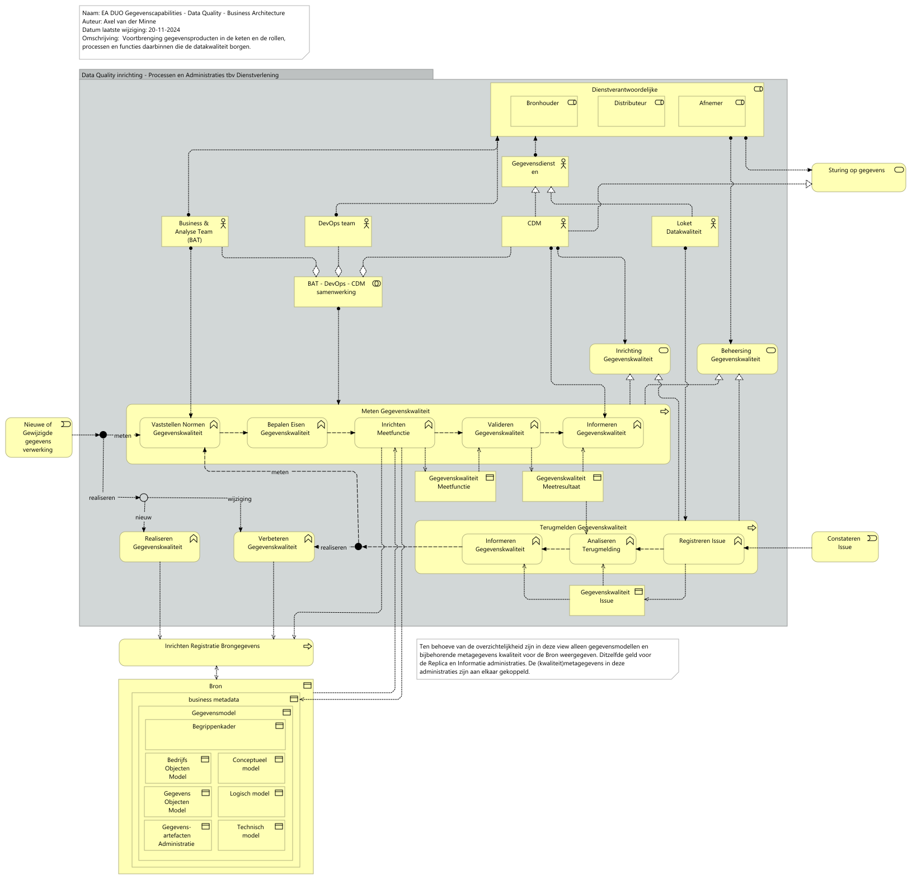
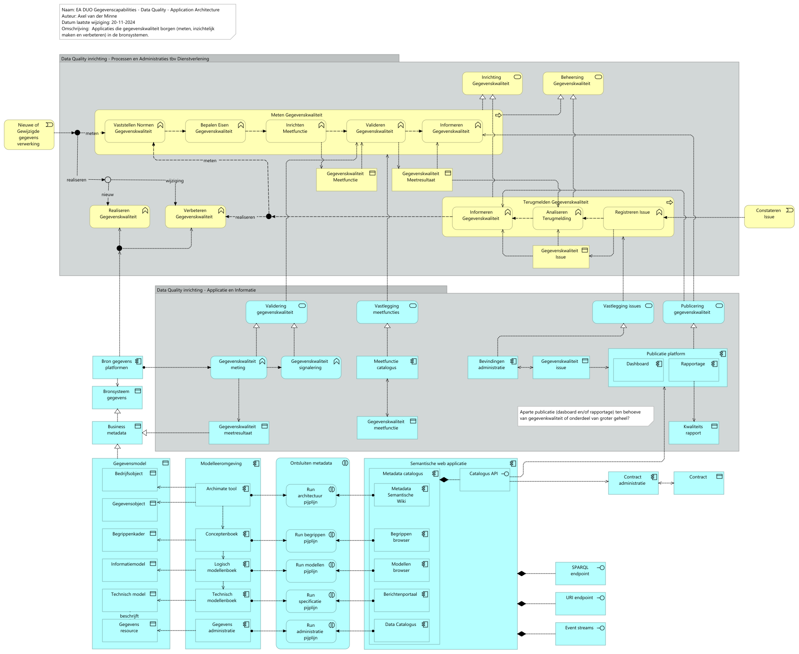

# Rapportage capability Data Quality

Report generated at: 2024-12-02  11:14:19

---
## Inhoudsopgave

* [Rapportage Data Quality inrichting](#rapportage-data-quality-inrichting)
  * [Rapportage Data Quality inrichting - Business Architecture](#rapportage-data-quality-inrichting--business-architecture)
    * [EA DUO Gegevenscapabilities - Data Quality - Business Architecture](#ea-duo-gegevenscapabilities--data-quality--business-architecture)
  * [Rapportage Data Quality inrichting - Application Architecture](#rapportage-data-quality-inrichting--application-architecture)
    * [EA DUO Gegevenscapabilities - Data Quality - Application Architecture](#ea-duo-gegevenscapabilities--data-quality--application-architecture)

---

## Rapportage Data Quality inrichting

### Rapportage Data Quality inrichting - Business Architecture

De review betreft de elementen gegroepeerd in 'Data Quality inrichting - Processen en Administraties tbv Dienstverlening' en de relaties tussen deze elementen en met elementen daaromheen uit de aspectarchitectuur gegegevens.

Deze view en element zijn eerder gereviewd en besproken als onderdeel van '2024-10-21 Rapport Capabilities', hier de vraag aan reviewers om te beoordelen of hun commentaar correct is verwerkt.

Vraag aan reviewers DataOffice: wat doen we met bestaande elementen (uit de main branch) waarop reviewcommentaar komt (zoals de rollen bronhouder en afnemer) **en** hergebruikte onderdelen uit ontwikkel die nog niet definitief zijn.
#### EA DUO Gegevenscapabilities - Data Quality - Business Architecture

Tijdelijke kopie tekst tbv review (bug properties rapportage script)

DUO kent verschillende vormen van dienstverlening waarbij gegevens verwerkt worden. Gegevens ingewonnen voor uitvoeren van een primaire taak, zoals toekennen studiefinanciering, worden ook gebruikt voor het leveren van informatie aan het ministerie ten behoeve van het ontwikkelen van beleid. 

Gegevensverwerking door DUO is onderdeel van een keten die begint voordat de uitvoeringstaak van DUO begint (bijvoorbeeld bij onderwijsinstellingen) en ook vaak buiten DUO eindigt (bij bijvoorbeeld het ministerie van OCW of de Onderwijsraden).

Het beheersen en verbeteren van gegevenskwaliteit is een gezamenlijke verantwoordelijkheid van partijen binnen de keten. Binnen DUO is deze keten onder te verdelen in 3 stukken met elk een eigen verantwoordelijkheid:
-	Primaire dienstverlening – verwerken gegevens binnen verschillende bronnen
-	Gegevensdistributie – verwerken gegevens ten behoeve van distributie van gegevens
-	Afnemer – verwerken gegevens ten behoeve van het verstrekken van informatie

Elke partij binnen deze keten kent een eigen toepassing van de gegevens en heeft daarbij een eigen behoefte ten aanzien van de kwaliteit van die gegevens (Fit for Purpose). Maatregelen om de gegevenskwaliteit te realiseren, inzichtelijk en meetbaar te maken en daarover te communiceren worden op meerdere plekken in deze keten ingericht.

>**NB**: Ten behoeve van de overzichtelijkheid zijn in deze view alleen gegevensmodellen en bijbehorende metagegevens kwaliteit voor de Bron weergegeven. Ditzelfde geld voor de Replica en Informatie administraties. De (kwaliteit)metagegevens in deze administraties zijn aan elkaar gekoppeld.

De capability Data Quality inrichting ondersteunt deze dienstverlening door middel van 2 services:
- Het inrichten van gegevenskwaliteit bij nieuwe of gewijzigde dienstverlening 
- Het beheersen van gegevenskwaliteit tijdens de dagelijkse operatie 

Binnen de capability Data Quality inrichting zijn 3 processen te herkennen: 
1.	Het inrichten van maatregelen om gegevenskwaliteit te realiseren en te verbeteren [^1]
2.	Het inrichten van maatregelen om gegevenskwaliteit te inzichtelijk en meetbaar te maken
3.	inrichten maatregelen om, aan de hand van terugkoppeling uit de keten, gegevenskwaliteit te verbeteren  en/of beter inzichtelijk te maken

[^1] Weergegeven als functies binnen processen t.b.v. het inrichten van diensten en systemen.

Op deze ketenprocessen zijn de verschillende maatregelen geplot die een rol spelen in het meten en verbeteren van gegevenskwaliteit. Hierbij ligt de nadruk op het voortbrengingsproces (i.t.t. beheer)  omdat daar maatregelen gerealiseerd worden (en daarmee onderdeel worden van de inrichting), welke (zoals kwaliteitsmetingen) weer gebruikt worden in de operatie. 

In principe maak het qua aanpak niet uit of het interne of externe partijen in de keten betreft. In het geval van externe partijen zullen (contractuele) afspraken gemaakt worden over de relevante eisen en normen ten aanzien van gegevenskwaliteit en de manier waarop invulling gegevens wordt aan de capability. Hierbij kan gedacht worden aan standaarden in taal en protocollen.

**Realiseren gegevenskwaliteit** 
In eerste instantie wordt gegevenskwaliteit gerealiseerd als onderdeel van het ontwikkelen van een nieuwe dienst of systeem. Hierbij gaat de aandacht niet alleen naar de kwaliteit die nodig is ten behoeve van de fit for purpose van de eigen dienst, maar worden ook requirements van andere partijen uit de keten, voor zover op dat moment bekend, meegenomen. 

Dit zal voornamelijk een rol spelen bij inrichten van gegevensregistratie voor een bepaalde bron, maar ook bij het creëren van nieuwe gegevens (door middel van samenvoegen, verrijken of transformaties) bij gegevensdistributie of informatieverstrekking. Daarnaast wordt kwaliteit van gegevens niet alleen bepaald door de gegevens zelf maar ook door de metagegevens die die gegevens beschrijven, bijvoorbeeld in de vorm van gegevensmodellen. Deze metagegevens geven inzicht in de betekenis en de toepasbaarheid van de gegevens.

**Meten gegevenskwaliteit**
Om gegevenskwaliteit op een transparante, objectieve en uniforme manier inzichtelijk te maken en daarover te communiceren zullen meetfuncties ingericht moeten worden. Hierbij worden verschillende aspecten van gegevens gemeten worden en gevalideerd tegen een vastgestelde norm. 

De meetfuncties die we binnen DUO inrichten beschrijven we op een uniforme manier. De resultaten uit de uitgevoerde validaties registreren we daar waar mogelijk centraal, zodat we hierover makkelijk kunnen communiceren binnen de keten. 

Valideren vindt in principe plaats daar waar gegevens ontstaan of waar een bepaalde samenhang tussen gegevens ontstaat. Indien dat niet mogelijk is kan validatie op een andere plek in de keten ingericht worden.

**Terugmelden gegevenskwaliteit**
Het proces terugmelden beschrijft het melden van issues ten aanzien van de kwaliteit van gegevens aan partijen die eerder in de keten een rol hebben tot aan de interne of zelfs externe bronhouder. Een issue kan hier ook een vermoeden van een kwaliteitsissue betekenen. In dat geval ligt het voor de hand om eerst een meetfunctie met bijbehorende validatie in te richten om het issue aantoonbaar en/of kwantificeerbaar te maken.

Kwaliteitsissues die we binnen DUO constateren beschrijven we op een uniforme manier. De issues registreren we daar waar mogelijk centraal, zodat we hierover makkelijk kunnen communiceren binnen de keten. 

**Actoren, rollen en samenwerking**
De capability Gegevenskwaliteit inrichten vraag om veel verschillende kennis en capaciteit die nu belegd is bij verschillende organisatieonderdelen die elk weer een eigen verantwoordelijkheid en mandaat (lees: recht om te verwerken) kennen. Hierdoor vraagt gegevenskwaliteit om inzet en samenwerking tussen verschillende afdelingen, teams en disciplines.
<figure align="center">
  
  <figcaption><i>EA DUO Gegevenscapabilities - Data Quality - Business Architecture</i></figcaption>
</figure>

<table>
  <thead>
    <tr>
      <th colspan="4" width="20%">Element</th>
      <th rowspan="2" width="40%">Definitie</th>
      <th rowspan="2" width="40%">Omschrijving</th>
    </tr>
  </thead>
  <tbody>
    <tr><td></td><td></td><td></td><td></td><td></td></tr>
    <tr valign="top")>
      <td colspan="4">Data Quality inrichting - Processen en Administraties tbv Dienstverlening 
(diagram-model-group)</td>
      <td></td>
    </tr>
    <tr valign="top")>
      <td colspan="1"></td>
      <td colspan="3">Inrichting Gegevenskwaliteit 
(business-service)</td>
      <td>
Inrichten van validatie functies waarmee Datakwaliteit op een eenduidige manier gemeten, gemonitord en inzichtelijk gemaakt kan worden, zodat hierover gecommuniceerd kan worden in de keten.

Onder deze inricht valt ook het bewaken van de effectiviteit van de gekozen inrichting en de signalering van issues en wensen naar inhoudelijke en verantwoordelijke afdelingen en rollen.
</td>
    </tr>
    <tr valign="top")>
      <td colspan="1"></td>
      <td colspan="3">Beheersing Gegevenskwaliteit 
(business-service)</td>
      <td>
Uitvoeren van maatregelen om kwaliteit van gegevens inzichtelijk te maken en te verbeteren.
</td>
    </tr>
    <tr valign="top")>
      <td colspan="1"></td>
      <td colspan="3">Meten Gegevenskwaliteit 
(business-process)</td>
      <td>
Meten Gegevenskwaliteit betreft het geheel aan activiteiten dat uitgevoerd moet worden om de kwaliteit van gegevens te definieren, te valideren en te communiceren.
</td>
    </tr>
    <tr valign="top")>
      <td colspan="2"></td>
      <td colspan="2">Vaststellen Normen Gegevenskwaliteit 
(business-function)</td>
      <td>
Stel vast welke normen gesteld moeten worden waaraan de datakwaliteit, gedefinieerd a.d.h.v. kwaliteitsdimensiens en attributen en meetbaar gemaakt mbv meetinstructie, moet voldoen om te voldoen aan 'Fit for Purpose'

Normen worden vastgesteld of bijgesteld op verzoek van alle partijen in de voortbrengingsketen.

Normen kunnen geformaliseerd worden als kpi en vastgelegd in een contract.
</td>
    </tr>
    <tr valign="top")>
      <td colspan="2"></td>
      <td colspan="2">Bepalen Eisen Gegevenskwaliteit 
(business-function)</td>
      <td>
Bepaal welke kwaliteitsdimensie en attribuut relevant zijn voor de gevraagde dienstverlening. Wat is 'Fit for Purpose'? 

Kwaliteitsdimensies en attributen worden vastgesteld of bijgesteld op verzoek van alle partijen in de voortbrengingsketen
</td>
    </tr>
    <tr valign="top")>
      <td colspan="2"></td>
      <td colspan="2">Inrichten Meetfunctie 
(business-function)</td>
      <td>
Richt meetfunctie in voor een bepaalde  kwaliteitsdimensie en attribuut, zodat daarover gecommuniceerd kan worden in de keten.

Een meetfunctie kan betrekking hebben op een dataset, een gegevensobject of een specifieke waarde.

Hierbij worden gegevens, metagegevens, modellen of een combinatie hiervan gebruikt.

Een meetfunctie kent een procedure waarmee deze functie wordt uitgevoerd.  Meetfucties zullen vaak beschreven worden in de vorm van een (logische) regel, maar kan ook de vorm van een statische toets (profiling)  uitgevoerd worden.

Daarnaast kan toetsing handmatig/steekproefsgewijs plaatsvinden.
</td>
    </tr>
    <tr valign="top")>
      <td colspan="2"></td>
      <td colspan="2">Valideren Gegevenskwaliteit 
(business-function)</td>
      <td>
Valideren  beschrijft het periodiek toetsen van datakwaliteit van gegevens.

De uit te voeren validaties zijn vastgelegd in de vorm van meetfuncties.

Valideren vindt in principe plaats daar waar gegevens ontstaan of waar een bepaalde samenhang tussen gegevens ontstaat. Indien dat niet mogelijk is kan validatie op een andere plek in de keten plaatsvinden.
</td>
    </tr>
    <tr valign="top")>
      <td colspan="2"></td>
      <td colspan="2">Informeren Gegevenskwaliteit 
(business-function)</td>
      <td>
Partners in de keten worden geinformeerd over de kwaliteit van de data in de keten. 

Dit kan gaan over de kwaliteit van een specifiek product (in de vorm van metagegevens), de kwaliteit van gegevens uit bepaalde bronnen en de gevonden afwijkingen (in de vorm van dashboard of rapportage) of de activiteiten die ondernomen zijn om kwaliteit te verbeteren (in de vorm van rapportage).

Deze communcatie kan Machine-to-Machine (M2M) zijn (in de vorm van metadata) of richting mensen (in de vorm van rapportage of dashboard).
</td>
    </tr>
    <tr valign="top")>
      <td colspan="1"></td>
      <td colspan="3">Gegevenskwaliteit Meetfunctie 
(business-object)</td>
      <td>
Een meetfunctie is de uit te voeren toets om te bepalen of gegevens voldoen aan vastgestelde kwaliteitscriteria (1..n per kwaliteitsdimensie en attribuut).

Een meetfunctie kan gedefineerd zijn op verschillende niveau's:

<ul>
<li>dataset</li>
<li>gegevensobject</li>
<li>specifieke waarde.</li>
</ul>

Hierbij worden gegevens, metagegevens, modellen of een combinatie hiervan gebruikt uit één of meerdere bronnen.

Meetfucties zullen vaak beschreven zijn in de vorm van een (logische) regel, maar kan ook de vorm van een statische toets (profiling), die geautomatiseerd uitgevoerd wordt.

Daarnaast kan een meetfunctie handmatig/steekproefsgewijs plaatsvinden.
</td>
      <td>
Een meetfunctie is de uit te voeren toets om te bepalen of gegevens voldoen aan vastgestelde kwaliteitscriteria (1..n per kwaliteitsdimensie en attribuut).

Een meetfunctie kan gedefineerd zijn op verschillende niveau's:

<ul>
<li>dataset</li>
<li>gegevensobject</li>
<li>specifieke waarde.</li>
</ul>

Hierbij worden gegevens, metagegevens, modellen of een combinatie hiervan gebruikt uit één of meerdere bronnen.

Meetfucties zullen vaak beschreven zijn in de vorm van een (logische) regel, maar kan ook de vorm van een statische toets (profiling), die geautomatiseerd uitgevoerd wordt.

Daarnaast kan een meetfunctie handmatig/steekproefsgewijs plaatsvinden.
</td>
    </tr>
    <tr valign="top")>
      <td colspan="1"></td>
      <td colspan="3">Gegevenskwaliteit Meetresultaat 
(business-object)</td>
      <td>
Een meetresultaat is het resultaat van een meetfunctie dat aangeeft (per kwaliteitsdimensie en attribuut) in welke mate gegevens voldoen aan kwaliteitseisen en/of daaraan gerelateerde kwaliteitsregels.
</td>
      <td>
Een meetresultaat is het resultaat van een meetfunctie dat aangeeft (per kwaliteitsdimensie en attribuut) in welke mate gegevens voldoen aan kwaliteitseisen en/of daaraan gerelateerde kwaliteitsregels.
</td>
    </tr>
    <tr valign="top")>
      <td colspan="1"></td>
      <td colspan="3">Realiseren Gegevenskwaliteit 
(business-function)</td>
      <td>
Het nemen van maatregelen om de kwaliteit van data op gewenst niveau te krijgen.

Dit zal meestal integraal bij het ontwikkelen van een nieuwe dienst of systeem gedaan worden.
</td>
    </tr>
    <tr valign="top")>
      <td colspan="1"></td>
      <td colspan="3">Verbeteren Gegevenskwaliteit 
(business-function)</td>
      <td>
Het nemen van maatregelen om de kwaliteit van data voor een stakeholder in de keten te verbeteren.
</td>
    </tr>
    <tr valign="top")>
      <td colspan="1"></td>
      <td colspan="3">Terugmelden Gegevenskwaliteit 
(business-process)</td>
      <td>
Het terugmelden van issues tav van de kwaliteit van de data of het vermoeden van kwaliteitsissues.

Zo kan bijvoorbeeld het vermoeden dat gegevens niet voldoende up-to-date zijn resulteren in

<ul>
<li>het inrichten van een meetfunctie: er worden een norm (max 24 uur) en een meetfunctie gedefinieerd voor de kwaliteitsdimensie Actualiteit en Attribuut Verheid gedefinieerd  </li>
<li>een oplossing: er worden één of meerdere maatregelen genomen om de doorloopsnelheid in de voortbrengingsketen te verhogen</li>
</ul>

Een bijzondere vorm van een terugmelding is een Audit rapport
</td>
    </tr>
    <tr valign="top")>
      <td colspan="2"></td>
      <td colspan="2">Informeren Gegevenskwaliteit 
(business-function)</td>
      <td>
Partners in de keten worden geinformeerd over de kwaliteit van de data in de keten. 

Dit kan gaan over de kwaliteit van een specifiek product (in de vorm van metagegevens), de kwaliteit van gegevens uit bepaalde bronnen en de gevonden afwijkingen (in de vorm van dashboard of rapportage) of de activiteiten die ondernomen zijn om kwaliteit te verbeteren (in de vorm van rapportage).

Deze communcatie kan Machine-to-Machine (M2M) zijn (in de vorm van metadata) of richting mensen (in de vorm van rapportage of dashboard).
</td>
    </tr>
    <tr valign="top")>
      <td colspan="2"></td>
      <td colspan="2">Analiseren Terugmelding 
(business-function)</td>
      <td>
Analiseren terugmelding bepaalt welke maatregelen het meest geschikt zijn om een issue te verduidelijken, te verminderen of op te lossen.

Analyse geeft duidelijkheid in de vorm van één of meerdere oplossingsalternatieven, waar deze geimplementeerd kunnen worden en waar dit issue en bijbehorende oplossingen besproken moet worden. 
</td>
    </tr>
    <tr valign="top")>
      <td colspan="2"></td>
      <td colspan="2">Registreren Issue 
(business-function)</td>
      <td>
Het vastleggen van gemelde issues tav datakwaliteit gemeld door een van de partijen in de keten.
</td>
    </tr>
    <tr valign="top")>
      <td colspan="1"></td>
      <td colspan="3">Gegevenskwaliteit Issue 
(business-object)</td>
      <td>
Registratie van een geconstateerd issue t.a.v. datakwaliteit of het vermoeden van een issue.
</td>
      <td>
Registratie van een geconstateerd issue t.a.v. datakwaliteit of het vermoeden van een issue.
</td>
    </tr>
    <tr valign="top")>
      <td colspan="4">Dienstverantwoordelijke 
(business-role)</td>
      <td>
Diegene die verantwoordelijk is voor bepaalde afgesproken dienstverlening waarbij gegevens op een verantwoorde manier verwerkt moeten worden.  

Bronhouder, Distributeur en Afnemer, zowel binnen DUO als extern (in een keten), zijn gezamenlijk verantwoordelijk, waarbij elke rol weer specifieke taken, verantwoordelijkheden en bevoegdheden kent.
</td>
    </tr>
    <tr valign="top")>
      <td colspan="1"></td>
      <td colspan="3">Bronhouder 
(business-role)</td>
      <td>
Bron Informatiemanagement: rolbeschrijvingen gegevensmanagement 17-1-2017

Omschrijving 

De bronhouder is verantwoordelijk voor het inwinnen, actueel houden, opslaan en ter beschikking stellen van de juiste gegevens in een registratie. Onder meer naar aanleiding van ontvangen meldingen is de bronhouder verantwoordelijk voor het borgen van de kwaliteit van de gegevens.

Doel 

<pre><code>- Dubbele inwinning van bestaande bestanden voorkomen;
- Efficiënt gebruik van gegevensbestanden mogelijk maken
- Inzetten van moderne technieken;
- Werkpakketten optimaal in de keten zetten.
</code></pre>

Hoofdtaken 

<pre><code>- Ontwikkelen en beheren van de voorzieningen nodig om de gegevensmanagement taken uit te kunnen voeren;
- Assembleren van de bestanden tot een DUO dekkend geheel;
- Assembleren van de eigen objecten met die van andere bronhouders;
- Afhandelen van de meldingen van gerede twijfel volgens onderling afgesproken procedures. De bronhouder bepaalt of de twijfel aanleiding is om de dienstverlening op te schorten;
- Realiseren en bijhouden van de gegevensbestanden;
- Transitie van gesloten naar ontsloten gegevensbestanden uitvoeren;
- Aanleveren van gegevens aan afnemers;
- Inwinnen, verwerken, afhandelen en verwerken van terugmeldingen;
- Uitvoeren van kwaliteitscontroles
</code></pre>

Contact met

<pre><code>- Domeinarchitect
- Distributeur
- Gegevensmakelaar
- Afnemer
- Functionaris voor de gegevensbescherming
</code></pre>

Resultaten 

<pre><code>- Stabiele, betrouwbare, beheerde gegevensverzamelingen;
- In het geval van verrijking en toevoeging blijft de verantwoordelijkheid voor de kwaliteit van de toegevoegde gegevens bij de bronhouder van de toegevoegde gegevens;
- Gegarandeerde en vastgestelde kwaliteit van de gegevens op basis van BIR, Wbp en afgesproken service levels;
- Generalisatie, transformatie, selectie op de gegevens vinden uitsluitend plaats in overleg met de bronhouder.
</code></pre>

Competenties
</td>
    </tr>
    <tr valign="top")>
      <td colspan="1"></td>
      <td colspan="3">Distributeur 
(business-role)</td>
      <td>
Bron Informatiemanagement: rolbeschrijvingen gegevensmanagement 17-1-2017

Omschrijving 

De distributeur ontvangt gegevens van bronhouders en stuurt deze, direct of via generieke voorzieningen zoals gegevensknooppunten, door naar afnemers. De distributeur is verantwoordelijk voor de vastlegging van de feitelijke distributie van een gegeven, bijvoorbeeld ten behoeve van het werk van de auditor. 

Doel 

Het leveren van gegevens aan interne en externe afnemers conform het GLO. 

Hoofdtaken 

<pre><code>- Onderhouden van contacten  en het maken van afspraken met afnemers voor producten, diensten en incidenten;
- Beheren contracten met afnemers;
- Voorlichten over gebruiks- en terugmeld verplichtingen;
- Informatie verstrekken over de beschikbaarheid en kwaliteit van de gegevensset;
- Borgen kwaliteit proces van verstrekken van producten en diensten;
- Verstrekken van gegevens aan afnemers;
- Inlichten van de regisseur over het gebruik van gegevens uit de registraties;
- Onderhouden producten- en dienstencatalogus;
- Accepteren (functioneel) van nieuwe software en releases;
- Doorgeven wensen afnemers aan de registerbeheerder centraal en decentraal ;
- Ondersteunen afnemers
</code></pre>

Contact met

<pre><code>- Bronhouder
- Register beheerder centraal en decentraal  
- Afnemer
</code></pre>

Resultaten 

Volledig en juist en tijdig leveren van gegevens aan interne en externe afnemers.  

Competenties

De distributeur ontvangt gegevens van bronhouders en stuurt deze, direct of via generieke voorzieningen zoals gegevensknooppunten, door naar afnemers. De distributeur is verantwoordelijk voor de vastlegging van de feitelijke distributie van een gegeven, bijvoorbeeld ten behoeve van het werk van de auditor. 
</td>
    </tr>
    <tr valign="top")>
      <td colspan="1"></td>
      <td colspan="3">Afnemer 
(business-role)</td>
      <td>
Bron Informatiemanagement: rolbeschrijvingen gegevensmanagement 17-1-2017

Omschrijving
Een afnemer is een overheidsorganisatie of private partij die geautoriseerd is om gegevens van DUO af te nemen voor gebruik in de eigen processen. Afname vindt plaats via de distributeur. Bij gerede twijfel over de kwaliteit van de gegevens melden afnemers dit via de distributeur bij de bronhouder.

Doel
Het daadwerkelijk, correct gebruiken van gegevens uit de registraties van ketenpartners zodat invulling gegeven wordt aan het principe “eenmalig vastleggen, meermalen gebruiken”.

Hoofdtaken
 Het afnemen van gegevens en deze conform doelbinding aanwenden voor gebruik in de informatieverzorgende processen binnen de eigen organisatie.
 Bij de bronhouder terug melden van gerede twijfel aan de juistheid van de afgenomen gegevens.

Contact met
 Distributeur
 Functionaris voor de gegevensbescherming
 Gegevensmakelaar
 Bronhouder
 Domeinarchitect

Resultaten
Hergebruik van gegevens door deze herhaald toe te passen binnen de processen van de organisatie.

Competenties
Bij wet aangewezen organisatie die op basis van doelbinding gebruik kan maken van de specifieke gegevens die benodigd zijn om het (beleids) doel te realiseren.
</td>
    </tr>
    <tr valign="top")>
      <td colspan="4">Gegevensdiensten 
(business-actor)</td>
      <td>
Gegevensdiensten vervult de functie gegevensmanagement

Hierin worden gegevens  integraal en beheerst verwerkt binnen een organisatie, zowel op strategisch tactisch als operationeel niveau, met als doel de gewenste kwaliteit en beschikbaarheid te realiseren
(https://www.noraonline.nl/wiki/Gegevensmanagement_(begrip)#:~:text=Beschrijving%3A%20Gegevensmanagement%20betreft%20het%20integraal,kwaliteit%20en%20beschikbaarheid%20te%20realiseren.)

DUO ontleent haar afdeling Gegevensdiensten uit het 'inrichtingsvoorstel gegevensmanagement':
Het inrichtingsvoorstel ‘Gegevensmanagement’ voorziet in het vormen van een afdeling ‘gegevensmanagement’ zoals beschreven in dit document en de bijlagen. De afdeling heeft een DUO brede doelstelling en staat voor het managen van alle DUO gegevensleveringen aan zowel collega organisaties als interne gegevensafnemers (primair en secundair) uit zowel generieke registers als applicatiespecifieke gegevensverzamelingen. 
bron: Gegevensmanagement inrichtingsvoorstel eindrapport v1.0
Afdeling georganiseerd binnen
DUO - R&amp;E -SEG Services
</td>
    </tr>
    <tr valign="top")>
      <td colspan="4">Sturing op gegevens 
(business-service)</td>
      <td>
Sturing op gegevens betreft de inrichting die nodig is om effectief en efficient te kunnen sturen op gegevens gedurende de gehele gegevenslevencyclus. Sturing vindt plaats op strategisch, tactisch en operationeel niveau.
</td>
    </tr>
    <tr valign="top")>
      <td colspan="4">Business & Analyse Team (BAT) 
(business-actor)</td>
      <td>
Business &amp; Analyse Team (BAT)

Het BAT heeft één of meerdere diensten als aandachtsgebied, dit is de scope van het domein. Het BAT bepaalt WAT er nodig is om een dienst te kunnen leveren op alle aspecten van SCOMPAFIJTHE. Het ontwerpen, realiseren en beschikbaar stellen van het HOE kan in veel gevallen worden uitbesteed. Zo is de ontwikkeling en het beheer van de I en de T aspecten de verantwoordelijkheid van het DevOpsteam(s) binnen het domein. Het BAT zal zelf ook activiteiten uitvoeren voor het leveren van de dienst en hiervoor dus zelf het HOE bepalen en de ontwikkeling en beheer verzorgen (uitvoeringsverantwoordelijkheid)

In het BAT zitten in elk geval een Product Owner, één of meerdere analisten, één of meerdere functioneel beheerders en één of meerdere vertegenwoordigers vanuit het DevOpsteam(s). Het BAT is daarmee echt een team en niet alleen een overlegvorm. Het BAT kan permanent of periodiek worden uitgebreid met andere rollen als de situatie daarom vraagt. Denk bijvoorbeeld aan een medewerker uitvoering, communicatie, beleid, relatiebeheer of architectuur. Er ontstaat op die manier een BAT team geschikt voor de huidige situatie. Het is de verantwoording van BAT zelf om te zorgen dat er voor het uitvoeren van de opdracht voldoende kennis en inzicht aanwezig is. Eén van de leden van het BAT neemt de rol van Scrum Master op zich. Het BAT organiseert zijn werk zelf conform de DUO Way of Working. Ook de wijze waarop gecommuniceerd wordt met derden. Goede communicatie met vertegenwoordigers van andere partijen en de Businessmanager hoort daarbij.

Bron: DUO Way of Working
</td>
    </tr>
    <tr valign="top")>
      <td colspan="4">DevOps team 
(business-actor)</td>
      <td>
Een DevOpsteam is een multidisciplinair team verantwoordelijk voor het ontwikkelen ( Dev elopment) en beheren ( Op erations) van applicaties ondersteunend aan bedrijfsprocessen. Daar waar de business verantwoordelijk is voor het “WAT” draagt het DevOpsteam de verantwoordelijkheid voor het “HOE”. Het team organiseert zijn werk op een Agile werkwijze, is grotendeels zelforganiserend en realiseert wijzigingen met behulp van Continuous Delivery. De prioriteit van de werkzaamheden van het DevOpsteam worden bepaald op basis van een backlog die door een Product Owner wordt gemanaged. Voor meer achtergrond, bekijk hier een checklist van de belangrijkste zaken die een DevOpsteam op orde moet hebben en hier een document met diverse criteria voor high performance DevOpsteams.

Bron: DUO Way of Working
</td>
    </tr>
    <tr valign="top")>
      <td colspan="4">CDM 
(business-actor)</td>
      <td>
Centraal Data Management (CDM)  ondersteunt DUO met kennis en hulpmiddelen waarmee DUO invulling kan geven aan de gestelde eisen aan begrippenkaders,  gegevensmodellen, metagegevens en datakwaliteit.

Hierbij is de afdeling verantwoordelijk voor het functioneel beheren van metagegevens waaronder gegevenswoordenboek en  gegevensmodellen. 

Het CDM  was voorheen het CMDA (en daarvoor Schakelpunt OCW) en daarmee tevens verantwoordelijk voor het toepassen van overheids- en onderwijsstandaarden binnen DUO.

Daarnaast beheert het serviceteam  de kennis die nodig is om datakwaliteit DUO breed te kunnen bewaken. 

Hiervoor bouwt het team kennis op over:

<ul>
<li>behoeften en wensen t.a.v. beheren datakwaliteit.</li>
<li>de hiervoor beschikbare methoden, technieken en middelen.</li>
<li>diensten die hiervoor beschikbaar zijn (binnen dit team of elders)</li>
<li>te maken afspraken binnen DUO en tussen DUO en ketenpartners t.a.v. datakwaliteit</li>
</ul></td>
    </tr>
    <tr valign="top")>
      <td colspan="4">Loket Datakwaliteit 
(business-actor)</td>
      <td>
Loket Datakwaliteit verzorgt het administreren en communiceren van  meldingen issues gegevenskwaliteit
</td>
    </tr>
    <tr valign="top")>
      <td colspan="4">BAT - DevOps - CDM samenwerking 
(business-collaboration)</td>
      <td></td>
    </tr>
    <tr valign="top")>
      <td colspan="4">Nieuwe of Gewijzigde gegevens verwerking 
(business-event)</td>
      <td></td>
    </tr>
    <tr valign="top")>
      <td colspan="4">Constateren Issue 
(business-event)</td>
      <td></td>
    </tr>
    <tr valign="top")>
      <td colspan="4">Inrichten Registratie Brongegevens 
(business-process)</td>
      <td>
Inrichten Registratie Brongegevens beschrijft het geheel aan activiteiten dat nodig is om gegevens en bijbehorende metagegevens vast te leggen ten behoeve van die bron. 
</td>
    </tr>
    <tr valign="top")>
      <td colspan="4">Bron 
(business-object)</td>
      <td>
Een bron bevat alle gegevens die nodig zijn voor de uitvoer van een wettelijke taak
</td>
    </tr>
    <tr valign="top")>
      <td colspan="1"></td>
      <td colspan="3">business metadata 
(business-object)</td>
      <td>
Zie properties
</td>
      <td>
Business metadata focust grotendeels op inhoud en conditie van data. Zie DMBOK voor voorbeelden. Business metadata is gescheiden van operational and technical metadata en ontstaat in belangrijke mate tijdens de modelmatiege ontwikkeling van gegevens.
</td>
    </tr>
    <tr valign="top")>
      <td colspan="2"></td>
      <td colspan="2">Gegevensmodel 
(business-object)</td>
      <td>
betreft de realisatie van de gegevensmodellencyclus: Conceptueel, Logisch en Technisch model
</td>
    </tr>
    <tr valign="top")>
      <td colspan="3"></td>
      <td colspan="1">Begrippenkader 
(business-object)</td>
      <td>
Zie properties
</td>
      <td>
Het DUO-begrippenkader bevat de uniforme definities van de gehanteerde begrippen (termen en betekenis) binnen DUO en hun relaties tot elkaar in een bepaalde context. 
</td>
    </tr>
    <tr valign="top")>
      <td colspan="3"></td>
      <td colspan="1">Bedrijfs Objecten Model 
(business-object)</td>
      <td>
Een bedrijfsobject (BO) is een passief architectuurelement dat vanuit bedrijfsperspectief relevantie heeft (definitie Archimate). Het is conceptueel van aard, dat wil zeggen, bedrijfsobjecten zijn er om dingen waarover gegevens worden verwerkt (opgeslagen, geraadpleegd e.d) te identificeren en te definiëren. Onderdeel van de enterprise-architectuur van DUO is een bedrijfsobjectenmodel (BOM) waarin alle bedrijfsobjecten worden verzameld en zo nodig generiek gemaakt.

Bron: 20211019 Kader gegevensontwikkeling en beheer v1.0
</td>
    </tr>
    <tr valign="top")>
      <td colspan="3"></td>
      <td colspan="1">Conceptueel model 
(business-object)</td>
      <td>
Zie properties
</td>
      <td>
Een conceptueel model is een modellering van de werkelijkheid binnen het beschouwde domein, voor wat betreft informatie en communicatie. Het is onafhankelijk van ontwerp van en implementatie in systemen.
</td>
    </tr>
    <tr valign="top")>
      <td colspan="3"></td>
      <td colspan="1">Gegevens Objecten Model 
(business-object)</td>
      <td>
Een gegevensobject (GO) is een passief element uit de toepassingsarchitectuur (naar Archimate). Er kan een één-op-één relatie zijn tussen bedrijfsobject en gegevensobject en ze kunnen dezelfde naam hebben, maar dat is geen opgelegde regel. Onderdeel van de enterprise-architectuur van DUO is een gegevensobjectenmodel (GOM) waarin alle bedrijfsobjecten worden verzameld en zo nodig generiek gemaakt.
Een gegevensobject hoort bij een organisatieonderdeel met specifieke verantwoordelijkheden op het gebied van gegevens, zoals:
• het maken van afspraken met ketenpartners over inwinning en levering
• het bewaken van de gegevenskwaliteit
• volgen van compliancyregels volgend uit AVG, BIO en Archiefwet
• het volledig, juist en actueel metadateren van de gegevens.
Bij een gegevensobject hoort een logisch model dat de structuur en gegevensgerelateerde bedrijfsregels beschrijft als implementatieonafhankelijke basis voor gegevens in opslag en gegevens op reis.

Bron: 20211019 Kader gegevensontwikkeling en beheer v1.0
</td>
    </tr>
    <tr valign="top")>
      <td colspan="3"></td>
      <td colspan="1">Logisch model 
(business-object)</td>
      <td>
Zie properties
</td>
      <td>
Een logisch model is een implementatie-onafhankelijke representatie van gegevens over de werkelijkheid in digitale registraties en in de uitwisseling daartussen.
</td>
    </tr>
    <tr valign="top")>
      <td colspan="3"></td>
      <td colspan="1">Gegevens-artefacten Administratie 
(business-object)</td>
      <td>
Een gegevensartefact is een architectuurelement dat de representatie is van een gegevensbron of een gegevensuitwisseling (Archimate). Gegevensartefacten zijn de realisatie van één of meer gegevensobjecten. Een sluitende administratie van de gegevensartefacten is een waardevol instrument:
• Het maakt op afroep inzichtelijk waar de gegevens DUO zich bevinden en wanneer daar iets mee gebeurt.
• Voor life-cycle management en gegevenshygiëne. Artefacten ontstaan, veranderen in de loop der tijd en verdwijnen weer.
• Inzicht in het kopieergedrag van de organisatie. Als er een kopie wordt gemaakt, zelfs al is die kopie exact hetzelfde, ontstaat er een ander artefact.
• Om te laten zien dat DUO compliant is aan uitvoeringsregels en leveringsafspraken.
De volledige, juiste en actuele administratie van artefacten is sluitstuk van de definition of done van elke veranderactiviteit met gegevens. De gegevensverantwoordelijke wordt daarbij ondersteund door gespecialiseerde data-administrators.

Bron: 20211019 Kader gegevensontwikkeling en beheer v1.0
</td>
    </tr>
    <tr valign="top")>
      <td colspan="3"></td>
      <td colspan="1">Technisch model 
(business-object)</td>
      <td>
Zie properties
</td>
      <td>
Een technische model is een specificatie van de structuur en eigenschappen van de technologie waarin de informatie wordt vastgelegd of uitgewisseld. Dit is sterk afhankelijk van de gebruikte opslagtechnologie zoals een specifieke database of de servicetechnologie zoals XML, GML, SOAP, REST, (Geo)JSON, LinkedData e.d.
</td>
    </tr>
  </tbody>
</table>

### Rapportage Data Quality inrichting - Application Architecture

De review betreft de elementen gegroepeerd in 'Data Quality inrichting - Applicatie en Informatie' en de relaties tussen deze elementen en met elementen daaromheen uit de business- en applicatiearchitectuur aspectarchitectuur gegegevens.
#### EA DUO Gegevenscapabilities - Data Quality - Application Architecture

Tijdelijke kopie tekst tbv review (bug properties rapportage script)

Applicaties die gegevenskwaliteit borgen (meten, inzichtelijk maken en verbeteren) in de bronsystemen.

>**NB**: Deze view is uitgewerkt voor de bronsystemen, de uitwerking voor het distributie- en informatie platform is vergelijkbaar. 

Vanuit de applicaties wordt de dienstverlening om kwaliteit van gegevens ondersteund door services, te weten:
•	*Validering gegevenskwaliteit*
•	*Vastlegging meetfuncties*
•	*Vastlegging issues*
•	*Publicering gegevenskwaliteit*

Naast specifieke elementen maakt de capability *Data Quality inrichting* gebruik van de applicaties die ingericht zijn ten behoeve van Metagegevens voor het vastleggen en publiceren van gegevenskwaliteit.

**Validering gegevenskwaliteit**
De service *Validering gegevenskwaliteit* biedt ondersteuning bij het realiseren van gegevenskwaliteit metingen, het vastleggen van de resultaten en het doorgeven van die resultaten. 

*Gegevenskwaliteit meting* (tegen vastgestelde norm) wordt uitgevoerd door de applicatie waar gegevens verwerkt worden, dit kunnen meerdere omgevingen (binnen bronnen, replica of afnemer)  zijn.  De meting wordt volgens een afgesproken frequentie uitgevoerd. Indien gewenst kunnen afwijkingen direct gesignaleerd worden naar een beherende partij.  

De *Gegevenskwaliteit meetresultaten* worden geadministreerd als business metagegevens bij een bepaalde waarde, object of gegevensset en zijn hiermee integraal onderdeel van de (meta)gegevens van die bron en worden conform capability architectuur metagegevens beheerd en ontsloten.

**Vastlegging meetfuncties**
De service *Vastlegging meetfuncties* biedt ondersteuning bij het administreren van de verschillende meetfuncties gegevenskwaliteit en de plek waar deze geïmplementeerd zijn.

De meetfuncties die ingericht zijn voor DUO en de applicaties waarbinnen deze ingericht zijn worden beheerd in een *Meetfunctie catalogus*.

**Vastlegging issues**
De service *Vastlegging issues* biedt ondersteuning bij het administreren van issues t.a.v. gegevenskwaliteit en de afhandelen van die issues.

Issues tav gegevenskwaliteit worden geregistreerd in een *Bevindingen administratie*. 

**Publicering gegevenskwaliteit**
De service *Publicering gegevenskwaliteit* biedt ondersteuning bij het publiceren van resultaten uit de verschillende meetfuncties gegevenskwaliteit en de (afhandeling van de) geconstateerde issues.

De (normen en) resultaten van de validaties, zoals vastgelegd in de vorm van metagegevens, kunnen op verschillende manieren gepubliceerd worden:
*Dashboard*: Publicatie van gegevenskwaliteit in de vorm van een online te raadplegen applicatie.
*Rapportage*: Publicatie van gegevenskwaliteit in de vorm van beschikbaar gestelde rapportages.

Naast de resultaten worden stakeholders ook geïnformeerd over de gemelde bevindingen en afhandeling daarvan.

**Gegevenskwaliteit (in) contracten**
Gegevenskwaliteit kan op 2 manieren onderdeel vormen van de contractadministratie:
•	Om te toetsen of de gemeten resultaten uit de validatie voldoen aan de vastgelegde normen (kpi's), vergelijkbaar met de signaleringsfunctie.
•	Om inzicht te geven in welke contracten expliciet afspraken zijn gemaakt tav gegevenskwaliteit (dekkingsgraad).
<figure align="center">
  
  <figcaption><i>EA DUO Gegevenscapabilities - Data Quality - Application Architecture</i></figcaption>
</figure>

<table>
  <thead>
    <tr>
      <th colspan="3" width="20%">Element</th>
      <th rowspan="2" width="40%">Definitie</th>
      <th rowspan="2" width="40%">Omschrijving</th>
    </tr>
  </thead>
  <tbody>
    <tr><td></td><td></td><td></td><td></td></tr>
    <tr valign="top")>
      <td colspan="3">Nieuwe of Gewijzigde gegevens verwerking 
(business-event)</td>
      <td></td>
    </tr>
    <tr valign="top")>
      <td colspan="3">Data Quality inrichting - Processen en Administraties tbv Dienstverlening 
(diagram-model-group)</td>
      <td></td>
    </tr>
    <tr valign="top")>
      <td colspan="1"></td>
      <td colspan="2">Inrichting Gegevenskwaliteit 
(business-service)</td>
      <td>
Inrichten van validatie functies waarmee Datakwaliteit op een eenduidige manier gemeten, gemonitord en inzichtelijk gemaakt kan worden, zodat hierover gecommuniceerd kan worden in de keten.

Onder deze inricht valt ook het bewaken van de effectiviteit van de gekozen inrichting en de signalering van issues en wensen naar inhoudelijke en verantwoordelijke afdelingen en rollen.
</td>
    </tr>
    <tr valign="top")>
      <td colspan="1"></td>
      <td colspan="2">Beheersing Gegevenskwaliteit 
(business-service)</td>
      <td>
Uitvoeren van maatregelen om kwaliteit van gegevens inzichtelijk te maken en te verbeteren.
</td>
    </tr>
    <tr valign="top")>
      <td colspan="1"></td>
      <td colspan="2">Meten Gegevenskwaliteit 
(business-process)</td>
      <td>
Meten Gegevenskwaliteit betreft het geheel aan activiteiten dat uitgevoerd moet worden om de kwaliteit van gegevens te definieren, te valideren en te communiceren.
</td>
    </tr>
    <tr valign="top")>
      <td colspan="2"></td>
      <td colspan="1">Vaststellen Normen Gegevenskwaliteit 
(business-function)</td>
      <td>
Stel vast welke normen gesteld moeten worden waaraan de datakwaliteit, gedefinieerd a.d.h.v. kwaliteitsdimensiens en attributen en meetbaar gemaakt mbv meetinstructie, moet voldoen om te voldoen aan 'Fit for Purpose'

Normen worden vastgesteld of bijgesteld op verzoek van alle partijen in de voortbrengingsketen.

Normen kunnen geformaliseerd worden als kpi en vastgelegd in een contract.
</td>
    </tr>
    <tr valign="top")>
      <td colspan="2"></td>
      <td colspan="1">Bepalen Eisen Gegevenskwaliteit 
(business-function)</td>
      <td>
Bepaal welke kwaliteitsdimensie en attribuut relevant zijn voor de gevraagde dienstverlening. Wat is 'Fit for Purpose'? 

Kwaliteitsdimensies en attributen worden vastgesteld of bijgesteld op verzoek van alle partijen in de voortbrengingsketen
</td>
    </tr>
    <tr valign="top")>
      <td colspan="2"></td>
      <td colspan="1">Inrichten Meetfunctie 
(business-function)</td>
      <td>
Richt meetfunctie in voor een bepaalde  kwaliteitsdimensie en attribuut, zodat daarover gecommuniceerd kan worden in de keten.

Een meetfunctie kan betrekking hebben op een dataset, een gegevensobject of een specifieke waarde.

Hierbij worden gegevens, metagegevens, modellen of een combinatie hiervan gebruikt.

Een meetfunctie kent een procedure waarmee deze functie wordt uitgevoerd.  Meetfucties zullen vaak beschreven worden in de vorm van een (logische) regel, maar kan ook de vorm van een statische toets (profiling)  uitgevoerd worden.

Daarnaast kan toetsing handmatig/steekproefsgewijs plaatsvinden.
</td>
    </tr>
    <tr valign="top")>
      <td colspan="2"></td>
      <td colspan="1">Valideren Gegevenskwaliteit 
(business-function)</td>
      <td>
Valideren  beschrijft het periodiek toetsen van datakwaliteit van gegevens.

De uit te voeren validaties zijn vastgelegd in de vorm van meetfuncties.

Valideren vindt in principe plaats daar waar gegevens ontstaan of waar een bepaalde samenhang tussen gegevens ontstaat. Indien dat niet mogelijk is kan validatie op een andere plek in de keten plaatsvinden.
</td>
    </tr>
    <tr valign="top")>
      <td colspan="2"></td>
      <td colspan="1">Informeren Gegevenskwaliteit 
(business-function)</td>
      <td>
Partners in de keten worden geinformeerd over de kwaliteit van de data in de keten. 

Dit kan gaan over de kwaliteit van een specifiek product (in de vorm van metagegevens), de kwaliteit van gegevens uit bepaalde bronnen en de gevonden afwijkingen (in de vorm van dashboard of rapportage) of de activiteiten die ondernomen zijn om kwaliteit te verbeteren (in de vorm van rapportage).

Deze communcatie kan Machine-to-Machine (M2M) zijn (in de vorm van metadata) of richting mensen (in de vorm van rapportage of dashboard).
</td>
    </tr>
    <tr valign="top")>
      <td colspan="1"></td>
      <td colspan="2">Gegevenskwaliteit Meetfunctie 
(business-object)</td>
      <td>
Een meetfunctie is de uit te voeren toets om te bepalen of gegevens voldoen aan vastgestelde kwaliteitscriteria (1..n per kwaliteitsdimensie en attribuut).

Een meetfunctie kan gedefineerd zijn op verschillende niveau's:

<ul>
<li>dataset</li>
<li>gegevensobject</li>
<li>specifieke waarde.</li>
</ul>

Hierbij worden gegevens, metagegevens, modellen of een combinatie hiervan gebruikt uit één of meerdere bronnen.

Meetfucties zullen vaak beschreven zijn in de vorm van een (logische) regel, maar kan ook de vorm van een statische toets (profiling), die geautomatiseerd uitgevoerd wordt.

Daarnaast kan een meetfunctie handmatig/steekproefsgewijs plaatsvinden.
</td>
      <td>
Een meetfunctie is de uit te voeren toets om te bepalen of gegevens voldoen aan vastgestelde kwaliteitscriteria (1..n per kwaliteitsdimensie en attribuut).

Een meetfunctie kan gedefineerd zijn op verschillende niveau's:

<ul>
<li>dataset</li>
<li>gegevensobject</li>
<li>specifieke waarde.</li>
</ul>

Hierbij worden gegevens, metagegevens, modellen of een combinatie hiervan gebruikt uit één of meerdere bronnen.

Meetfucties zullen vaak beschreven zijn in de vorm van een (logische) regel, maar kan ook de vorm van een statische toets (profiling), die geautomatiseerd uitgevoerd wordt.

Daarnaast kan een meetfunctie handmatig/steekproefsgewijs plaatsvinden.
</td>
    </tr>
    <tr valign="top")>
      <td colspan="1"></td>
      <td colspan="2">Gegevenskwaliteit Meetresultaat 
(business-object)</td>
      <td>
Een meetresultaat is het resultaat van een meetfunctie dat aangeeft (per kwaliteitsdimensie en attribuut) in welke mate gegevens voldoen aan kwaliteitseisen en/of daaraan gerelateerde kwaliteitsregels.
</td>
      <td>
Een meetresultaat is het resultaat van een meetfunctie dat aangeeft (per kwaliteitsdimensie en attribuut) in welke mate gegevens voldoen aan kwaliteitseisen en/of daaraan gerelateerde kwaliteitsregels.
</td>
    </tr>
    <tr valign="top")>
      <td colspan="1"></td>
      <td colspan="2">Realiseren Gegevenskwaliteit 
(business-function)</td>
      <td>
Het nemen van maatregelen om de kwaliteit van data op gewenst niveau te krijgen.

Dit zal meestal integraal bij het ontwikkelen van een nieuwe dienst of systeem gedaan worden.
</td>
    </tr>
    <tr valign="top")>
      <td colspan="1"></td>
      <td colspan="2">Verbeteren Gegevenskwaliteit 
(business-function)</td>
      <td>
Het nemen van maatregelen om de kwaliteit van data voor een stakeholder in de keten te verbeteren.
</td>
    </tr>
    <tr valign="top")>
      <td colspan="1"></td>
      <td colspan="2">Terugmelden Gegevenskwaliteit 
(business-process)</td>
      <td>
Het terugmelden van issues tav van de kwaliteit van de data of het vermoeden van kwaliteitsissues.

Zo kan bijvoorbeeld het vermoeden dat gegevens niet voldoende up-to-date zijn resulteren in

<ul>
<li>het inrichten van een meetfunctie: er worden een norm (max 24 uur) en een meetfunctie gedefinieerd voor de kwaliteitsdimensie Actualiteit en Attribuut Verheid gedefinieerd  </li>
<li>een oplossing: er worden één of meerdere maatregelen genomen om de doorloopsnelheid in de voortbrengingsketen te verhogen</li>
</ul>

Een bijzondere vorm van een terugmelding is een Audit rapport
</td>
    </tr>
    <tr valign="top")>
      <td colspan="2"></td>
      <td colspan="1">Informeren Gegevenskwaliteit 
(business-function)</td>
      <td>
Partners in de keten worden geinformeerd over de kwaliteit van de data in de keten. 

Dit kan gaan over de kwaliteit van een specifiek product (in de vorm van metagegevens), de kwaliteit van gegevens uit bepaalde bronnen en de gevonden afwijkingen (in de vorm van dashboard of rapportage) of de activiteiten die ondernomen zijn om kwaliteit te verbeteren (in de vorm van rapportage).

Deze communcatie kan Machine-to-Machine (M2M) zijn (in de vorm van metadata) of richting mensen (in de vorm van rapportage of dashboard).
</td>
    </tr>
    <tr valign="top")>
      <td colspan="2"></td>
      <td colspan="1">Analiseren Terugmelding 
(business-function)</td>
      <td>
Analiseren terugmelding bepaalt welke maatregelen het meest geschikt zijn om een issue te verduidelijken, te verminderen of op te lossen.

Analyse geeft duidelijkheid in de vorm van één of meerdere oplossingsalternatieven, waar deze geimplementeerd kunnen worden en waar dit issue en bijbehorende oplossingen besproken moet worden. 
</td>
    </tr>
    <tr valign="top")>
      <td colspan="2"></td>
      <td colspan="1">Registreren Issue 
(business-function)</td>
      <td>
Het vastleggen van gemelde issues tav datakwaliteit gemeld door een van de partijen in de keten.
</td>
    </tr>
    <tr valign="top")>
      <td colspan="1"></td>
      <td colspan="2">Gegevenskwaliteit Issue 
(business-object)</td>
      <td>
Registratie van een geconstateerd issue t.a.v. datakwaliteit of het vermoeden van een issue.
</td>
      <td>
Registratie van een geconstateerd issue t.a.v. datakwaliteit of het vermoeden van een issue.
</td>
    </tr>
    <tr valign="top")>
      <td colspan="3">Constateren Issue 
(business-event)</td>
      <td></td>
    </tr>
    <tr valign="top")>
      <td colspan="3">Bron gegevens platformen 
(application-component)</td>
      <td>
Brongegevens platformen zijn softwareoplossingen die zijn ontworpen om organisaties te helpen bij het verzamelen, opschonen, verwerken en opslaan van grote hoeveelheden gegevens uit verschillende bronnen. Deze platforms kunnen verschillende soorten gegevensbronnen integreren, zoals relationele databases, bestanden, cloudservices en big data-oplossingen, en kunnen geavanceerde tools en technieken bieden voor gegevensintegratie, transformatie, analyse en rapportage. Voorbeelden van brongegevens platformen zijn IBM (registers), Oracle (Kinderopvang) en SAP (bedrijfsvoering).
</td>
    </tr>
    <tr valign="top")>
      <td colspan="3">Bronsysteem gegevens 
(data-object)</td>
      <td>
Gegevens uit het transactionele domein. Dit betreft zowel relationele gegevens uit bij voorbeeld de registers als ongestructureerde gegevens zoals documenten (NoSQL).
</td>
    </tr>
    <tr valign="top")>
      <td colspan="3">Business metadata 
(data-object)</td>
      <td>
Business metadata focust grotendeels op inhoud en conditie van data. Zie DMBOK voor voorbeelden. Business metadata is gescheiden van operational and technical metadata en ontstaat in belangrijke mate tijdens de modelmatige ontwikkeling van gegevens.
</td>
    </tr>
    <tr valign="top")>
      <td colspan="3">Data Quality inrichting - Applicatie en Informatie 
(diagram-model-group)</td>
      <td></td>
    </tr>
    <tr valign="top")>
      <td colspan="1"></td>
      <td colspan="2">Validering gegevenskwaliteit 
(application-service)</td>
      <td>
Applicatieve ondersteuning bij het realiseren van gegevenskwaliteit metingen, het vastleggen van de resultaten en het doorgeven van die resultaten. 
</td>
    </tr>
    <tr valign="top")>
      <td colspan="1"></td>
      <td colspan="2">Vastlegging meetfuncties 
(application-service)</td>
      <td>
Applicatieve ondersteuning bij het administreren van de verschillende meetfuncties gegevenskwaliteit en de plek waar deze geïmplementeerd zijn.
</td>
    </tr>
    <tr valign="top")>
      <td colspan="1"></td>
      <td colspan="2">Vastlegging issues 
(application-service)</td>
      <td>
Applicatieve ondersteuning bij het administreren van issues t.a.v.gegevenskwaliteit en de afhandelen van die issues.
</td>
    </tr>
    <tr valign="top")>
      <td colspan="1"></td>
      <td colspan="2">Publicering gegevenskwaliteit 
(application-service)</td>
      <td>
Applicatieve ondersteuning bij het publiceren van resultaten uit de verschillende meetfuncties gegevenskwaliteit en de (afhandeling van de) geconstateerde issues.
</td>
    </tr>
    <tr valign="top")>
      <td colspan="1"></td>
      <td colspan="2">Gegevenskwaliteit meting 
(application-function)</td>
      <td>
Een gegevenskwaliteit meting toetst gegevens tegen de conditie vastgelegd in de meetfunctie.

Een meetfunctie kan betrekking hebben op een dataset, een gegevensobject of een specifieke waarde.

Hierbij worden gegevens, metagegevens, modellen of een combinatie hiervan gebruikt.

Een meetfunctie kent een procedure waarmee deze functie wordt uitgevoerd.  Meetfucties zullen vaak beschreven worden in de vorm van een (logische) regel, maar kan ook de vorm van een statische toets (profiling)  uitgevoerd worden.
</td>
    </tr>
    <tr valign="top")>
      <td colspan="1"></td>
      <td colspan="2">Gegevenskwaliteit signalering 
(application-function)</td>
      <td>
Gegevenskwaliteit signalering geeft een signaal dat het resultaat van de toest niet voldoet aan de gestelde norm zoals vastgelegd in de conditie van de meetfunctie.
</td>
    </tr>
    <tr valign="top")>
      <td colspan="1"></td>
      <td colspan="2">Meetfunctie catalogus 
(application-component)</td>
      <td>
Applicatie om de functionele beschrijving van de gedefinieerde meetfuncties te beheren. Daarnaast wordt hiering bijgehouden op welke plek(ken) deze meetfunctie is geimplementeerd.
</td>
    </tr>
    <tr valign="top")>
      <td colspan="1"></td>
      <td colspan="2">Bevindingen administratie 
(application-component)</td>
      <td>
Administratie om bevindingen tav gegevenskwaliteit te adminstreren en de afhandeling hierop administratief bij te houden.
</td>
    </tr>
    <tr valign="top")>
      <td colspan="1"></td>
      <td colspan="2">Gegevenskwaliteit issue 
(data-object)</td>
      <td>
Registratie van een geconstateerd issue t.a.v. gegevenskwaliteit of het vermoeden van een issue, inclusief de informatie t.b.v. de afhandeling van dat issue.
</td>
    </tr>
    <tr valign="top")>
      <td colspan="1"></td>
      <td colspan="2">Publicatie platform 
(application-component)</td>
      <td>
Publicatie platform verzorgt het ontsluiten van verschillende bronnen ten behoeve van (verschillende vormen van) publicatie gegevenskwaliteit en afhandeling van bevindingen.
</td>
    </tr>
    <tr valign="top")>
      <td colspan="2"></td>
      <td colspan="1">Dashboard 
(application-component)</td>
      <td>
Publicatie van gegevenskwaliteit en afhandeling van bevindingen in de vorm van een online te raadplegen applicatie.
</td>
    </tr>
    <tr valign="top")>
      <td colspan="2"></td>
      <td colspan="1">Rapportage 
(application-component)</td>
      <td>
Publicatie van gegevenskwaliteit en afhandeling van bevindingen in de vorm van beschikbaar gestelde rapportages.
</td>
    </tr>
    <tr valign="top")>
      <td colspan="1"></td>
      <td colspan="2">Gegevenskwaliteit meetresultaat 
(data-object)</td>
      <td>
Een meetresultaat is het resultaat van een meetfunctie dat aangeeft (per kwaliteitsdimensie en attribuut) in welke mate gegevens voldoen aan kwaliteitseisen en/of daaraan gerelateerde kwaliteitsregels.
</td>
    </tr>
    <tr valign="top")>
      <td colspan="1"></td>
      <td colspan="2">Gegevenskwaliteit meetfunctie 
(data-object)</td>
      <td>
Een meetfunctie is de uit te voeren toets om te bepalen of gegevens voldoen aan vastgestelde kwaliteitscriteria (1..n per kwaliteitsdimensie en attribuut).

Een meetfunctie kan gedefineerd zijn op verschillende niveau's:
dataset
gegevensobject
specifieke waarde.

Hierbij worden gegevens, metagegevens, modellen of een combinatie hiervan gebruikt uit één of meerdere bronnen.

Meetfucties zullen vaak beschreven zijn in de vorm van een (logische) regel, maar kan ook de vorm van een statische toets (profiling), die geautomatiseerd uitgevoerd wordt.
</td>
    </tr>
    <tr valign="top")>
      <td colspan="1"></td>
      <td colspan="2">Kwaliteits rapport 
(data-object)</td>
      <td>
Rapport dat gegevenskwaliteit en afhandeling van bevindingen beschrijft.
</td>
    </tr>
    <tr valign="top")>
      <td colspan="3">Gegevensmodel 
(data-object)</td>
      <td></td>
    </tr>
    <tr valign="top")>
      <td colspan="1"></td>
      <td colspan="2">Bedrijfsobject 
(data-object)</td>
      <td></td>
    </tr>
    <tr valign="top")>
      <td colspan="1"></td>
      <td colspan="2">Gegevensobject 
(data-object)</td>
      <td></td>
    </tr>
    <tr valign="top")>
      <td colspan="1"></td>
      <td colspan="2">Begrippenkader 
(data-object)</td>
      <td>
De gegevens die systematisch worden bijgehouden over de taal waarin over het beschouwde domein wordt gecommuniceerd.  De eigenschappen worden gespecificeerd door de werkgroep begrippenkader. Informatie: https://github.com/pldn/nederlands-profiel-voor-stelselcatalogi
</td>
    </tr>
    <tr valign="top")>
      <td colspan="1"></td>
      <td colspan="2">Informatiemodel 
(data-object)</td>
      <td>
De gegevens die systematisch worden bijgehouden over de logische structuur en geldigheidsregels van gegevens (gegevens over gegevens dus). Het informatiemodel is geschreven in een standaard modeleertaal (UML) en bestaat uit diverse onderdelen (klasse, attribuut, gegevenstype, waardenlijst, associaties e.d).
</td>
    </tr>
    <tr valign="top")>
      <td colspan="1"></td>
      <td colspan="2">Technisch model 
(data-object)</td>
      <td>
Dit zijn de gegevens die systematisch worden bijgehouden over het formaat waarin gegevens worden opgeslagen of uitgewisseld.  De gegevens worden gebruikt om de specificatie op te stellen die past bij de gemaakte implementatiekeuzen, bijvoorbeeld een schema om een database te genereren of een bericht te valideren.
</td>
    </tr>
    <tr valign="top")>
      <td colspan="1"></td>
      <td colspan="2">Gegevens resource 
(data-object)</td>
      <td>
DIt zijn de gegevens die worden bijgehouden over gerealiseerde gegevensverzamelingen en -distributiewijzen. 

Elk technisch model realiseert een gegevensresource.
</td>
    </tr>
    <tr valign="top")>
      <td colspan="3">Modelleeromgeving 
(application-component)</td>
      <td>
De modelleeromgeving is een tool waarmee (vaak grafische) modellen gemaakt en beheerd worden.  De modelleeromgeving wordt centraal aangeboden . Dit bevordert het leggen van onderliggende verbanden, het hergebruik van elementen en continïteit van kennis.
</td>
    </tr>
    <tr valign="top")>
      <td colspan="1"></td>
      <td colspan="2">Archimate tool 
(application-component)</td>
      <td>
Een archimate tool is een tekentool voor Bedrijfs-, informatie en tecnologische architectuur. De gezamenlijke CIO's  van de NL overheid hebben Archimate (OMG) als standaard tekentaal geadopteerd.
</td>
    </tr>
    <tr valign="top")>
      <td colspan="1"></td>
      <td colspan="2">Conceptenboek 
(application-component)</td>
      <td>
Het conceptenboek is een module binnen de modelleeromgeving waarin concepten (a.k.a. begrippen) worden beheerd. Concepten bestaan uit een term plus betekenis. De context(en) waarin de concepten worden gebruikt wordt expliciet gemaakt..
</td>
    </tr>
    <tr valign="top")>
      <td colspan="1"></td>
      <td colspan="2">Logisch modellenboek 
(application-component)</td>
      <td>
Het logisch modellenboek is een module in de modelleeromgeving waarin logische modellen worden ontwikkeld en beheerd. 
Er is een expliciete verwantschap tussen logisch modellenboek en conceptenboek.
Het gegevenswoordenboek is een verbijzondering van het logische modellenboek met de enkelvoudige gegevenstypen (en waardenlijsten) 
</td>
    </tr>
    <tr valign="top")>
      <td colspan="1"></td>
      <td colspan="2">Technisch modellenboek 
(application-component)</td>
      <td>
Het technisch modellenboek is een module in de modelleeromgeving waarin gegevens over de technische of fysieke implementatie worden ontwikkeld en beheerd. Er is een expliciete verwantschap tussen logisch en technisch modellenboek.
</td>
    </tr>
    <tr valign="top")>
      <td colspan="1"></td>
      <td colspan="2">Gegevens administratie 
(application-component)</td>
      <td>
De vastlegging van de ontwikkelde  gegevensverzamelingen en -uitwisselingen. Dit is vergelijkbaar met de index van de bibliotheek (welke boeken zijn aan wie uitgeleend?) en is vraagbaak voor life cycle management.  
</td>
    </tr>
    <tr valign="top")>
      <td colspan="3">Ontsluiten metadata 
(application-interaction)</td>
      <td>
Dit is een interactie tussen de modelleeromgeving en de stelselcatalogus.  Vermoedelijk gaat het in eerste instantie om éénrichtingsverkeer om de onwikkelde modellen ter beschikking te stellen. De frequente van de interactie hangt af van het onderwerp en varieert van adhoc (nieuwe versie model), tot dagelijks (nieuwe begrippen) of nog vaker (nieuwe waarden in een waardenlijst).

Verkeer de andere kant op, kan relevant worden als resultaten van ketenpartners (basisregisters, Edustandaard) herbruikbaar worden gemaakt voor processen binnen DUO.
</td>
    </tr>
    <tr valign="top")>
      <td colspan="1"></td>
      <td colspan="2">Run architectuur pijplijn 
(application-interaction)</td>
      <td>
Dit is de geautomatiseerde interactie voor het toegankelijk maken en hergebruiken van architectuur.
</td>
    </tr>
    <tr valign="top")>
      <td colspan="1"></td>
      <td colspan="2">Run begrippen pijplijn 
(application-interaction)</td>
      <td>
Dit is de geautomatiseerde interactie voor het toegankelijk maken en hergebruiken van begrippen.
</td>
    </tr>
    <tr valign="top")>
      <td colspan="1"></td>
      <td colspan="2">Run modellen pijplijn 
(application-interaction)</td>
      <td>
Dit is de geautomatiseerde interactie voor het toegankelijk maken en hergebruiken van logische modellen.
</td>
    </tr>
    <tr valign="top")>
      <td colspan="1"></td>
      <td colspan="2">Run specificatie pijplijn 
(application-interaction)</td>
      <td>
Dit is de geautomatiseerde interactie voor het toegankelijk maken en hergebruiken van technische specificaties.
</td>
    </tr>
    <tr valign="top")>
      <td colspan="1"></td>
      <td colspan="2">Run administratie pijplijn 
(application-interaction)</td>
      <td>
Dit is de geautomatiseerde interactie voor het toegankelijk maken en hergebruiken van gegevensverzamelingen en -uitwisselingen.
</td>
    </tr>
    <tr valign="top")>
      <td colspan="3">Semantische web applicatie 
(application-component)</td>
      <td>
Het semantisch web is een doorontwikkeling van het wereld wijde web.  Het is een term gemunt door Tim Berners-Lee en gebaseerd op bekende web technologiëen: HTTP, URI, een standaard formaat RDF en bijbehorende vraagtaal SPARQL. Samen heten die bekend als Linked Data.  Het is in principe een wereldwijde database.

Een semantische web applicatie is een toepassing die gestructureerde, semantisch geannoteerde (=uitgelegde) webpagina's, toont aan gebruikers.  In principe is de ervaring voor menselijke gebruikers hezelfde als het gewone 'web. Ze kunnen van pagina naar pagina 'surfen'. En het semantisch web is ook door machines te interpreteren en te bevragen met precieze zoekresultaten. 

Een unieke eigenschap van het semantisch web is dat metagegevens en gegevens geïntegreerd zijn. Dus…nooit meer gegevens in hun blote kont.
</td>
    </tr>
    <tr valign="top")>
      <td colspan="1"></td>
      <td colspan="2">Metadata catalogus 
(application-component)</td>
      <td>
De metadata catalogus is de DUO-poot van de federatieve stelselcatalogus van de Nederlandse overheid voor alle uit de wet voortvloeiende registers. In principe geldt dit als  open data.
</td>
    </tr>
    <tr valign="top")>
      <td colspan="2"></td>
      <td colspan="1">Metadata Semantische Wiki 
(application-component)</td>
      <td>
Een Metadata Semantische Wiki applicatie component is een softwarecomponent die wordt gebruikt om metadata op te slaan en te beheren op een manier die menselijk leesbaar is en toch door computers kan worden verwerkt. Het maakt gebruik van de wiki-structuur om gegevens te organiseren en biedt semantische ondersteuning om de betekenis van de gegevens vast te leggen en te structureren. Dit stelt gebruikers in staat om gemakkelijk en snel metadata toe te voegen, te wijzigen en te verwijderen, en het stelt machines in staat om de informatie te begrijpen en te gebruiken.
</td>
    </tr>
    <tr valign="top")>
      <td colspan="2"></td>
      <td colspan="1">Begrippen browser 
(application-component)</td>
      <td>
Een begrippenbrowser is een toepassing die wordt gebruikt om de terminologie en definities binnen een organisatie of industrie te standaardiseren en te beheren. Het kan ook worden gebruikt om ervoor te zorgen dat alle belanghebbenden dezelfde betekenis toekennen aan termen en definities die worden gebruikt in bedrijfsdocumenten, rapporten en communicatie. Een begrippenbrowser kan helpen om verwarring te voorkomen en de efficiëntie te verbeteren door de communicatie te stroomlijnen en de kwaliteit van gegevens te verbeteren.
</td>
    </tr>
    <tr valign="top")>
      <td colspan="2"></td>
      <td colspan="1">Modellen browser 
(application-component)</td>
      <td>
Een modellenbrowser is een applicatiecomponent die wordt gebruikt om de structuur en gegevensregels binnen een organisatie of industrie ter beschikking te stellen. Het kan ook worden gebruikt om de aanwezige gegevenswaarden te valideren op inhoudelijke gegevenskwaliteit. 
</td>
    </tr>
    <tr valign="top")>
      <td colspan="2"></td>
      <td colspan="1">Berichtenportaal 
(application-component)</td>
      <td>
Een component die het mogelijk maakt om een berichtspecificaties te bekijken, in te laden en eventueel direct af te vuren. Zie API strategie van de NL overheid voor meer details.
</td>
    </tr>
    <tr valign="top")>
      <td colspan="2"></td>
      <td colspan="1">Data Catalogus 
(application-component)</td>
      <td>
Een datacatalogus is een georganiseerde en doorzoekbare verzameling die beschrijft welke gegevensresources beschikbaar zijn binnen een organisatie. Het biedt een overzicht van alle datasets, inclusief informatie over de bron, de structuur, de inhoud en andere relevante eigenschappen.

Een datacatalogus kan bijvoorbeeld de volgende informatie bevatten:

<ul>
<li>De naam van de dataset</li>
<li>De oorsprong van de dataset</li>
<li>De beschrijving van de dataset</li>
<li>De kolommen en velden in de dataset</li>
<li>De relatie van de dataset met andere datasets</li>
<li>De toegangsrechten en beveiligingsmaatregelen van de dataset</li>
<li>De kwaliteit van de dataset en de gebruikte datakwaliteitsonderdelen</li>
<li>De laatste wijzigingen en updates van de dataset</li>
<li>Een datacatalogus kan worden gebruikt door verschillende afdelingen binnen een organisatie, zoals data scientists, business analisten, IT-professionals en andere gebruikers die toegang nodig -hebben tot gegevens. Het biedt een gestructureerde manier om datasets te vinden, te begrijpen en te gebruiken.</li>
</ul>

Het beheren van een datacatalogus kan ook bijdragen aan beter datamanagement, zoals het verminderen van dubbele datasets en het verhogen van de gegevenskwaliteit. Het kan ook helpen bij het bevorderen van samenwerking binnen de organisatie door het delen van informatie en het verbeteren van de transparantie van gegevens.

Voorbeeld : https://atlan.com/openmetadata-explained/
</td>
    </tr>
    <tr valign="top")>
      <td colspan="1"></td>
      <td colspan="2">Catalogus API 
(application-interface)</td>
      <td>
De catalogus API is een interface voor het opvragen van (meta)gegevens uit de federatieve stelselcatalogus om die te gebruiken in een applicatie.  Welke metagegevens is nog niet uitgekristalliseerd, maar er is in elk geval een vastgestelde behoefte om gegevenswaarden te valideren op basis van gedefinieerde gegevenstypen (w.o. waardenlijsten).
</td>
    </tr>
    <tr valign="top")>
      <td colspan="3">Contract administratie 
(application-component)</td>
      <td>
Administratie van (meer of minder formele) contracten tussen partijen binnen DUO of tussen DUO en partijen in de keten.
</td>
    </tr>
    <tr valign="top")>
      <td colspan="3">Contract 
(data-object)</td>
      <td>
Meer of minder formele contracten tussen partijen binnen DUO of tussen DUO en partijen in de keten.

Bijvoorbeeld:

<ul>
<li>Bronhouder- Distributeur</li>
<li>Distributeur-Afnemer</li>
<li>DUO-CBS</li>
</ul></td>
    </tr>
    <tr valign="top")>
      <td colspan="3">SPARQL endpoint 
(application-interface)</td>
      <td>
Een SPARQL endpoint is interface om een query te schrijven en af te vuren op de database. SPARQL is een krachtige door W3C gedefinieerde vraagtaal voor het semantisch web die wel wat weg heeft van SQL voor relationele databases.
</td>
    </tr>
    <tr valign="top")>
      <td colspan="3">URI endpoint 
(application-interface)</td>
      <td>
Het URI endpoint maakt een webresource 'resolvable'. Door de URI, de identiteit van de resource,  op te voeren in de adresbalk van een browser worden de eigenschappen van de resource getoond.  Dat resultaat kan ook URI's bevatten, zelfs externe URI's. Dit vormt het mechanisme om door de materie 'te  surfen'.
</td>
    </tr>
    <tr valign="top")>
      <td colspan="3">Event streams 
(application-interface)</td>
      <td>
Een event stream is een interface waarbij gebruik wordt gemaakt van websockets tussen client en server. Die kunnen elkaar daardoor langerdurend vertrouwen, zonder dat er elke keer een beveiligingshandshake doorlopen moet worden.  Als er sprake is van regelmatig verkeer, bijvoorbeeld update-events om een kopie van een register actueel te houden, is dat veel sneller. 
</td>
    </tr>
  </tbody>
</table>

