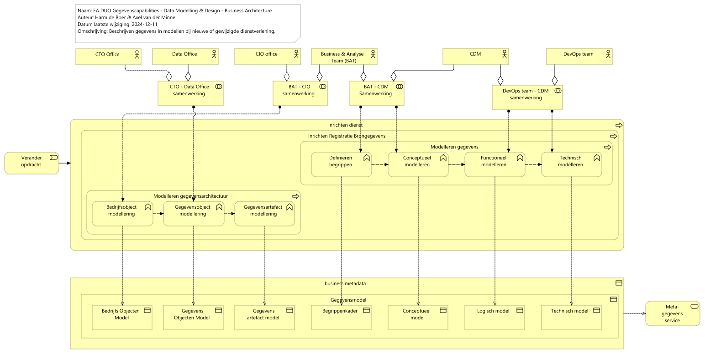

# Rapportage capability Data Modelling & Design - BA

Report generated at: 2024-12-13  11:27:34

---
## Inhoudsopgave

* [Rapportage capability Data Modelling & Design review instructies](#rapportage-capability-data-modelling-&-design-review-instructies)
  * [EA DUO Gegevenscapabilities - Data Modelling & Design - Business Architecture](#ea-duo-gegevenscapabilities--data-modelling-&-design--business-architecture)

---

## Rapportage capability Data Modelling & Design review instructies

Graag view, elementen en relaties daartussen reviewen
### EA DUO Gegevenscapabilities - Data Modelling & Design - Business Architecture

*Capability Data Modelling & Design* beschrijft het beschrijven van gegevens in de modellen van de *Gegevensmodellencyclus* als onderdeel van de inrichting van nieuwe of gewijzigde dienstverlening van DUO. 

Voor het uitvoeren van de wettelijke taken van DUO winnen wij heel veel gegevens in over o.a. inschrijvingen, onderwijsdeelnames en onderwijsresultaten van leerlingen en studenten. Om betrouwbaarheid van taakuitvoering en geschiktheid van de daarvoor gebruikte gegevens te kunnen garanderen, is het noodzakelijk dat we inzicht hebben en houden in de gegevens die ons toevertrouwd zijn. Dit inzicht wordt vastgelegd in de vorm van metagegevens, in het specifiek de gegevensmodellen van de *Gegevensmodellencyclus*. De inhoud van deze modellen wordt vastgelegd in de vorm van metadata en kan in die vorm worden ontsloten.

Deze view beschrijft het beheren van de inhoud van de gegevensmodellen. De volgende uitgangspunten zijn van toepassing:
1.	Het maken en beheren van de (gegevens)modellen ligt bij de business onderdelen die een bepaalde (wettelijke) taak uitvoeren of daarvoor een gedelegeerd deel van die taak uitvoeren. 
2.	Het opstellen en beheren van de kaders en inrichting van gegevensmodellen ligt bij organisatieonderdelen die verantwoordelijk zijn voor de juiste toepassing van bepaalde modellen.
3.	De de samenhang en consistentie van de gegevensmodellen die binnen de primaire taakuitvoering, distributie en informatie verstrekking gehanteerd worden, wordt centraal bewaakt.

Business teams, vaak bestaande uit een BAT en één of meerdere DevOps teams, maken en wijzingen modellen die nodig zijn om met (keten)partners kennis te delen ten behoeve van de taakuitvoering. 
Hier ligt de kennis, capaciteit en verantwoordelijk voor de kwaliteit van de data en metadata behorende bij hun datadomein. De inriching van de architectuurmodellen loopt via de domeinarchitect vanuit het CIO office die verantwoordelijk is voor dat domein en vaak aangesloten bij de business teams. 

De te hanteren kaders, richtlijnen en werkwijzen zijn bescheven in de kaderdocumenten van de Gegevensmodellencyclus.
<figure align="center">
  
  <figcaption><i>EA DUO Gegevenscapabilities - Data Modelling & Design - Business Architecture</i></figcaption>
</figure>

<table>
  <thead>
    <tr>
      <th colspan="4" width="20%">Element</th>
      <th rowspan="2" width="40%">Definitie</th>
      <th rowspan="2" width="40%">Omschrijving</th>
    </tr>
  </thead>
  <tbody>
    <tr><td></td><td></td><td></td><td></td><td></td></tr>
    <tr valign="top")>
      <td colspan="4">CTO Office 
(business-actor)</td>
      <td>
Architecten die de Chief Technical Officer (CTO) ondersteunen.
</td>
    </tr>
    <tr valign="top")>
      <td colspan="4">Data Office 
(business-actor)</td>
      <td>
Het Data Office voorziet de DUO organisatie in de behoefte naar een vertaling van gegevenskaders, geeft richting mee over hoe om te gaan met gegevens (opslag, gebruik, beheer, verwerking) en over hoe aan te sluiten bij initiatieven over duurzaam gebruik van gegevens in o.a. de onderwijsketen. Daarbij vertaalt zij  toekomstige trends op het gebied van gegevens.

Het Data Office bestaat uit een team van Gegevensmanagement adviseurs/architecten. Het team geeft invulling aan de bovenstaande behoefte en werkt in nauwe samenwerking met o.a. het CIO(domein), ICT(software en infrastructuur) en Compliancy.
</td>
    </tr>
    <tr valign="top")>
      <td colspan="4">CIO office 
(business-actor)</td>
      <td>
Team met specialisten, met name domein- en aspectarchitecten, die de Chief Information Officer ondersteunen.
</td>
    </tr>
    <tr valign="top")>
      <td colspan="4">Business & Analyse Team (BAT) 
(business-actor)</td>
      <td>
Business &amp; Analyse Team (BAT)

Het BAT heeft één of meerdere diensten als aandachtsgebied, dit is de scope van het domein. Het BAT bepaalt WAT er nodig is om een dienst te kunnen leveren op alle aspecten van SCOMPAFIJTHE. Het ontwerpen, realiseren en beschikbaar stellen van het HOE kan in veel gevallen worden uitbesteed. Zo is de ontwikkeling en het beheer van de I en de T aspecten de verantwoordelijkheid van het DevOpsteam(s) binnen het domein. Het BAT zal zelf ook activiteiten uitvoeren voor het leveren van de dienst en hiervoor dus zelf het HOE bepalen en de ontwikkeling en beheer verzorgen (uitvoeringsverantwoordelijkheid)

In het BAT zitten in elk geval een Product Owner, één of meerdere analisten, één of meerdere functioneel beheerders en één of meerdere vertegenwoordigers vanuit het DevOpsteam(s). Het BAT is daarmee echt een team en niet alleen een overlegvorm. Het BAT kan permanent of periodiek worden uitgebreid met andere rollen als de situatie daarom vraagt. Denk bijvoorbeeld aan een medewerker uitvoering, communicatie, beleid, relatiebeheer of architectuur. Er ontstaat op die manier een BAT team geschikt voor de huidige situatie. Het is de verantwoording van BAT zelf om te zorgen dat er voor het uitvoeren van de opdracht voldoende kennis en inzicht aanwezig is. Eén van de leden van het BAT neemt de rol van Scrum Master op zich. Het BAT organiseert zijn werk zelf conform de DUO Way of Working. Ook de wijze waarop gecommuniceerd wordt met derden. Goede communicatie met vertegenwoordigers van andere partijen en de Businessmanager hoort daarbij.

Bron: DUO Way of Working
</td>
    </tr>
    <tr valign="top")>
      <td colspan="4">CDM 
(business-actor)</td>
      <td>
Centraal Data Management (CDM)  ondersteunt DUO met kennis en hulpmiddelen waarmee DUO invulling kan geven aan de gestelde eisen aan begrippenkaders,  gegevensmodellen, metagegevens en datakwaliteit.

Hierbij is de afdeling verantwoordelijk voor het functioneel beheren van metagegevens waaronder gegevenswoordenboek en  gegevensmodellen. 

Het CDM  was voorheen het CMDA (en daarvoor Schakelpunt OCW) en daarmee tevens verantwoordelijk voor het toepassen van overheids- en onderwijsstandaarden binnen DUO.

Daarnaast beheert het serviceteam  de kennis die nodig is om datakwaliteit DUO breed te kunnen bewaken. 

Hiervoor bouwt het team kennis op over:

<ul>
<li>behoeften en wensen t.a.v. beheren datakwaliteit.</li>
<li>de hiervoor beschikbare methoden, technieken en middelen.</li>
<li>diensten die hiervoor beschikbaar zijn (binnen dit team of elders)</li>
<li>te maken afspraken binnen DUO en tussen DUO en ketenpartners t.a.v. datakwaliteit</li>
</ul></td>
    </tr>
    <tr valign="top")>
      <td colspan="4">DevOps team 
(business-actor)</td>
      <td>
Een DevOpsteam is een multidisciplinair team verantwoordelijk voor het ontwikkelen ( Dev elopment) en beheren ( Op erations) van applicaties ondersteunend aan bedrijfsprocessen. Daar waar de business verantwoordelijk is voor het “WAT” draagt het DevOpsteam de verantwoordelijkheid voor het “HOE”. Het team organiseert zijn werk op een Agile werkwijze, is grotendeels zelforganiserend en realiseert wijzigingen met behulp van Continuous Delivery. De prioriteit van de werkzaamheden van het DevOpsteam worden bepaald op basis van een backlog die door een Product Owner wordt gemanaged. Voor meer achtergrond, bekijk hier een checklist van de belangrijkste zaken die een DevOpsteam op orde moet hebben en hier een document met diverse criteria voor high performance DevOpsteams.

Bron: DUO Way of Working
</td>
    </tr>
    <tr valign="top")>
      <td colspan="4">CTO - Data Office samenwerking 
(business-collaboration)</td>
      <td></td>
    </tr>
    <tr valign="top")>
      <td colspan="4">BAT - CIO samenwerking 
(business-collaboration)</td>
      <td></td>
    </tr>
    <tr valign="top")>
      <td colspan="4">BAT - CDM Samenwerking 
(business-collaboration)</td>
      <td></td>
    </tr>
    <tr valign="top")>
      <td colspan="4">DevOps team - CDM samenwerking 
(business-collaboration)</td>
      <td></td>
    </tr>
    <tr valign="top")>
      <td colspan="4">Verander opdracht 
(business-event)</td>
      <td>
Een veranderopdracht is het het formele begin om een activiteit dat er op is gericht een deel van de organisatie te veranderen. Zo'n opdracht is door het management gegeven. De voortgang van het werk wordt doorgangs één of meerdere keren besproken door management voordat het compleet is.
</td>
    </tr>
    <tr valign="top")>
      <td colspan="4">Inrichten dienst 
(business-process)</td>
      <td>
Inrichten processen en administraties ten behoeve van nieuwe (wettelijke) dienstverlening. 
</td>
    </tr>
    <tr valign="top")>
      <td colspan="1"></td>
      <td colspan="3">Inrichten Registratie Brongegevens 
(business-process)</td>
      <td>
Inrichten Registratie Brongegevens beschrijft het geheel aan activiteiten dat nodig is om gegevens en bijbehorende metagegevens vast te leggen ten behoeve van die bron. 
</td>
    </tr>
    <tr valign="top")>
      <td colspan="2"></td>
      <td colspan="2">Modelleren gegevens 
(business-process)</td>
      <td>
Het beschrijven en vastleggen van de gegevens die verwerkt worden ten behoeve van een bepaalde (wettelijke) taak. 

Deze inrichting wordt vastgelegd in verschillende samenhangende gegevens modellen.
</td>
    </tr>
    <tr valign="top")>
      <td colspan="3"></td>
      <td colspan="1">Definieren begrippen 
(business-function)</td>
      <td>
Het vastleggen van uniforme definities van de gehanteerde begrippen (termen en betekenis) binnen DUO en hun relaties tot elkaar in een bepaalde context (begrippenkader). 
</td>
    </tr>
    <tr valign="top")>
      <td colspan="3"></td>
      <td colspan="1">Conceptueel modelleren 
(business-function)</td>
      <td>
Het  maken van een formele uitwerking van aspecten van begrip en communicatie, bedoeld voor menselijke gebruikers (Mylopoulos).
</td>
    </tr>
    <tr valign="top")>
      <td colspan="3"></td>
      <td colspan="1">Functioneel modelleren 
(business-function)</td>
      <td>
Het  enkelvoudig en implementatieonafhankelijk vastleggen van bedrijfsregels, waaronder gegevensregels.
</td>
    </tr>
    <tr valign="top")>
      <td colspan="3"></td>
      <td colspan="1">Technisch modelleren 
(business-function)</td>
      <td>
Het beschrijven van de fysieke vorm waarin een systeem wordt gerealiseerd, inclusief de opslag en uitwisseling van gegevens.
</td>
    </tr>
    <tr valign="top")>
      <td colspan="2"></td>
      <td colspan="2">Modelleren gegevensarchitectuur 
(business-process)</td>
      <td>
Het beschrijven en vastleggen van de inrichting binnen architectuur  van gegevens die verwerkt worden ten behoeve van een bepaalde (wettelijke) taak. 

Deze inrichting wordt vastgelegd in verschillende samenhangende architectuur modellen.
</td>
    </tr>
    <tr valign="top")>
      <td colspan="3"></td>
      <td colspan="1">Bedrijfsobject modellering 
(business-function)</td>
      <td>
Het identificeren en definiëren van een architectuurelement (bedrijfsobject) waarover gegevens worden verwerkt en die vanuit bedrijfsperspectief relevantie heeft.
</td>
    </tr>
    <tr valign="top")>
      <td colspan="3"></td>
      <td colspan="1">Gegevensobject modellering 
(business-function)</td>
      <td>
Het identificeren en definiëren van een architectuurelement (gegevensobject) wat een gegevensverzameling binnen een bepaalde bedrijfsfunctie representeert. 
Het gegevensobjectenmodel represententeert de logische modellen van DUO in samenhang.
</td>
    </tr>
    <tr valign="top")>
      <td colspan="3"></td>
      <td colspan="1">Gegevensartefact modellering 
(business-function)</td>
      <td>
Het identificeren en definiëren van een architectuurelement (gegevensartefact) dat de representatie is van een gegevensbron of een gegevensuitwisseling. 
Gegevensartefacten zijn de realisatie van één of meer gegevensobjecten. 

Een sluitende administratie van de gegevensartefacten is een waardevol instrument:
• Het maakt op afroep inzichtelijk waar de gegevens DUO zich bevinden en wanneer daar iets mee gebeurt.
• Voor life-cycle management en gegevenshygiëne. Artefacten ontstaan, veranderen in de loop der tijd en verdwijnen weer.
• Inzicht in het kopieergedrag van de organisatie. Als er een kopie wordt gemaakt, zelfs al is die kopie exact hetzelfde, ontstaat er een ander artefact.
• Om te laten zien dat DUO compliant is aan uitvoeringsregels en leveringsafspraken.
</td>
    </tr>
    <tr valign="top")>
      <td colspan="4">business metadata 
(business-object)</td>
      <td>
Tijdelijke tekst (tekst properties is leidend) 
Business metadata focust grotendeels op inhoud en conditie van data. Zie DMBOK voor voorbeelden. Business metadata is gescheiden van operational and technical metadata en ontstaat in belangrijke mate tijdens de modelmatiege ontwikkeling van gegevens.
</td>
      <td>
Business metadata focust grotendeels op inhoud en conditie van data. Zie DMBOK voor voorbeelden. Business metadata is gescheiden van operational and technical metadata en ontstaat in belangrijke mate tijdens de modelmatiege ontwikkeling van gegevens.
</td>
    </tr>
    <tr valign="top")>
      <td colspan="1"></td>
      <td colspan="3">Gegevensmodel 
(business-object)</td>
      <td>
betreft de realisatie van de gegevensmodellencyclus: Conceptueel, Logisch en Technisch model
</td>
    </tr>
    <tr valign="top")>
      <td colspan="2"></td>
      <td colspan="2">Bedrijfs Objecten Model 
(business-object)</td>
      <td>
Een bedrijfsobject (BO) is een passief architectuurelement dat vanuit bedrijfsperspectief relevantie heeft (definitie Archimate). Het is conceptueel van aard, dat wil zeggen, bedrijfsobjecten zijn er om dingen waarover gegevens worden verwerkt (opgeslagen, geraadpleegd e.d) te identificeren en te definiëren. Onderdeel van de enterprise-architectuur van DUO is een bedrijfsobjectenmodel (BOM) waarin alle bedrijfsobjecten worden verzameld en zo nodig generiek gemaakt.

Bron: 20211019 Kader gegevensontwikkeling en beheer v1.0
</td>
    </tr>
    <tr valign="top")>
      <td colspan="2"></td>
      <td colspan="2">Gegevens Objecten Model 
(business-object)</td>
      <td>
Een gegevensobject (GO) is een passief element uit de toepassingsarchitectuur (naar Archimate). Er kan een één-op-één relatie zijn tussen bedrijfsobject en gegevensobject en ze kunnen dezelfde naam hebben, maar dat is geen opgelegde regel. Onderdeel van de enterprise-architectuur van DUO is een gegevensobjectenmodel (GOM) waarin alle bedrijfsobjecten worden verzameld en zo nodig generiek gemaakt.
Een gegevensobject hoort bij een organisatieonderdeel met specifieke verantwoordelijkheden op het gebied van gegevens, zoals:
• het maken van afspraken met ketenpartners over inwinning en levering
• het bewaken van de gegevenskwaliteit
• volgen van compliancyregels volgend uit AVG, BIO en Archiefwet
• het volledig, juist en actueel metadateren van de gegevens.
Bij een gegevensobject hoort een logisch model dat de structuur en gegevensgerelateerde bedrijfsregels beschrijft als implementatieonafhankelijke basis voor gegevens in opslag en gegevens op reis.

Bron: 20211019 Kader gegevensontwikkeling en beheer v1.0
</td>
    </tr>
    <tr valign="top")>
      <td colspan="2"></td>
      <td colspan="2">Gegevens artefact model 
(business-object)</td>
      <td>
Een gegevens artefacten model is een modellering van architectuurelementen (gegevensartefacten) dat de representatie is van een gegevensbron of een gegevensuitwisseling. 
</td>
      <td>
Een gegevens artefacten model is een modellering van architectuurelementen (gegevensartefacten) dat de representatie is van een gegevensbron of een gegevensuitwisseling. 
</td>
    </tr>
    <tr valign="top")>
      <td colspan="2"></td>
      <td colspan="2">Begrippenkader 
(business-object)</td>
      <td>
Het DUO-begrippenkader bevat de uniforme definities van de gehanteerde begrippen (termen en betekenis) binnen DUO en hun relaties tot elkaar in een bepaalde context. 
</td>
      <td>
Het DUO-begrippenkader bevat de uniforme definities van de gehanteerde begrippen (termen en betekenis) binnen DUO en hun relaties tot elkaar in een bepaalde context. 
</td>
    </tr>
    <tr valign="top")>
      <td colspan="2"></td>
      <td colspan="2">Conceptueel model 
(business-object)</td>
      <td>
Een conceptueel model is een modellering van de werkelijkheid binnen het beschouwde domein, voor wat betreft informatie en communicatie. Het is onafhankelijk van ontwerp van en implementatie in systemen.
</td>
      <td>
Een conceptueel model is een modellering van de werkelijkheid binnen het beschouwde domein, voor wat betreft informatie en communicatie. Het is onafhankelijk van ontwerp van en implementatie in systemen.
</td>
    </tr>
    <tr valign="top")>
      <td colspan="2"></td>
      <td colspan="2">Logisch model 
(business-object)</td>
      <td>
Een logisch model is een implementatie-onafhankelijke representatie van gegevens over de werkelijkheid in digitale registraties en in de uitwisseling daartussen.
</td>
      <td>
Een logisch model is een implementatie-onafhankelijke representatie van gegevens over de werkelijkheid in digitale registraties en in de uitwisseling daartussen.
</td>
    </tr>
    <tr valign="top")>
      <td colspan="2"></td>
      <td colspan="2">Technisch model 
(business-object)</td>
      <td>
Een technische model is een specificatie van de structuur en eigenschappen van de technologie waarin de informatie wordt vastgelegd of uitgewisseld. Dit is sterk afhankelijk van de gebruikte opslagtechnologie zoals een specifieke database of de servicetechnologie zoals XML, GML, SOAP, REST, (Geo)JSON, LinkedData e.d.
</td>
      <td>
Een technische model is een specificatie van de structuur en eigenschappen van de technologie waarin de informatie wordt vastgelegd of uitgewisseld. Dit is sterk afhankelijk van de gebruikte opslagtechnologie zoals een specifieke database of de servicetechnologie zoals XML, GML, SOAP, REST, (Geo)JSON, LinkedData e.d.
</td>
    </tr>
    <tr valign="top")>
      <td colspan="4">Meta-gegevens service 
(business-service)</td>
      <td>
Om te kunnen bepalen welke gegevens uit welke bronnen gebruikt mogen worden voor welke analyse vragen, en om afdoende maatregelen te treffen tav het beheer van die gegevens binnen het platform, zijn alle gegevens voorzien van Metadata. 

Daarnaast zijn metadata essentieel voor afnemers om gegevens te vinden die passen bij hun onderzoeksvraag.

DataHub borgt dat gegevens die op het platform beschikbaar zijn voorzien zijn van de juiste metadata.

--RB: Belangrijkste metadata: data clasiificatie
</td>
    </tr>
  </tbody>
</table>

