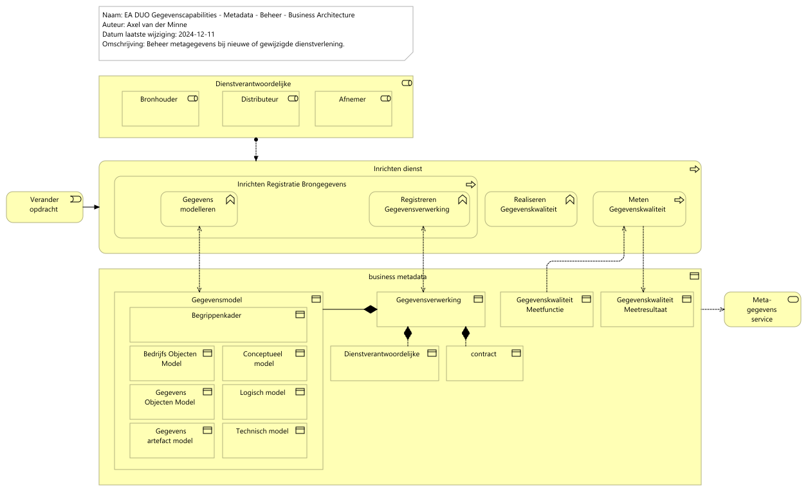

# Rapportage capability Metadata - Beheer

Report generated at: 2024-12-13  11:27:50

---
## Inhoudsopgave

* [Rapportage capability Metadata - Beheer review instructies](#rapportage-capability-metadata--beheer-review-instructies)
  * [EA DUO Gegevenscapabilities - Metadata - Beheer](#ea-duo-gegevenscapabilities--metadata--beheer)

---

## Rapportage capability Metadata - Beheer review instructies

Graag view, elementen en relaties daartussen reviewen
### EA DUO Gegevenscapabilities - Metadata - Beheer

*Capability Metadata* beschrijft de metagegevens die vastgelegd en beheerd moeten worden als onderdeel van de inrichting van nieuwe of gewijzigde dienstverlening van DUO. Metagegevens ten behoeve van het beschrijven van de gegevens, bijbehorende compliance kenmerken en datakwaliteit worden beschreven bij respectievelijk de views van *Capability Data Modelling & Design*, *Capability Security & Privacy* en *Capability Data Quality*. 

- *Capability Data Modelling & Design*: De functie *Gegevensmodelleren* resulteert in een *Gegevensmodel* conform de Gegevensmodellencyclus
- *Capability Security & Privacy*: De functie *Registreren Gegevensverwerking* resulteert in een vastgelegde (en vastgestelde) *Gegevensverwerking*
- *Capability Data Quality*: Beschrijft de functies *Realiseren Gegevenskwaliteit* en *Meten Gegevenskwaliteit*. De meetfuncties en de daaruit volgende resultaten worden vastgelegd (als *Gegevenskwaliteit Meetfunctie* en *Gegevenskwaliteit Meetresultaat*)

Deze view richt zich op het integrale beheer van deze metagegevens zodat hieruit een eenduidig en betrouwbaar beeld opgebouwd kan worden waarmee DUO kan sturen doelmatig en rechtmatig gebruik ervan. 

Het beheren vangegevens is een gezamenlijke verantwoordelijkheid van partijen binnen de keten. Binnen DUO is deze keten onder te verdelen in 3 stukken met elk een eigen verantwoordelijkheid:
-	Primaire dienstverlening – verwerken gegevens binnen verschillende bronnen
-	Gegevensdistributie – verwerken gegevens ten behoeve van distributie van gegevens
-	Afnemer – verwerken gegevens ten behoeve van het verstrekken van informatie
<figure align="center">
  
  <figcaption><i>EA DUO Gegevenscapabilities - Metadata - Beheer</i></figcaption>
</figure>

<table>
  <thead>
    <tr>
      <th colspan="3" width="20%">Element</th>
      <th rowspan="2" width="40%">Definitie</th>
      <th rowspan="2" width="40%">Omschrijving</th>
    </tr>
  </thead>
  <tbody>
    <tr><td></td><td></td><td></td><td></td></tr>
    <tr valign="top")>
      <td colspan="3">Dienstverantwoordelijke 
(business-role)</td>
      <td>
Diegene die verantwoordelijk is voor bepaalde afgesproken dienstverlening waarbij gegevens op een verantwoorde manier verwerkt moeten worden.  

Bronhouder, Distributeur en Afnemer, zowel binnen DUO als extern (in een keten), zijn gezamenlijk verantwoordelijk, waarbij elke rol weer specifieke taken, verantwoordelijkheden en bevoegdheden kent.
</td>
    </tr>
    <tr valign="top")>
      <td colspan="1"></td>
      <td colspan="2">Bronhouder 
(business-role)</td>
      <td>
Bron Informatiemanagement: rolbeschrijvingen gegevensmanagement 17-1-2017

Omschrijving 

De bronhouder is verantwoordelijk voor het inwinnen, actueel houden, opslaan en ter beschikking stellen van de juiste gegevens in een registratie. Onder meer naar aanleiding van ontvangen meldingen is de bronhouder verantwoordelijk voor het borgen van de kwaliteit van de gegevens.

Doel 

<pre><code>- Dubbele inwinning van bestaande bestanden voorkomen;
- Efficiënt gebruik van gegevensbestanden mogelijk maken
- Inzetten van moderne technieken;
- Werkpakketten optimaal in de keten zetten.
</code></pre>

Hoofdtaken 

<pre><code>- Ontwikkelen en beheren van de voorzieningen nodig om de gegevensmanagement taken uit te kunnen voeren;
- Assembleren van de bestanden tot een DUO dekkend geheel;
- Assembleren van de eigen objecten met die van andere bronhouders;
- Afhandelen van de meldingen van gerede twijfel volgens onderling afgesproken procedures. De bronhouder bepaalt of de twijfel aanleiding is om de dienstverlening op te schorten;
- Realiseren en bijhouden van de gegevensbestanden;
- Transitie van gesloten naar ontsloten gegevensbestanden uitvoeren;
- Aanleveren van gegevens aan afnemers;
- Inwinnen, verwerken, afhandelen en verwerken van terugmeldingen;
- Uitvoeren van kwaliteitscontroles
</code></pre>

Contact met

<pre><code>- Domeinarchitect
- Distributeur
- Gegevensmakelaar
- Afnemer
- Functionaris voor de gegevensbescherming
</code></pre>

Resultaten 

<pre><code>- Stabiele, betrouwbare, beheerde gegevensverzamelingen;
- In het geval van verrijking en toevoeging blijft de verantwoordelijkheid voor de kwaliteit van de toegevoegde gegevens bij de bronhouder van de toegevoegde gegevens;
- Gegarandeerde en vastgestelde kwaliteit van de gegevens op basis van BIR, Wbp en afgesproken service levels;
- Generalisatie, transformatie, selectie op de gegevens vinden uitsluitend plaats in overleg met de bronhouder.
</code></pre>

Competenties
</td>
    </tr>
    <tr valign="top")>
      <td colspan="1"></td>
      <td colspan="2">Distributeur 
(business-role)</td>
      <td>
Bron Informatiemanagement: rolbeschrijvingen gegevensmanagement 17-1-2017

Omschrijving 

De distributeur ontvangt gegevens van bronhouders en stuurt deze, direct of via generieke voorzieningen zoals gegevensknooppunten, door naar afnemers. De distributeur is verantwoordelijk voor de vastlegging van de feitelijke distributie van een gegeven, bijvoorbeeld ten behoeve van het werk van de auditor. 

Doel 

Het leveren van gegevens aan interne en externe afnemers conform het GLO. 

Hoofdtaken 

<pre><code>- Onderhouden van contacten  en het maken van afspraken met afnemers voor producten, diensten en incidenten;
- Beheren contracten met afnemers;
- Voorlichten over gebruiks- en terugmeld verplichtingen;
- Informatie verstrekken over de beschikbaarheid en kwaliteit van de gegevensset;
- Borgen kwaliteit proces van verstrekken van producten en diensten;
- Verstrekken van gegevens aan afnemers;
- Inlichten van de regisseur over het gebruik van gegevens uit de registraties;
- Onderhouden producten- en dienstencatalogus;
- Accepteren (functioneel) van nieuwe software en releases;
- Doorgeven wensen afnemers aan de registerbeheerder centraal en decentraal ;
- Ondersteunen afnemers
</code></pre>

Contact met

<pre><code>- Bronhouder
- Register beheerder centraal en decentraal  
- Afnemer
</code></pre>

Resultaten 

Volledig en juist en tijdig leveren van gegevens aan interne en externe afnemers.  

Competenties

De distributeur ontvangt gegevens van bronhouders en stuurt deze, direct of via generieke voorzieningen zoals gegevensknooppunten, door naar afnemers. De distributeur is verantwoordelijk voor de vastlegging van de feitelijke distributie van een gegeven, bijvoorbeeld ten behoeve van het werk van de auditor. 
</td>
    </tr>
    <tr valign="top")>
      <td colspan="1"></td>
      <td colspan="2">Afnemer 
(business-role)</td>
      <td>
Bron Informatiemanagement: rolbeschrijvingen gegevensmanagement 17-1-2017

Omschrijving
Een afnemer is een overheidsorganisatie of private partij die geautoriseerd is om gegevens van DUO af te nemen voor gebruik in de eigen processen. Afname vindt plaats via de distributeur. Bij gerede twijfel over de kwaliteit van de gegevens melden afnemers dit via de distributeur bij de bronhouder.

Doel
Het daadwerkelijk, correct gebruiken van gegevens uit de registraties van ketenpartners zodat invulling gegeven wordt aan het principe “eenmalig vastleggen, meermalen gebruiken”.

Hoofdtaken
 Het afnemen van gegevens en deze conform doelbinding aanwenden voor gebruik in de informatieverzorgende processen binnen de eigen organisatie.
 Bij de bronhouder terug melden van gerede twijfel aan de juistheid van de afgenomen gegevens.

Contact met
 Distributeur
 Functionaris voor de gegevensbescherming
 Gegevensmakelaar
 Bronhouder
 Domeinarchitect

Resultaten
Hergebruik van gegevens door deze herhaald toe te passen binnen de processen van de organisatie.

Competenties
Bij wet aangewezen organisatie die op basis van doelbinding gebruik kan maken van de specifieke gegevens die benodigd zijn om het (beleids) doel te realiseren.
</td>
    </tr>
    <tr valign="top")>
      <td colspan="3">Verander opdracht 
(business-event)</td>
      <td>
Een veranderopdracht is het het formele begin om een activiteit dat er op is gericht een deel van de organisatie te veranderen. Zo'n opdracht is door het management gegeven. De voortgang van het werk wordt doorgangs één of meerdere keren besproken door management voordat het compleet is.
</td>
    </tr>
    <tr valign="top")>
      <td colspan="3">Inrichten dienst 
(business-process)</td>
      <td>
Inrichten processen en administraties ten behoeve van nieuwe (wettelijke) dienstverlening. 
</td>
    </tr>
    <tr valign="top")>
      <td colspan="1"></td>
      <td colspan="2">Inrichten Registratie Brongegevens 
(business-process)</td>
      <td>
Inrichten Registratie Brongegevens beschrijft het geheel aan activiteiten dat nodig is om gegevens en bijbehorende metagegevens vast te leggen ten behoeve van die bron. 
</td>
    </tr>
    <tr valign="top")>
      <td colspan="2"></td>
      <td colspan="1">Gegevens modelleren 
(business-function)</td>
      <td>
Een model is een schematische weergave van de werkelijkheid. Modellen worden gebruikt om een gemeenschappelijke taal te spreken waarin we onze kennis borgen en met elkaar delen. Hierin kennen we verschillende vormen; modellen beschrijven onze dienstverlening, onze applicaties en techniek en onze gegevens. [Bron: 230210 Notitie inrichten Gegevensmodelleren.doc]

Modelleren betreft de structuur van de data elementen, de bijbehorende metadata en onderlinge relaties voor de verschillende niveau's uit de gegevensmodellencyslus.

Het is de explicitering van de contexten die het mogelijk maakt dat er gecommuniceerd kan worden over gegevens en deze gegevens op een juiste en betekenisvolle wijze worden gebruikt en begrepen worden [bron: Inrichting Chief Data Officer-profiel en -stelsel]

DAMA DMBOK2: Data modeling is the process of discovering, analyzing, and scoping data requirements, and then representing and communicating these data requirements in a precise form called the data model. This process is iterative and may include a conceptual, logical, and physical model.
</td>
    </tr>
    <tr valign="top")>
      <td colspan="2"></td>
      <td colspan="1">Registreren Gegevensverwerking 
(business-function)</td>
      <td>
Registreren Gegevensverwerking legt gegevensverwerking van DUO en de daarbij verwerkt gegevens vast. Deze registratie zal normaliter plaatsvinden naar het doorlopen van het aanvraagproces en toetsing van de compliance aspecten van de verwerking.
</td>
    </tr>
    <tr valign="top")>
      <td colspan="1"></td>
      <td colspan="2">Realiseren Gegevenskwaliteit 
(business-function)</td>
      <td>
Het nemen van maatregelen om de kwaliteit van data op gewenst niveau te krijgen.

Dit zal meestal integraal bij het ontwikkelen van een nieuwe dienst of systeem gedaan worden.
</td>
    </tr>
    <tr valign="top")>
      <td colspan="1"></td>
      <td colspan="2">Meten Gegevenskwaliteit 
(business-process)</td>
      <td>
Meten Gegevenskwaliteit betreft het geheel aan activiteiten dat uitgevoerd moet worden om de kwaliteit van gegevens te definieren, te valideren en te communiceren.
</td>
    </tr>
    <tr valign="top")>
      <td colspan="3">business metadata 
(business-object)</td>
      <td>
Tijdelijke tekst (tekst properties is leidend) 
Business metadata focust grotendeels op inhoud en conditie van data. Zie DMBOK voor voorbeelden. Business metadata is gescheiden van operational and technical metadata en ontstaat in belangrijke mate tijdens de modelmatiege ontwikkeling van gegevens.
</td>
      <td>
Business metadata focust grotendeels op inhoud en conditie van data. Zie DMBOK voor voorbeelden. Business metadata is gescheiden van operational and technical metadata en ontstaat in belangrijke mate tijdens de modelmatiege ontwikkeling van gegevens.
</td>
    </tr>
    <tr valign="top")>
      <td colspan="1"></td>
      <td colspan="2">Gegevensmodel 
(business-object)</td>
      <td>
betreft de realisatie van de gegevensmodellencyclus: Conceptueel, Logisch en Technisch model
</td>
    </tr>
    <tr valign="top")>
      <td colspan="2"></td>
      <td colspan="1">Begrippenkader 
(business-object)</td>
      <td>
Het DUO-begrippenkader bevat de uniforme definities van de gehanteerde begrippen (termen en betekenis) binnen DUO en hun relaties tot elkaar in een bepaalde context. 
</td>
      <td>
Het DUO-begrippenkader bevat de uniforme definities van de gehanteerde begrippen (termen en betekenis) binnen DUO en hun relaties tot elkaar in een bepaalde context. 
</td>
    </tr>
    <tr valign="top")>
      <td colspan="2"></td>
      <td colspan="1">Bedrijfs Objecten Model 
(business-object)</td>
      <td>
Een bedrijfsobject (BO) is een passief architectuurelement dat vanuit bedrijfsperspectief relevantie heeft (definitie Archimate). Het is conceptueel van aard, dat wil zeggen, bedrijfsobjecten zijn er om dingen waarover gegevens worden verwerkt (opgeslagen, geraadpleegd e.d) te identificeren en te definiëren. Onderdeel van de enterprise-architectuur van DUO is een bedrijfsobjectenmodel (BOM) waarin alle bedrijfsobjecten worden verzameld en zo nodig generiek gemaakt.

Bron: 20211019 Kader gegevensontwikkeling en beheer v1.0
</td>
    </tr>
    <tr valign="top")>
      <td colspan="2"></td>
      <td colspan="1">Conceptueel model 
(business-object)</td>
      <td>
Een conceptueel model is een modellering van de werkelijkheid binnen het beschouwde domein, voor wat betreft informatie en communicatie. Het is onafhankelijk van ontwerp van en implementatie in systemen.
</td>
      <td>
Een conceptueel model is een modellering van de werkelijkheid binnen het beschouwde domein, voor wat betreft informatie en communicatie. Het is onafhankelijk van ontwerp van en implementatie in systemen.
</td>
    </tr>
    <tr valign="top")>
      <td colspan="2"></td>
      <td colspan="1">Gegevens Objecten Model 
(business-object)</td>
      <td>
Een gegevensobject (GO) is een passief element uit de toepassingsarchitectuur (naar Archimate). Er kan een één-op-één relatie zijn tussen bedrijfsobject en gegevensobject en ze kunnen dezelfde naam hebben, maar dat is geen opgelegde regel. Onderdeel van de enterprise-architectuur van DUO is een gegevensobjectenmodel (GOM) waarin alle bedrijfsobjecten worden verzameld en zo nodig generiek gemaakt.
Een gegevensobject hoort bij een organisatieonderdeel met specifieke verantwoordelijkheden op het gebied van gegevens, zoals:
• het maken van afspraken met ketenpartners over inwinning en levering
• het bewaken van de gegevenskwaliteit
• volgen van compliancyregels volgend uit AVG, BIO en Archiefwet
• het volledig, juist en actueel metadateren van de gegevens.
Bij een gegevensobject hoort een logisch model dat de structuur en gegevensgerelateerde bedrijfsregels beschrijft als implementatieonafhankelijke basis voor gegevens in opslag en gegevens op reis.

Bron: 20211019 Kader gegevensontwikkeling en beheer v1.0
</td>
    </tr>
    <tr valign="top")>
      <td colspan="2"></td>
      <td colspan="1">Logisch model 
(business-object)</td>
      <td>
Een logisch model is een implementatie-onafhankelijke representatie van gegevens over de werkelijkheid in digitale registraties en in de uitwisseling daartussen.
</td>
      <td>
Een logisch model is een implementatie-onafhankelijke representatie van gegevens over de werkelijkheid in digitale registraties en in de uitwisseling daartussen.
</td>
    </tr>
    <tr valign="top")>
      <td colspan="2"></td>
      <td colspan="1">Gegevens artefact model 
(business-object)</td>
      <td>
Een gegevens artefacten model is een modellering van architectuurelementen (gegevensartefacten) dat de representatie is van een gegevensbron of een gegevensuitwisseling. 
</td>
      <td>
Een gegevens artefacten model is een modellering van architectuurelementen (gegevensartefacten) dat de representatie is van een gegevensbron of een gegevensuitwisseling. 
</td>
    </tr>
    <tr valign="top")>
      <td colspan="2"></td>
      <td colspan="1">Technisch model 
(business-object)</td>
      <td>
Een technische model is een specificatie van de structuur en eigenschappen van de technologie waarin de informatie wordt vastgelegd of uitgewisseld. Dit is sterk afhankelijk van de gebruikte opslagtechnologie zoals een specifieke database of de servicetechnologie zoals XML, GML, SOAP, REST, (Geo)JSON, LinkedData e.d.
</td>
      <td>
Een technische model is een specificatie van de structuur en eigenschappen van de technologie waarin de informatie wordt vastgelegd of uitgewisseld. Dit is sterk afhankelijk van de gebruikte opslagtechnologie zoals een specifieke database of de servicetechnologie zoals XML, GML, SOAP, REST, (Geo)JSON, LinkedData e.d.
</td>
    </tr>
    <tr valign="top")>
      <td colspan="1"></td>
      <td colspan="2">Gegevensverwerking 
(business-object)</td>
      <td>
Tijdelijke tekst (tekst properties is leidend) 
De administratie <em>Gegevensverwerking</em> beschrijft de overeengekomen gegevensverwerkingen aan de hand van de volgende kenmerken. Deze kenmerken worden vastgelegd bij dit gegevensobject dan wel opgehaald uit gekoppelde administraties <em>Gegevensmodel</em>, <em>Dienstverantwoordelijke</em> en <em>contract</em>.

|Nr    |Kenmerk    |Kar.   |Omschrijving|
|--    |-------    |----   |------------|
|V01    |Naam   |1..1   |De naam van de verwerking. Dit is het uniek zelfstandig naamwoord (enkelvoud) eventueel aangevuld met een of enkele verbijzonderende woorden.|
|V02    |Definitie  |1..1   |Korte omschrijving van de verwerking. Dit zijn één of meer volwaardige zinnen die de verwerking beschrijven en/of toelichten.| 
|V03    |Doelbinding    |1..1   |Een aanduiding van het legitieme doel waarvoor de gegevens zijn verzameld. Dit is een binnen DUO beheerde referentielijst.|
|V04    |Dienstverantwoordelijke (link) |1..1   |Diegene die binnen DUO verantwoordelijk is voor de afgesproken dienstverlening / verwerking. Dit is een binnen DUO beheerde referentie naar de verschillende rollen en teams (niet herleidbaar naar individuele medewerkers) die betrokken zijn bij gegevensverwerking. <strong>Business perspectief</strong>: SCOPAFIJTH aspecten dienstverlening, in het bijzonder Procesbeschrijving en het Begrippenkader, <strong>Applicatie perspectief</strong>: inrichting en beheer applicaties tbv de gevraagde dienstverlening, in het bijzonder Functionele Ontwerpen en Logische datamodellen &amp; <strong>Technisch perspectief</strong>: inrichting en beheer technische inrichting tbv levering van de gevraagde dienstverlening, in het bijzonder systemen, databases en infrastructuur. <strong>NB</strong>: Deze term is breder dan de termen Bronhouder (geldt ook voor Distributeur en Informatieleverancier (interne Afnemer)) en Gegevenseigenaar (meer aspecten dan alleen eigendom).|
|V05    |Contract (link)    |0..1   |Overeenkomst die dienstverlening DUO beschrijft aan afnemer.|
|V06    |Gegevensmodel (link)   |n..m   |De gegevens die verwerkt worden.| 
|V07    |Begindatum |1..1   |De datum dat de verwerking van kracht wordt.
|V08    |Einddatum  |1..1   |De datum dat de verwerking van vervalt of herzien moet worden.|
|V09    |Categorisatie AVG  |1..1   |De aanduiding of de gegevens persoonsgegevens (P) niet-persoonsgegevens (NP) of bijzondere/strafrechtelijk persoonsgegevens (BSP) bevat.|
|V10a    |Classificatie Beschikbaarheid (BIO)    |1..1   |Beschikbaarheid is de mate waarin het aanwezig is en klaar voor gebruik of inzage door geautoriseerde entiteiten (personen, processen, systemen). Zie DUO-voorschrift classificatie.|
|V10b    |Classificatie Integriteit (BIO)    |1..1   |Integriteit is de mate waarin het niet, of alleen door geautoriseerde entiteiten (personen, processen, systemen), is/kan worden gewijzigd of vernietigd. Zie DUO-voorschrift classificatie.|
|V10c    |Classificatie Vertrouwelijk-heid (BIO) |1..1   |Vertrouwelijkheid van een informatieobject is de mate waarin het alleen toegankelijk en te interpreteren of kopiëren is voor geautoriseerde entiteiten (personen, processen, systemen) binnen een specifieke gebruikscontext. Zie DUO-voorschrift classificatie.|
|V11    |Rubricering ja/nee |1..1   |Geheimhouding is geboden vanwege het belang van de Staat, zijn bondgenoten of één of meer ministeries.
|V12    |Archiverings-kenmerk |1..1 |Dit kenmerk verwijst naar een entry in de Generieke Selectielijst OCW: https://www.nationaalarchief.nl/archiveren/kennisbank/generieke-selectielijst-onderwijs-cultuur-en-wetenschap-ocw|
</td>
      <td>
De administratie <em>Gegevensverwerking</em> beschrijft de overeengekomen gegevensverwerkingen aan de hand van de volgende kenmerken. Deze kenmerken worden vastgelegd bij dit gegevensobject dan wel opgehaald uit gekoppelde administraties <em>Gegevensmodel</em>, <em>Dienstverantwoordelijke</em> en <em>contract</em>.

|Nr    |Kenmerk    |Kar.   |Omschrijving|
|--    |-------    |----   |------------|
|V01    |Naam   |1..1   |De naam van de verwerking. Dit is het uniek zelfstandig naamwoord (enkelvoud) eventueel aangevuld met een of enkele verbijzonderende woorden.|
|V02    |Definitie  |1..1   |Korte omschrijving van de verwerking. Dit zijn één of meer volwaardige zinnen die de verwerking beschrijven en/of toelichten.| 
|V03    |Doelbinding    |1..1   |Een aanduiding van het legitieme doel waarvoor de gegevens zijn verzameld. Dit is een binnen DUO beheerde referentielijst.|
|V04    |Dienstverantwoordelijke (link) |1..1   |Diegene die binnen DUO verantwoordelijk is voor de afgesproken dienstverlening / verwerking. Dit is een binnen DUO beheerde referentie naar de verschillende rollen en teams (niet herleidbaar naar individuele medewerkers) die betrokken zijn bij gegevensverwerking. <strong>Business perspectief</strong>: SCOPAFIJTH aspecten dienstverlening, in het bijzonder Procesbeschrijving en het Begrippenkader, <strong>Applicatie perspectief</strong>: inrichting en beheer applicaties tbv de gevraagde dienstverlening, in het bijzonder Functionele Ontwerpen en Logische datamodellen &amp; <strong>Technisch perspectief</strong>: inrichting en beheer technische inrichting tbv levering van de gevraagde dienstverlening, in het bijzonder systemen, databases en infrastructuur. <strong>NB</strong>: Deze term is breder dan de termen Bronhouder (geldt ook voor Distributeur en Informatieleverancier (interne Afnemer)) en Gegevenseigenaar (meer aspecten dan alleen eigendom).|
|V05    |Contract (link)    |0..1   |Overeenkomst die dienstverlening DUO beschrijft aan afnemer.|
|V06    |Gegevensmodel (link)   |n..m   |De gegevens die verwerkt worden.| 
|V07    |Begindatum |1..1   |De datum dat de verwerking van kracht wordt.
|V08    |Einddatum  |1..1   |De datum dat de verwerking van vervalt of herzien moet worden.|
|V09    |Categorisatie AVG  |1..1   |De aanduiding of de gegevens persoonsgegevens (P) niet-persoonsgegevens (NP) of bijzondere/strafrechtelijk persoonsgegevens (BSP) bevat.|
|V10a    |Classificatie Beschikbaarheid (BIO)    |1..1   |Beschikbaarheid is de mate waarin het aanwezig is en klaar voor gebruik of inzage door geautoriseerde entiteiten (personen, processen, systemen). Zie DUO-voorschrift classificatie.|
|V10b    |Classificatie Integriteit (BIO)    |1..1   |Integriteit is de mate waarin het niet, of alleen door geautoriseerde entiteiten (personen, processen, systemen), is/kan worden gewijzigd of vernietigd. Zie DUO-voorschrift classificatie.|
|V10c    |Classificatie Vertrouwelijk-heid (BIO) |1..1   |Vertrouwelijkheid van een informatieobject is de mate waarin het alleen toegankelijk en te interpreteren of kopiëren is voor geautoriseerde entiteiten (personen, processen, systemen) binnen een specifieke gebruikscontext. Zie DUO-voorschrift classificatie.|
|V11    |Rubricering ja/nee |1..1   |Geheimhouding is geboden vanwege het belang van de Staat, zijn bondgenoten of één of meer ministeries.
|V12    |Archiverings-kenmerk |1..1 |Dit kenmerk verwijst naar een entry in de Generieke Selectielijst OCW: https://www.nationaalarchief.nl/archiveren/kennisbank/generieke-selectielijst-onderwijs-cultuur-en-wetenschap-ocw|
</td>
    </tr>
    <tr valign="top")>
      <td colspan="1"></td>
      <td colspan="2">Gegevenskwaliteit Meetfunctie 
(business-object)</td>
      <td>
Een meetfunctie is de uit te voeren toets om te bepalen of gegevens voldoen aan vastgestelde kwaliteitscriteria (1..n per kwaliteitsdimensie en attribuut).

Een meetfunctie kan gedefineerd zijn op verschillende niveau's:

<ul>
<li>dataset</li>
<li>gegevensobject</li>
<li>specifieke waarde.</li>
</ul>

Hierbij worden gegevens, metagegevens, modellen of een combinatie hiervan gebruikt uit één of meerdere bronnen.

Meetfucties zullen vaak beschreven zijn in de vorm van een (logische) regel, maar kan ook de vorm van een statische toets (profiling), die geautomatiseerd uitgevoerd wordt.

Daarnaast kan een meetfunctie handmatig/steekproefsgewijs plaatsvinden.
</td>
      <td>
Een meetfunctie is de uit te voeren toets om te bepalen of gegevens voldoen aan vastgestelde kwaliteitscriteria (1..n per kwaliteitsdimensie en attribuut).

Een meetfunctie kan gedefineerd zijn op verschillende niveau's:

<ul>
<li>dataset</li>
<li>gegevensobject</li>
<li>specifieke waarde.</li>
</ul>

Hierbij worden gegevens, metagegevens, modellen of een combinatie hiervan gebruikt uit één of meerdere bronnen.

Meetfucties zullen vaak beschreven zijn in de vorm van een (logische) regel, maar kan ook de vorm van een statische toets (profiling), die geautomatiseerd uitgevoerd wordt.

Daarnaast kan een meetfunctie handmatig/steekproefsgewijs plaatsvinden.
</td>
    </tr>
    <tr valign="top")>
      <td colspan="1"></td>
      <td colspan="2">Gegevenskwaliteit Meetresultaat 
(business-object)</td>
      <td>
Een meetresultaat is het resultaat van een meetfunctie dat aangeeft (per kwaliteitsdimensie en attribuut) in welke mate gegevens voldoen aan kwaliteitseisen en/of daaraan gerelateerde kwaliteitsregels.
</td>
      <td>
Een meetresultaat is het resultaat van een meetfunctie dat aangeeft (per kwaliteitsdimensie en attribuut) in welke mate gegevens voldoen aan kwaliteitseisen en/of daaraan gerelateerde kwaliteitsregels.
</td>
    </tr>
    <tr valign="top")>
      <td colspan="1"></td>
      <td colspan="2">Dienstverantwoordelijke 
(business-object)</td>
      <td>
Tijdelijke tekst (tekst properties is leidend) 
Diegene die binnen DUO verantwoordelijk is voor de afgesproken dienstverlening / verwerking. 

Dit is een binnen DUO beheerde referentie naar de verschillende rollen en teams (niet herleidbaar naar individuele medewerkers) die betrokken zijn bij gegevensverwerking.

<ul>
<li><strong>Business perspectief</strong>: SCOPAFIJTH aspecten dienstverlening, in het bijzonder Procesbeschrijving en het Begrippenkader</li>
<li><strong>Applicatie perspectief</strong>: inrichting en beheer applicaties tbv de gevraagde dienstverlening, in het bijzonder Functionele Ontwerpen en Logische datamodellen
-<strong>Technisch perspectief</strong>: inrichting en beheer technische inrichting tbv levering van de gevraagde dienstverlening, in het bijzonder systemen, databases en infrastructuur.</li>
</ul>

NB: Deze term is breder dan de termen Bronhouder (geldt ook voor Distributeur en Informatieleverancier (interne Afnemer)) en Gegevenseigenaar (meer aspecten dan alleen eigendom).
</td>
      <td>
Diegene die binnen DUO verantwoordelijk is voor de afgesproken dienstverlening / verwerking. 

Dit is een binnen DUO beheerde referentie naar de verschillende rollen en teams (niet herleidbaar naar individuele medewerkers) die betrokken zijn bij gegevensverwerking.

<ul>
<li><strong>Business perspectief</strong>: SCOPAFIJTH aspecten dienstverlening, in het bijzonder Procesbeschrijving en het Begrippenkader</li>
<li><strong>Applicatie perspectief</strong>: inrichting en beheer applicaties tbv de gevraagde dienstverlening, in het bijzonder Functionele Ontwerpen en Logische datamodellen
-<strong>Technisch perspectief</strong>: inrichting en beheer technische inrichting tbv levering van de gevraagde dienstverlening, in het bijzonder systemen, databases en infrastructuur.</li>
</ul>

NB: Deze term is breder dan de termen Bronhouder (geldt ook voor Distributeur en Informatieleverancier (interne Afnemer)) en Gegevenseigenaar (meer aspecten dan alleen eigendom).
</td>
    </tr>
    <tr valign="top")>
      <td colspan="1"></td>
      <td colspan="2">contract 
(business-object)</td>
      <td>
Tijdelijke tekst (tekst properties is leidend) 
Een contract is een bindende afspraak tussen de organisatie en een leverancier rondom het leveren van producten of diensten. Opmerking: Het betreft ook de afspraken tussen DUO en gegevensleveranciers of -afnemers.
</td>
      <td>
Een contract is een bindende afspraak tussen de organisatie en een leverancier rondom het leveren van producten of diensten. Opmerking: Het betreft ook de afspraken tussen DUO en gegevensleveranciers of -afnemers.
</td>
    </tr>
    <tr valign="top")>
      <td colspan="3">Meta-gegevens service 
(business-service)</td>
      <td>
Om te kunnen bepalen welke gegevens uit welke bronnen gebruikt mogen worden voor welke analyse vragen, en om afdoende maatregelen te treffen tav het beheer van die gegevens binnen het platform, zijn alle gegevens voorzien van Metadata. 

Daarnaast zijn metadata essentieel voor afnemers om gegevens te vinden die passen bij hun onderzoeksvraag.

DataHub borgt dat gegevens die op het platform beschikbaar zijn voorzien zijn van de juiste metadata.

--RB: Belangrijkste metadata: data clasiificatie
</td>
    </tr>
  </tbody>
</table>

