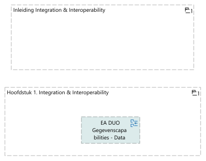

## Rapportage capability Integration & Interoperability
<figure align="center">
  
  <figcaption><i>Rapportage capability Integration & Interoperability</i></figcaption>
</figure>

<table>
  <thead>
    <tr>
      <th colspan="1" width="20%">Element</th>
      <th rowspan="2" width="40%">Definitie</th>
      <th rowspan="2" width="40%">Omschrijving</th>
    </tr>
  </thead>
  <tbody>
    <tr><td></td><td></td></tr>
    <tr valign="top")>
      <td colspan="1">Inleiding Integration & Interoperability 
(grouping)</td>
      <td>
Integration &amp; interoperability gaat over beschikbaarheid van gegevens, Het gaat hier niet om gegevens in de blote kont maar om het beschikbaar hebben van gegevens met daarbij de juiste context / betekenis. 

<ul>
<li>
Op dit moment (begin 2025) loopt er al een tijd project GABI met daar in een data distributie platform en een meta data platform inclusief presentatie. Dit project heeft al PSA's en een PRSA.
</li>
<li>
Daarnaast wordt team gegevensmagazijn (GGM) omgedoopt tot team gegevensintegratie (GGI) onder de business unit Gegevensdiensten. Vanuit de techniek wordt deze domeinarchitectuur doorontwikkeld. Dit is mede ingegeven door de migratie van DB2 naar Postgress waar een andere oplossing nodig was voor het gegevensmagazijn die de primaire appicaties verbind.
</li>
<li>
Tot slot wordt er een PSA door de CIO domeinarchitect gegevens opgesteld met betrekkeing tot gegevensintegratie.
</li>
</ul>

Al deze initiatieven raken Integration &amp; Interoperability, en wat mist is dus eigenlijk strategische sturing aan deze initiatieven. De aanleiding voor het nu opzetten van deze capability is daarmee ook om de samenhang en volledigheid van Integration &amp; Interoperability over deze intiatieven onder architectuur te brengen.
</td>
    </tr>
    <tr valign="top")>
      <td colspan="1">Hoofdstuk 1. Integration & Interoperability 
(grouping)</td>
      <td>
In de onderstaande view worden de services m.b.t. Integration &amp; Interoperability beschreven. Er is hier een natuurlijke opdeling in het toewijzen van integratiepatronen om gegevens te kunnen delen en het hierbij bereiken van het vereiste vermogen van verschillende ogransiatieonderdelen en systemen om  naadloos samen te kunnen werken met de brongegevens.
</td>
    </tr>
  </tbody>
</table>

