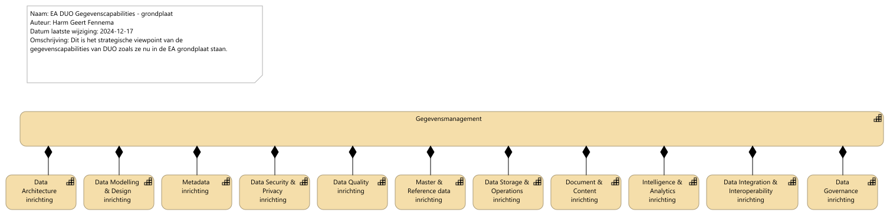
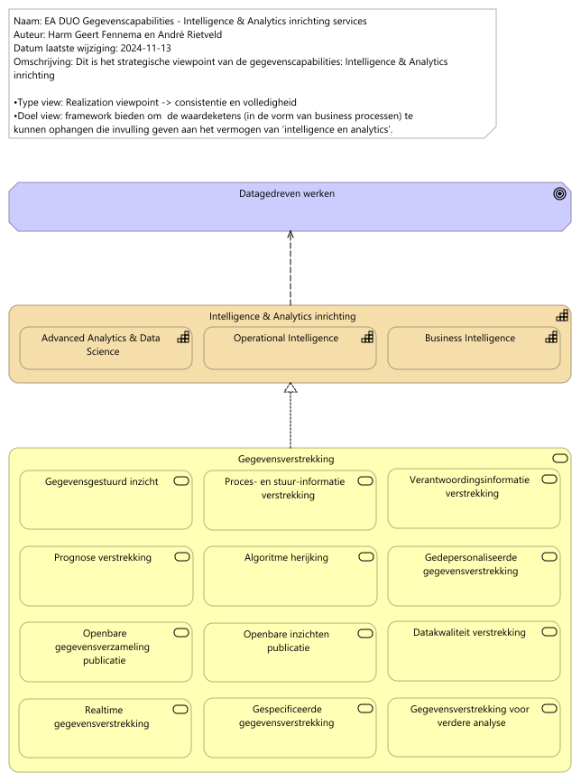
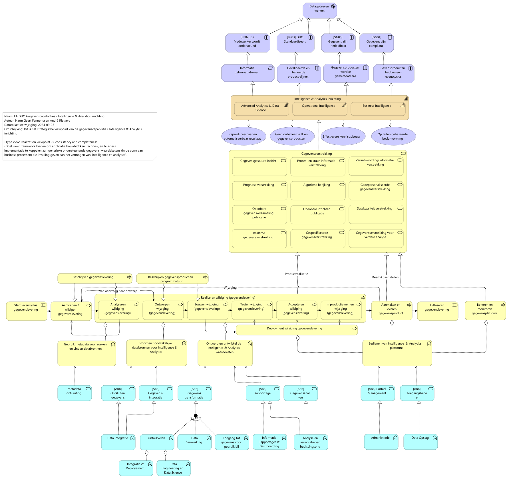

# Rapportage capability Intelligence & Analytics

Report generated at: 2025-02-03  10:07:26

---
## Inhoudsopgave

* [Inleiding Gegevenscapability Intelligence en Analytics](#inleiding-gegevenscapability-intelligence-en-analytics)
* [Hoofdstuk 1.  Gegevenscapabilities grondplaat](#hoofdstuk-1-gegevenscapabilities-grondplaat)
  * [EA DUO Gegevenscapabilities - grondplaat](#ea-duo-gegevenscapabilities--grondplaat)
* [Hoofdstuk 2.  Gegevenscapability Intelligence en Analytics](#hoofdstuk-2-gegevenscapability-intelligence-en-analytics)
  * [2.1  Intelligence en Analytics services](#21-intelligence-en-analytics-services)
    * [EA DUO Gegevenscapabilities Intelligence en Analytics inrichting services](#ea-duo-gegevenscapabilities-intelligence-en-analytics-inrichting-services)
  * [2.2  Intelligence and Analytics generieke processen en functies](#22-intelligence-and-analytics-generieke-processen-en-functies)
    * [EA DUO Gegevenscapabilities Intelligence en Analytics inrichting](#ea-duo-gegevenscapabilities-intelligence-en-analytics-inrichting)

---

## Inleiding Gegevenscapability Intelligence en Analytics

##### Rapportage van de views 'EA DUO Gegevenscapabilities grondplaat' en de 'EA DUO Gegevenscapabilities Intelligence en Analytics inrichting services'
Dit is een rapportage van (een deel van) de gegevenscapability architectuur.
Deze rapportage heeft als doel om de twee architectuurviews in hoofdstuk 1 en 2.1 te accepteren en daarmee een architectuur fundament te leggen voor gegevensmanagement-ondersteuning aan de business en het werken aan gegevens.

- Hoofdstuk 1 bevat de ophanging van de DUO gegevenscapabilities aan de EA grondplaat.

- Hoofdstuk 2.1 bevat een verdieping van de Gegevenscapability Analytics en Intelligence.

- Hoofdstuk 2.2 staat niet ter review maar is een voorproef van de doorvertaling naar functies en services als brug voor verdere invulling van ABB's en SBB's.

###### Technische notitie:
Deze rapportage is geheel gegenereerd vanuit archi met behulp van scripts en staat daarmee ook onder versie beheer en is reproduceerbaar. Dit type rapportage is publiceerbaar op wiki's/confluence en kan door meerdere mensen worden becommentarieerd in een review processtap die verder uit te werken is door de werkgroep.

---

## Hoofdstuk 1.  Gegevenscapabilities grondplaat

Het doel van onderstaande view is tweeledig
1) level 3 (L3) gegevenscapabilities onder de aandacht brengen
2) de ophanging van de L3 gegevenscapabilities aan de EA (IST situatie) vast te stellen 
### EA DUO Gegevenscapabilities - grondplaat

Zie properties.
<figure align="center">
  
  <figcaption><i>EA DUO Gegevenscapabilities - grondplaat</i></figcaption>
</figure>

<table>
  <thead>
    <tr>
      <th colspan="1" width="20%">Element</th>
      <th rowspan="2" width="40%">Definitie</th>
      <th rowspan="2" width="40%">Omschrijving</th>
    </tr>
  </thead>
  <tbody>
    <tr><td></td><td></td></tr>
    <tr valign="top")>
      <td colspan="1">Gegevensmanagement 
(capability)</td>
      <td>
Gegevensmanagement betreft het geheel aan activiteiten dat DUO uitvoert om gegevens te verzamelen, vast te leggen, te beheren en ter beschikking te stellen. De functie staat voor het garanderen van de juistheid, tijdigheid en volledigheid en transparantie van alle gegevensleveringen aan alle klanten van DUO, ze vormt de grondslag voor de processen waarmee DUO haar klanten van informatie voorziet.
bron: Gegevensmanagement inrichtingsvoorstel eindrapport v1.0
</td>
      <td>
DUO heeft het vermogen de ontwikkeling, uitvoering en supervisie van plannen, beleid, programma's en praktijken die de waarde van gegevens en informatiemiddelen gedurende hun levenscyclus opleveren, controleren, beschermen en vergroten.
Hiermee:
•    begrijpen en ondersteunen wij de informatiebehoefte van DUO en haar klanten, medewerkers en ketenpartners
•    kunnen we onze data assets vastleggen, beschermen en de integriteit daarvan waarborgen
•    kunnen we de kwaliteit van onze gegevens en informatie waarborgen
•    kunnen we de privacy en vertrouwelijkheid van gegevens over onze stakholders waarborgen
•    kunnen we de ongeautoriseerde of ongepaste toegang, manipulatie of gebruik van gegevens en informatie voorkokmen
•    kunnen we waarborgen dat gegevens effectief binnen DUO gebruikt worden wat de waarde van onze gegevens vergroot.
</td>
    </tr>
    <tr valign="top")>
      <td colspan="1">Data Architecture inrichting 
(capability)</td>
      <td>
DUO heeft het vermogen om een consistent geheel van principes en modellen op te stellen dat richting geeft aan ontwerp en realisatie van de processen, organisatorische inrichting, informatievoorziening en technische infrastructuur van het gegevensmanagement van DUO.
Data architectuur is aspect binnen DUO's Enterprise Architectuur
Bron: DUO Architectuur wiki

In de data architectuur vindt de vertaling plaats van ambitie naar realisatie.
</td>
      <td>
Bron: DAMA BMBOK2
</td>
    </tr>
    <tr valign="top")>
      <td colspan="1">Data Modelling & Design inrichting 
(capability)</td>
      <td>
DUO heeft het vermogen het proces uit te voeren waarbij datavereisten ontdekt, geanalyseerd en in kaart gebracht wordt en vervolgens te representeren en communiceren in een precieze vorm die het gegevensmodel wordt genoemd. Datamodellering en ontwerp betreft het analyseren, ontwerpen, bouwen, testen en onderhouden van (conceptuele, logische en fysieke) gegevensmodellen.

Bron: DAMA DMBOK2:
</td>
      <td>
Gegevensmodellen zijn van cruciaal belang voor effectief gegevensbeheer. Met een gegevensmodel kan DUO:
• Zorgen voor een gemeenschappelijk vocabulaire rond gegevens.
• Expliciete kennis vastleggen en documenteren over de gegevens en systemen van een organisatie.
• Laten fungeren als primair communicatiemiddel tijdens projecten.
• Bieden van het startpunt voor maatwerk, integratie of zelfs vervanging van een applicatie.

Modellen hebben een relatie met metadata en bevatten metagegevens zoals: betekenis, de structuur, de compliancy op het gebied van archivering,  BIV, , eigenaar, locatie e.d).
</td>
    </tr>
    <tr valign="top")>
      <td colspan="1">Metadata inrichting 
(capability)</td>
      <td>
DUO heeft het vermogen beschrijvende gegevens over de gegevens (metagegevens) enkelvoudig te beheren en meervoudig te gebruiken, zodat niet elk team van verwekers moet zoeken naar of opnieuw nadenken over de bruikbaarheid van de gegevens. Dit is vergelijkbaar met de bijsluiter van een medicijn.
</td>
      <td>
Met goed beheerde metadata kan DUO:

<ul>
<li>Door context te bieden het vertrouwen geven in de gegevens</li>
<li>Het meten van datakwaliteit mogelijk te maken</li>
<li>De waarde van strategische informatie (bijvoorbeeld Master Data) door meerdere toepassingen mogelijk te maken</li>
<li>De operationele efficiëntie verbeteren door redundante gegevens en processen te identificeren</li>
<li>Voorkomen van het gebruik van verouderde of onjuiste gegevens</li>
<li>Verkorten van gegevensgerichte onderzoekstijd</li>
<li>Verbeteren van de communicatie tussen gegevensconsumenten en IT-professionals</li>
<li>Nauwkeurigere impactanalyses maken en zo verkleinen van het risico op projectmislukking</li>
<li>Verbeteren van de time-to-market door de levenscyclustijd van systeemontwikkeling te verkorten</li>
<li>Verlagen van de trainingskosten en verminderen van de impact van personeelsverloop door grondige documentatie van de gegevenscontext, -geschiedenis en -oorsprong</li>
<li>Ondersteuning bieden van naleving van regelgeving</li>
</ul>

Metagegevens bevinden zich in 

<ul>
<li>Modellen ( betekenis, de structuur, de compliancy, eigenaar, locatie e.d) . Dit punt heeft overlap met de Capability Gegevensmodellering (Data Modelling en Design).</li>
<li>Standaard attributen in de database (herkomst, datum ontvangst, logging e.d.). Dit wordt standaard aan de database toegevoegd o.b.v.  metadatapatronen.</li>
</ul></td>
    </tr>
    <tr valign="top")>
      <td colspan="1">Data Security & Privacy  inrichting 
(capability)</td>
      <td>
Data Security betreft het vermogen om op een veilige manier met gegevens om te gaan conform wettelijke kaders en richtlijnen.

Privacy betreft het vermogen om op een veilige manier met persoonsgegevens om te gaan conform wettelijke kaders en richtlijnen.
</td>
      <td>
Bron: DAMA DMBOK2
</td>
    </tr>
    <tr valign="top")>
      <td colspan="1">Data Quality inrichting 
(capability)</td>
      <td>
Het vermogen om de kwaliteit van gegevens inzichtelijk en daarmee geschikt te maken voor verschillende toepassingen.
</td>
      <td>
Gegevenskwaliteit is het definiëren, valideren (tegen normen) en onderhouden van gegevens langs een aantal dimensies om de kwaliteit, fit-for-purpose, inzichtelijk te maken en te verbeteren.DUO heeft het vermogen om langs een aantal dimensies de kwaliteit van gegevens te definiëren, monitoren en onderhouden om zo de fit-for-purpose van de gegevens te verbeteren. Het beheren van de gegevenskwaliteit maakt dat DUO:
• De waarde vergroot van gegevens en de mogelijkheden om deze te gebruiken
• De risico’s en kosten vermindert die gepaard gaan met gegevens van slechte kwaliteit
• De efficiëntie en productiviteit verbetert van de organisatie
• De reputatie op gebied van gegevens en informatie van DUO beschermt en verbetert
</td>
    </tr>
    <tr valign="top")>
      <td colspan="1">Master & Reference data inrichting 
(capability)</td>
      <td>
Het vermogen om over domeinen heen kerngegevens te gebruiken als referentie -en materdata te identificeren, eenduidig te beheren en breed beschikbaar te stellen. 

Bron: DAMA DMBOK2
</td>
      <td>
DUO heeft het vermogen om kerngegevens (masterdata) en referentiegegevens te identificeren, golden records te realiseren, enkelvoudig te beheren en breed beschikbaar te maken. Het managen van het golden record voor de kerngegevens geldt voor de gehele levenscylcus.

Zo kan DUO: 
•    Vertrouwen geven in de compleetheid, actualiteit en consistentie van gedeelde kerngegevens over de verschillende organisatie onderdelen heen
•    Beter de gegevenskwaliteit van herbruikbare kerngegevens beheren
•    Data redundantie en onnodige (en onnodig complexe ) gegevensintegratie voorkomen
•    Risico’s verminderen geassocieerd met inconsistente gegevens
</td>
    </tr>
    <tr valign="top")>
      <td colspan="1">Data Storage & Operations inrichting 
(capability)</td>
      <td>
DUO heeft het vermogen op gegevensopslag te ontwerpen, implementeren en beheren zodat de waarde van gegevens gemaximaliseerd wordt. 
Bron: DAMA DMBOK2
</td>
      <td>
Zo kan DUO:
•    De beschikbaarheid van gegevens gedurende de gegevenslevenscyclus beheren
•    Zorgen voor de integriteit van de data assets
•    Beheren van de prestaties van gegevenstransacties.
</td>
    </tr>
    <tr valign="top")>
      <td colspan="1">Document & Content inrichting 
(capability)</td>
      <td>
DUO heeft het vermogen documenten en andere content te archiveren, op te slaan en toegankelijk te maken in ongestructureerde en gestructureerde gegevensopslag.

Bron: DAMA DMBOK2
</td>
      <td>
Zo kan DUO:
•    (On)gestructureerde gegevens eenvoudig vinden en gebruiken
•    Integratie tussen gestructureerde en ongestructureerde gegevens bevorderen
•    Voldoen aan wettelijke verplichtingen en verwachtingen van de klant.
</td>
    </tr>
    <tr valign="top")>
      <td colspan="1">Intelligence & Analytics inrichting 
(capability)</td>
      <td>
DUO heeft het vermogen om met intelligence- (OI en BI) en analyseprocessen (bv. data science technieken) het gevraagde gegevens- of  informatieproduct te ontwerpen, ontwikkelen, te beheren en te leveren zodat DUO, ketenpartners en andere interne en externe afnemers met het verkregen inzicht besluitvorming kunnen ondersteunen.
De gegevensverwerkingen die nodig zijn om uiteindelijk tot de gewenste informatie te komen is onderdeel van de gegevensmanagement functie.

Bron: DAMA DMBOK2 Dataware-housing en Business, Intelligence, Big Data en Data Science.
</td>
    </tr>
    <tr valign="top")>
      <td colspan="1">Data Integration & Interoperability inrichting 
(capability)</td>
      <td>
Het vermogen om de flow en consolidatie van gegevens tussen eenheden systemen en partijen te managen. 
Interoperabiliteit is het vermogen om samen te werken. Dit gebeurt typisch langs de lijn van standaarden als de samenwerkende partners er voor kiezen of toe worden aangezet om een standaard te volgen.
</td>
      <td>
Bron: DAMA DMBOK2
Doel is om 
1)    Gegevens veilig (compliant) en binnen het gestelde tijdsframe door de organisatie te laten stromen. 
2)    Kosten en complexiteit en het aantal te beheren oplossingen te reduceren door gedeelde modellen en interfaces te ontwikkelen en toe te wijzen
3)    Ondersteunen van onder andere: Analytics, BI, Master data management en operationele efficiency
</td>
    </tr>
    <tr valign="top")>
      <td colspan="1">Data Governance inrichting 
(capability)</td>
      <td>
Datagovernance betreft de planning, het overzicht en de controle over gegevensmanagement. Bij DUO wordt de term gegevensmanagement gebruikt voor het hele vakgebied, waarbinnen datagovernance over de verschillende onderdelen de regie voert.

De ontwikkeling kent een fasering en vraagt om een balans tussen:
Strategie en Doelen
Besturing en Organisatie
Leiderschap en Gedrag
</td>
      <td>
Ensuring data is managed
Bron: DAMA DMBOK2
</td>
    </tr>
  </tbody>
</table>

---

## Hoofdstuk 2.  Gegevenscapability Intelligence en Analytics

Hieronder is in hoofdstuk 2.1 de L3 gegevenscapability Intelligence en Analytics verder uitgewerkt naar L4 capabilities en business services.
In hoofdstuk 2.2 is te zien hoe deze verder uitgewerkt wordt naar Business processen en functies en Applicatie services en functies.

Hoofdstuk 2.1 staat ter review. Hoofdstuk 2.2 is het vervolg en staat nog niet ter review maar is een doorkijkje naar de verdere uitwerking.
### 2.1  Intelligence en Analytics services

In de onderstaande view worden L4 capabilies op gebied van Operational Intelligence, Business Intelligence en Advanced Analytics en Data Science  gegroepeerd onder Intelligence en Analytics.
Het gaat hier om ondersteunende capabilities die verstrekkingen voortbrengen die de business (intern en externe partners) nodig heeft om invulling te geven aan  hun informatiegebruikspatronen.

Dit bestaat voornamelijk aan het werken aan gegevens, en daarmee het analyseren, realiseren, beheren en publiceren van verschillende typen gegevensproducten.
#### EA DUO Gegevenscapabilities Intelligence en Analytics inrichting services

Zie properties.
<figure align="center">
  
  <figcaption><i>EA DUO Gegevenscapabilities Intelligence en Analytics inrichting services</i></figcaption>
</figure>

<table>
  <thead>
    <tr>
      <th colspan="2" width="20%">Element</th>
      <th rowspan="2" width="40%">Definitie</th>
      <th rowspan="2" width="40%">Omschrijving</th>
    </tr>
  </thead>
  <tbody>
    <tr><td></td><td></td><td></td></tr>
    <tr valign="top")>
      <td colspan="2">Datagedreven werken 
(goal)</td>
      <td>
DUO heeft de ambitie om 'meer te doen met data' en meer datagedreven te gaan werken. Dit om beslissingen niet op basis van gevoel maar op basis van feiten te nemen en om deze processen reproduceer en automatiseerbaar te maken. Dit maakt processen bestendiger, uitlegbaar en verkort doorlooptijden.
</td>
    </tr>
    <tr valign="top")>
      <td colspan="2">Intelligence & Analytics inrichting 
(capability)</td>
      <td>
DUO heeft het vermogen om met intelligence- (OI en BI) en analyseprocessen (bv. data science technieken) het gevraagde gegevens- of  informatieproduct te ontwerpen, ontwikkelen, te beheren en te leveren zodat DUO, ketenpartners en andere interne en externe afnemers met het verkregen inzicht besluitvorming kunnen ondersteunen.
De gegevensverwerkingen die nodig zijn om uiteindelijk tot de gewenste informatie te komen is onderdeel van de gegevensmanagement functie.

Bron: DAMA DMBOK2 Dataware-housing en Business, Intelligence, Big Data en Data Science.
</td>
    </tr>
    <tr valign="top")>
      <td colspan="1"></td>
      <td colspan="1">Advanced Analytics & Data Science  
(capability)</td>
      <td>
DUO heeft het vermogen aan de hand van geavanceerde technieken complexe gegevensverzamelingen te verwerken tot inzichten en/of voorspellende/-schrijvende algoritmische modellen waarmee gegevensgestuurde/-onderbouwde besluiten genomen kunnen worden op strategisch, tactisch of operationeel niveau.
</td>
      <td>
Deze capability omvat een breed scala aan functies en activiteiten die nodig zijn om geavanceerde analyses en datagedreven modellering uit te voeren.

Binnen deze overkoepelende capability bevinden zich verschillende subcapabilities en competenties.

Gegevensverzameling en -opslag: Het verzamelen, opslaan en beheren van grote hoeveelheden gegevens, inclusief gestructureerde en ongestructureerde gegevens, die nodig zijn voor data science-projecten.

Gegevensvoorbereiding en -opschoning: Het proces van het voorbereiden en opschonen van ruwe gegevens om ze geschikt te maken voor analyse en modellering.

Gegevensexploratie en -visualisatie: Het verkennen van gegevens en het gebruik van visualisaties om inzichten te krijgen en patronen te identificeren.

Statistische Analyse: Het uitvoeren van statistische analyses om de gegevens te begrijpen en te karakteriseren.

Machine Learning en Algoritme-ontwikkeling: Het ontwikkelen van machine learning-modellen en algoritmen om voorspellingen te doen, patronen te ontdekken en besluitvorming te automatiseren.

Deep Learning en Neurale Netwerken: Het gebruik van diepe leermodellen en neurale netwerken voor complexe taken zoals beeldherkenning en natuurlijke taalverwerking.

Big Data-technologieën: Het werken met big data-technologieën en -platforms voor de verwerking en analyse van grote hoeveelheden gegevens.

Experimentontwerp en A/B-testing: Het ontwerpen en uitvoeren van gecontroleerde experimenten om hypotheses te testen en de impact van veranderingen te meten.

Model Evaluatie en Validatie: Het beoordelen en valideren van de prestaties van modellen en algoritmen om ervoor te zorgen dat ze betrouwbaar zijn.

Opschaling en Implementatie: Het schalen en implementeren van data science-modellen in productieomgevingen.

Ethiek en Privacy: Het waarborgen van ethische en wettelijke overwegingen met betrekking tot gegevensgebruik en privacy.

De overkoepelende capability voor Advanced Analytics and Data Science is cruciaal omdat het de organisatie in staat stelt om geavanceerde technieken en modellen te gebruiken om waardevolle inzichten uit data te halen. Data science maakt gebruik van deze capability om complexe analyses uit te voeren, voorspellingen te doen en besluitvorming te ondersteunen op basis van gegevens. Het speelt een essentiële rol bij het omzetten van gegevens in zakelijke waarde en innovatie.
</td>
    </tr>
    <tr valign="top")>
      <td colspan="1"></td>
      <td colspan="1">Operational Intelligence 
(capability)</td>
      <td>
DUO heeft het vermogen om ((near) real-time) gegevens te analyseren van specifieke events of individuele business processen/functies om verbeteringen of mogelijkheden te identificeren vanuit een operationeel oogpunt, waardoor besluiten ten behoeve van verbeteringen of optimalisatie van het operationele proces genomen kunnen worden.
</td>
      <td>
Operational Intelligence hanteert een proactieve activiteit-centrische aanpak waar een constante stroom van (near) real-time operationele data vanuit een bron direct in een analytisch platform wordt geladen zonder te worden opgeslagen in een datawarehouse. Operational Intelligence pas je toe wanneer je accurate en actuele situationele inzicht wil hebben op een specifiek business proces/functie waar je snel op wilt reageren.

Operational Intelligence gebruikt technologie die ook voor traditionele BI worden ingezet, maar voegt daar tooling en technieken aan toe voor snelle data cleansing (detecteren en repareren of verwijderen van (corrupte) data) en het snel kunnen verwerken van data zodat medewerkers die werken binnen een proces beter de voortdurende real-time stroom aan data kunnen analyseren of op kunnen reageren. Operational Intelligence kan ook gaan over voorspellende modellen en ML algoritmes die real-time feedback geven binnen het primaire proces. De dynamische operationele data worden in een analytisch platform geïntegreerd met meer statische data of normen (bijvoorbeeld drempelwaarden) om tot het inzicht te komen.
</td>
    </tr>
    <tr valign="top")>
      <td colspan="1"></td>
      <td colspan="1">Business Intelligence 
(capability)</td>
      <td>
DUO heeft het vermogen om aan de hand van (gestructureerde) gegevensverzamelingen en tools analyses en onderzoeken uit te voeren zoals oorzaak-gevolg relaties tussen ogenschijnlijk ongerelateerde macro-trends over verschillende bedrijfsprocessen heen. Hierdoor kan het een belangrijke waarde leveren aan bedrijfsbrede lange termijn tactische en strategische doelen.
</td>
      <td>
BI volgt de reactieve aanpak “onderzoek het verleden om de huidige situatie te begrijpen en verwachtingspatronen te ontwikkelen”. Er worden binnen het BI-proces over de jaren heen historische data verzamelt vanuit diverse processen die volgens business logica getransformeerd worden en tot slot worden opgeslagen in een data warehouse zodat hieruit later inzichten uit kunnen worden gehaald. 
 Het wordt voornamelijk gebruikt om onderliggende dynamieken/patronen te analyseren van bepaalde trends.

BI heeft technologie nodig die medewerkers in staat stelt om grote datasets te extraheren, te transformeren, integreren, op te slaan en te kunnen analyseren. Dit bevat data integratie oplossingen, ETL-systemen, algoritme gebaseerde data modelleer software om relaties of patronen te herkennen in de data en datavisualisatie oplossingen om de data inzichten te kunnen delen. De gebruikerslaag voor BI bestaat doorgaans uit dimensioneel gemodelleerde datamarts (zogeheten stermodellen met een business focus) gekoppeld aan een presentatielaag in de vorm van een rapportagetool.
</td>
    </tr>
    <tr valign="top")>
      <td colspan="2">Gegevensverstrekking 
(business-service)</td>
      <td>
Gegevensverstrekking is de overkoepelde DUO dienst die staat voor alles wat DUO inricht om gegevensproducten te ontwikkelen en beschikbaar te stellen voor klanten zowel binnen als buiten DUO.

We maken geen onderscheid tussen gegevens en informatie. Gegevens zonder context hebben geen waarde en gegevens met context zou informatie zijn. Gegevensverzamelingen die worden bewaard hebben een beschrijving en zijn dus geen gegevensverzamelingen, maar een informatiebank. Dit is basis voor veel verwarring en het gaat om de mate van raffinage en verwerking van de grondstof. De grens is diffuus en daarom geen onderscheid.

Gegevensverstrekking vindt plaats op basis van een verzoek van een klant. Op basis van een leveringsovereenkomst vindt verstrekking plaats waar naast de realisatie van het product ook de service en ondersteuning rondom de verstrekking van de producten geborgd is.

De service beslaat de gehele levencyclus en hier moeten dus (raam)afspraken over gemaakt worden.

Het bestaat dus zowel uit de aanvraag, de realisatie, de toegang, het beheer van het leverkanaal, de ondersteuning bij het gebruik als de uitfasering.
</td>
    </tr>
    <tr valign="top")>
      <td colspan="1"></td>
      <td colspan="1">Gegevensgestuurd inzicht 
(business-service)</td>
      <td>
De DUO dienst gegevensgestuurd inzicht levert op verzoek van klanten een onderzoeksresultaat /  adviesrapport, storytelling met DUO gegevensverzameling(en) als onderbouwing.

Deze dienst heeft domeinkennis van het onderwerp waar de klantvraag over gaat en gebruikt deze tijdens gegevensanalyse en productontwikkeling. Het inzicht / advies wordt verwerkt in het product. 

Dit kan een onderzoek zijn, managementondersteuning, advies maar ook een beantwoording van een kamervraag .
Welk gegevensproduct als onderbouwing gebruikt wordt, of welke vorm van self service kan verschillen.
</td>
    </tr>
    <tr valign="top")>
      <td colspan="1"></td>
      <td colspan="1">Proces- en stuur-informatie verstrekking 
(business-service)</td>
      <td>
De DUO dienst Proces- en Stuurinformatie Verstrekking verstrekken rapporten / dashboards met procesinzicht of stuur informatie enerzijds voor managers, of gedelegeerde en ondersteunende medewerkers voor sturing en coördinatie van de business en beheerders anderzijds voor ondersteuning van de techniek en taken ondersteunend aan de business.

Dit laatste een overzicht veelal gebaseerd op metadata van 'scheduling' of van de tooling waar het platform operationeel op is.
</td>
    </tr>
    <tr valign="top")>
      <td colspan="1"></td>
      <td colspan="1">Verantwoordingsinformatie verstrekking 
(business-service)</td>
      <td>
De DUO dienst Verantwoordingsinformatie verstrekt rapporten aan managers, of gelegeerde en ondersteunende medewerkers ten behoeve van de af te leggen verantwoording voor de evaluatie van hun business. Dit is veelal gerelateerd aan een planning en control cyclus.
</td>
    </tr>
    <tr valign="top")>
      <td colspan="1"></td>
      <td colspan="1">Prognose verstrekking 
(business-service)</td>
      <td>
De DUO dienst Prognose Verstrekking verstrekt gegevensproducten die op basis van gegevensverzamelingen en statistische, wiskundige en/of op AI-technieken gebaseerde modellen een voorspelling verstrekt.
</td>
    </tr>
    <tr valign="top")>
      <td colspan="1"></td>
      <td colspan="1">Algoritme herijking 
(business-service)</td>
      <td>
De DUO dienst Algoritme Herijking verzorgt het opnieuw trainen van een bestaand algoritme nadat de gegevensverzameling waarop het algoritme getraind is niet meer representatief is voor de actualiteit zodat het algoritme weer betrouwbaar wordt.

Dit gaat vooral om algoritmen die zijn gemaakt met AI technieken zoals Machine Learning. Ze kunnen worden gebruikt voor algoritmen in de operatie, onderzoek, en om algoritmen te verifieren die zijn getraind met synthetische data.
</td>
    </tr>
    <tr valign="top")>
      <td colspan="1"></td>
      <td colspan="1">Gedepersonaliseerde gegevensverstrekking 
(business-service)</td>
      <td>
De DUO dienst Gedepersonaliseerde Gegevensverstrekking verstrekt gegevensverzamelingen die geen tot op de persoon herleidbare gegevens bevatten gebruik makend van Privacy Enhancement Techniques waaronder anonimisering, pseudonimisering en synthetisering.
</td>
    </tr>
    <tr valign="top")>
      <td colspan="1"></td>
      <td colspan="1">Openbare gegevensverzameling publicatie 
(business-service)</td>
      <td>
De DUO dienst Openbare Gegevensverzameling Publicatie faciliteert het publiceren van openbare gegevensverzamelingen.
</td>
    </tr>
    <tr valign="top")>
      <td colspan="1"></td>
      <td colspan="1">Openbare inzichten publicatie 
(business-service)</td>
      <td>
De DUO dienst Openbare Inzichten Publicatie faciliteert de publicatie van door DUO ontwikkelde openbare inzichten met betrekking tot het Nederlandse onderwijs.

Het gaat hier op openbare inzichten ondersteunt door een (grafisch)gegevensproduct om de maatschappij en/of het onderwijsveld te informeren.
</td>
    </tr>
    <tr valign="top")>
      <td colspan="1"></td>
      <td colspan="1">Datakwaliteit verstrekking 
(business-service)</td>
      <td>
De DUO dienst Datakwaliteit Verstrekking betreft de terugkoppeling van de kwaliteit van de aangeleverde of verwerkte gegevens aan de eigenaar van de gegevensbron.
De verstrekking kan op verschillende wijzen (Bijvoorbeeld een dashboard of een bestand met detailgegevens). 

Dit gaat bijvoorbeeld over controle op aangeleverde gegevens van een instelling die DUO heeft ontvangen. Op basis hier van kan de kwaliteit aan de bron worden verbeterd. In dit voorbeeld gaat het vooral over functionele controles op basis van business rules die in use cases zijn beschreven.

Andere voorbeelden zijn:
Tellingen in en uit een datawarehouse
Controles op de technische en logische modellen
</td>
    </tr>
    <tr valign="top")>
      <td colspan="1"></td>
      <td colspan="1">Realtime gegevensverstrekking 
(business-service)</td>
      <td>
De DUO dienst Realtime Gegevensvertrekking faciliteert het, op aanvraag/afspraak, verstrekken van actuele gegevens van een bronsysteem (registratie) aan een primair systeem.

Het gaat hier om M2M aanvragen / API calls volgens vaste definities die een applicatie in staat stelt realtime gegevens op transactie niveau te verwerken zonder dat het de gegevens op voorhand hoeft te kopieëren.

Te denken valt aan een API platform in de vorm van het DUO gegevensmagazijn.
</td>
    </tr>
    <tr valign="top")>
      <td colspan="1"></td>
      <td colspan="1">Gespecificeerde gegevensverstrekking 
(business-service)</td>
      <td>
De DUO dienst Gespecificeerde Gegevensvertrekking faciliteert de verstrekking van een gegevensverzameling welke verderop in de keten weer (geautomatiseerd) verwerkt wordt.

Deze gegevensverzameling wordt volgens een klantspecifieke definitie opgeleverd volgens een afgesproken frequentie. Dit kan zowel binnen als buiten DUO zijn. 
Extern kan dit ook een afnemer specifieke variant op opendata zijn als er klantspecifieke wensen zijn.

Het kan hier ook gaan om halffabrikaten voor intern gebruik.
</td>
    </tr>
    <tr valign="top")>
      <td colspan="1"></td>
      <td colspan="1">Gegevensverstrekking voor verdere analyse 
(business-service)</td>
      <td>
De DUO dienst Gegevensvertrekking tbv Analyse faciliteert het beschikbaar stellen van gegevensverzamelingen voor verdere analyse / onderzoek.

Het gaat hier er om dat er in de keten iemand een gegevensproduct gebruikt mogelijk in een self service omgeving of een analytische werklaats, om er zelf een afleiding van te maken en tot inzicht te komen.
</td>
    </tr>
  </tbody>
</table>

### 2.2  Intelligence and Analytics generieke processen en functies

In de onderstaande views zijn de generieke processtappen beschreven waarmee we gegevensproducten en daarmee de verschillende verstrekkingen voortbrengen. Vervolgens is dit doorvertaalt naar generieke business functies, applicatie functies en applicatie services.
Per service/gebruikspatroon/capability kunnen er op specifiek niveau andere functies, technieken en bouwblokken worden uitgewerkt in de solution architectuur.
#### EA DUO Gegevenscapabilities Intelligence en Analytics inrichting

Zie properties.
<figure align="center">
  
  <figcaption><i>EA DUO Gegevenscapabilities Intelligence en Analytics inrichting</i></figcaption>
</figure>

<table>
  <thead>
    <tr>
      <th colspan="2" width="20%">Element</th>
      <th rowspan="2" width="40%">Definitie</th>
      <th rowspan="2" width="40%">Omschrijving</th>
    </tr>
  </thead>
  <tbody>
    <tr><td></td><td></td><td></td></tr>
    <tr valign="top")>
      <td colspan="2">Datagedreven werken 
(goal)</td>
      <td>
DUO heeft de ambitie om 'meer te doen met data' en meer datagedreven te gaan werken. Dit om beslissingen niet op basis van gevoel maar op basis van feiten te nemen en om deze processen reproduceer en automatiseerbaar te maken. Dit maakt processen bestendiger, uitlegbaar en verkort doorlooptijden.
</td>
    </tr>
    <tr valign="top")>
      <td colspan="2">[BP02] De Medewerker wordt ondersteund 
(principle)</td>
      <td>
Zie properties.
</td>
      <td>
Iedere medewerker wordt zodanig ondersteund dat hij voldoende is toegerust.
</td>
    </tr>
    <tr valign="top")>
      <td colspan="2">[BP03] DUO Standaardiseert 
(principle)</td>
      <td>
Zie properties.
</td>
      <td>
DUO standaardiseert processen, gegevens en ondersteunende applicaties en IT technologie, gebruikt daarbij open standaarden en sluit aan op referentiearchitecturen van de overheid.
</td>
    </tr>
    <tr valign="top")>
      <td colspan="2">[GG05]  Gegevens zijn  herleidbaar 
(principle)</td>
      <td>
Zie properties.
</td>
      <td>
DUO wil achteraf het spoor kunnen laten zien hoe gegevens van een natuurlijk of niet-natuurlijk persoon door de organisatie zijn gestroomd en naar buiten, inclusief vragen als wanneer, aan wie en waarom.
</td>
    </tr>
    <tr valign="top")>
      <td colspan="2">[GG04] Gegevens zijn compliant 
(principle)</td>
      <td>
Zie properties.
</td>
      <td>
Het verwerken van gegevens is onderhevig aan diverse wettelijke eisen en normen. Vaak geformaliseerd in generieke wetgeving, niet direct gelinkt aan een onderwijswet. Compliancy wil zeggen dat DUO aantoonbaar voldoet. In de praktijk gaat het om privacy, gegevensbescherming en archivering.
</td>
    </tr>
    <tr valign="top")>
      <td colspan="2">Informatie gebruikspatronen 
(requirement)</td>
      <td>
Om datagedreven te kunnen werken is het van belang dat de business inzicht heeft in haar processen, en de informatiebehoefte binnen deze processen. Deze informatiebehoefte wordt in voorzien middels gegevensproducten. Het gewenste gebruik van gegevens in een proces noemen we een informatie gebruikspatroon. Het vermogen om gegevensproducten voort te brengen wordt ingevuld door de capability Intelligence &amp; Analytics. 
</td>
    </tr>
    <tr valign="top")>
      <td colspan="2">Gevalideerde en beheerde productielijnen 
(principle)</td>
      <td>
Door gebruik te maken van gevalideerde en beheerde productielijnen krijg je midner wildgroei aan applicaties en een betere kennisopbouw binnen de organisatie. Dit leidt tot een bestendigere en beheersbaardere bedrijfsvoering.
</td>
    </tr>
    <tr valign="top")>
      <td colspan="2">Gegevensproducten worden gemetadateerd 
(principle)</td>
      <td>
Net als gegevens moeten gegevensproducten worden gemetadateerd. Denk hier bij aan de leveringsovereenkomst, doelbinding, maar ook de gegevenspsecificatie en de gekoppelde gegevens.
</td>
    </tr>
    <tr valign="top")>
      <td colspan="2">Gevensproducten hebben een levenscyclus 
(principle)</td>
      <td>
Gegevensproducten worden volgens proces compliant ter beschikking gesteld. De noodzaak en/of het functioneren van het gegevensproduct wordt periodiek herzien.
</td>
    </tr>
    <tr valign="top")>
      <td colspan="2">Intelligence & Analytics inrichting 
(capability)</td>
      <td>
DUO heeft het vermogen om met intelligence- (OI en BI) en analyseprocessen (bv. data science technieken) het gevraagde gegevens- of  informatieproduct te ontwerpen, ontwikkelen, te beheren en te leveren zodat DUO, ketenpartners en andere interne en externe afnemers met het verkregen inzicht besluitvorming kunnen ondersteunen.
De gegevensverwerkingen die nodig zijn om uiteindelijk tot de gewenste informatie te komen is onderdeel van de gegevensmanagement functie.

Bron: DAMA DMBOK2 Dataware-housing en Business, Intelligence, Big Data en Data Science.
</td>
    </tr>
    <tr valign="top")>
      <td colspan="1"></td>
      <td colspan="1">Advanced Analytics & Data Science  
(capability)</td>
      <td>
DUO heeft het vermogen aan de hand van geavanceerde technieken complexe gegevensverzamelingen te verwerken tot inzichten en/of voorspellende/-schrijvende algoritmische modellen waarmee gegevensgestuurde/-onderbouwde besluiten genomen kunnen worden op strategisch, tactisch of operationeel niveau.
</td>
      <td>
Deze capability omvat een breed scala aan functies en activiteiten die nodig zijn om geavanceerde analyses en datagedreven modellering uit te voeren.

Binnen deze overkoepelende capability bevinden zich verschillende subcapabilities en competenties.

Gegevensverzameling en -opslag: Het verzamelen, opslaan en beheren van grote hoeveelheden gegevens, inclusief gestructureerde en ongestructureerde gegevens, die nodig zijn voor data science-projecten.

Gegevensvoorbereiding en -opschoning: Het proces van het voorbereiden en opschonen van ruwe gegevens om ze geschikt te maken voor analyse en modellering.

Gegevensexploratie en -visualisatie: Het verkennen van gegevens en het gebruik van visualisaties om inzichten te krijgen en patronen te identificeren.

Statistische Analyse: Het uitvoeren van statistische analyses om de gegevens te begrijpen en te karakteriseren.

Machine Learning en Algoritme-ontwikkeling: Het ontwikkelen van machine learning-modellen en algoritmen om voorspellingen te doen, patronen te ontdekken en besluitvorming te automatiseren.

Deep Learning en Neurale Netwerken: Het gebruik van diepe leermodellen en neurale netwerken voor complexe taken zoals beeldherkenning en natuurlijke taalverwerking.

Big Data-technologieën: Het werken met big data-technologieën en -platforms voor de verwerking en analyse van grote hoeveelheden gegevens.

Experimentontwerp en A/B-testing: Het ontwerpen en uitvoeren van gecontroleerde experimenten om hypotheses te testen en de impact van veranderingen te meten.

Model Evaluatie en Validatie: Het beoordelen en valideren van de prestaties van modellen en algoritmen om ervoor te zorgen dat ze betrouwbaar zijn.

Opschaling en Implementatie: Het schalen en implementeren van data science-modellen in productieomgevingen.

Ethiek en Privacy: Het waarborgen van ethische en wettelijke overwegingen met betrekking tot gegevensgebruik en privacy.

De overkoepelende capability voor Advanced Analytics and Data Science is cruciaal omdat het de organisatie in staat stelt om geavanceerde technieken en modellen te gebruiken om waardevolle inzichten uit data te halen. Data science maakt gebruik van deze capability om complexe analyses uit te voeren, voorspellingen te doen en besluitvorming te ondersteunen op basis van gegevens. Het speelt een essentiële rol bij het omzetten van gegevens in zakelijke waarde en innovatie.
</td>
    </tr>
    <tr valign="top")>
      <td colspan="1"></td>
      <td colspan="1">Operational Intelligence 
(capability)</td>
      <td>
DUO heeft het vermogen om ((near) real-time) gegevens te analyseren van specifieke events of individuele business processen/functies om verbeteringen of mogelijkheden te identificeren vanuit een operationeel oogpunt, waardoor besluiten ten behoeve van verbeteringen of optimalisatie van het operationele proces genomen kunnen worden.
</td>
      <td>
Operational Intelligence hanteert een proactieve activiteit-centrische aanpak waar een constante stroom van (near) real-time operationele data vanuit een bron direct in een analytisch platform wordt geladen zonder te worden opgeslagen in een datawarehouse. Operational Intelligence pas je toe wanneer je accurate en actuele situationele inzicht wil hebben op een specifiek business proces/functie waar je snel op wilt reageren.

Operational Intelligence gebruikt technologie die ook voor traditionele BI worden ingezet, maar voegt daar tooling en technieken aan toe voor snelle data cleansing (detecteren en repareren of verwijderen van (corrupte) data) en het snel kunnen verwerken van data zodat medewerkers die werken binnen een proces beter de voortdurende real-time stroom aan data kunnen analyseren of op kunnen reageren. Operational Intelligence kan ook gaan over voorspellende modellen en ML algoritmes die real-time feedback geven binnen het primaire proces. De dynamische operationele data worden in een analytisch platform geïntegreerd met meer statische data of normen (bijvoorbeeld drempelwaarden) om tot het inzicht te komen.
</td>
    </tr>
    <tr valign="top")>
      <td colspan="1"></td>
      <td colspan="1">Business Intelligence 
(capability)</td>
      <td>
DUO heeft het vermogen om aan de hand van (gestructureerde) gegevensverzamelingen en tools analyses en onderzoeken uit te voeren zoals oorzaak-gevolg relaties tussen ogenschijnlijk ongerelateerde macro-trends over verschillende bedrijfsprocessen heen. Hierdoor kan het een belangrijke waarde leveren aan bedrijfsbrede lange termijn tactische en strategische doelen.
</td>
      <td>
BI volgt de reactieve aanpak “onderzoek het verleden om de huidige situatie te begrijpen en verwachtingspatronen te ontwikkelen”. Er worden binnen het BI-proces over de jaren heen historische data verzamelt vanuit diverse processen die volgens business logica getransformeerd worden en tot slot worden opgeslagen in een data warehouse zodat hieruit later inzichten uit kunnen worden gehaald. 
 Het wordt voornamelijk gebruikt om onderliggende dynamieken/patronen te analyseren van bepaalde trends.

BI heeft technologie nodig die medewerkers in staat stelt om grote datasets te extraheren, te transformeren, integreren, op te slaan en te kunnen analyseren. Dit bevat data integratie oplossingen, ETL-systemen, algoritme gebaseerde data modelleer software om relaties of patronen te herkennen in de data en datavisualisatie oplossingen om de data inzichten te kunnen delen. De gebruikerslaag voor BI bestaat doorgaans uit dimensioneel gemodelleerde datamarts (zogeheten stermodellen met een business focus) gekoppeld aan een presentatielaag in de vorm van een rapportagetool.
</td>
    </tr>
    <tr valign="top")>
      <td colspan="2">Reproduceerbaar en automatiseerbaar resultaat 
(value)</td>
      <td></td>
    </tr>
    <tr valign="top")>
      <td colspan="2">Geen onbeheerde IT en gegevensproducten 
(value)</td>
      <td></td>
    </tr>
    <tr valign="top")>
      <td colspan="2">Effectievere kennisopbouw 
(value)</td>
      <td></td>
    </tr>
    <tr valign="top")>
      <td colspan="2">Op feiten gebaseerde besluitvorming 
(value)</td>
      <td></td>
    </tr>
    <tr valign="top")>
      <td colspan="2">Gegevensverstrekking 
(business-service)</td>
      <td>
Gegevensverstrekking is de overkoepelde DUO dienst die staat voor alles wat DUO inricht om gegevensproducten te ontwikkelen en beschikbaar te stellen voor klanten zowel binnen als buiten DUO.

We maken geen onderscheid tussen gegevens en informatie. Gegevens zonder context hebben geen waarde en gegevens met context zou informatie zijn. Gegevensverzamelingen die worden bewaard hebben een beschrijving en zijn dus geen gegevensverzamelingen, maar een informatiebank. Dit is basis voor veel verwarring en het gaat om de mate van raffinage en verwerking van de grondstof. De grens is diffuus en daarom geen onderscheid.

Gegevensverstrekking vindt plaats op basis van een verzoek van een klant. Op basis van een leveringsovereenkomst vindt verstrekking plaats waar naast de realisatie van het product ook de service en ondersteuning rondom de verstrekking van de producten geborgd is.

De service beslaat de gehele levencyclus en hier moeten dus (raam)afspraken over gemaakt worden.

Het bestaat dus zowel uit de aanvraag, de realisatie, de toegang, het beheer van het leverkanaal, de ondersteuning bij het gebruik als de uitfasering.
</td>
    </tr>
    <tr valign="top")>
      <td colspan="1"></td>
      <td colspan="1">Gegevensgestuurd inzicht 
(business-service)</td>
      <td>
De DUO dienst gegevensgestuurd inzicht levert op verzoek van klanten een onderzoeksresultaat /  adviesrapport, storytelling met DUO gegevensverzameling(en) als onderbouwing.

Deze dienst heeft domeinkennis van het onderwerp waar de klantvraag over gaat en gebruikt deze tijdens gegevensanalyse en productontwikkeling. Het inzicht / advies wordt verwerkt in het product. 

Dit kan een onderzoek zijn, managementondersteuning, advies maar ook een beantwoording van een kamervraag .
Welk gegevensproduct als onderbouwing gebruikt wordt, of welke vorm van self service kan verschillen.
</td>
    </tr>
    <tr valign="top")>
      <td colspan="1"></td>
      <td colspan="1">Proces- en stuur-informatie verstrekking 
(business-service)</td>
      <td>
De DUO dienst Proces- en Stuurinformatie Verstrekking verstrekken rapporten / dashboards met procesinzicht of stuur informatie enerzijds voor managers, of gedelegeerde en ondersteunende medewerkers voor sturing en coördinatie van de business en beheerders anderzijds voor ondersteuning van de techniek en taken ondersteunend aan de business.

Dit laatste een overzicht veelal gebaseerd op metadata van 'scheduling' of van de tooling waar het platform operationeel op is.
</td>
    </tr>
    <tr valign="top")>
      <td colspan="1"></td>
      <td colspan="1">Verantwoordingsinformatie verstrekking 
(business-service)</td>
      <td>
De DUO dienst Verantwoordingsinformatie verstrekt rapporten aan managers, of gelegeerde en ondersteunende medewerkers ten behoeve van de af te leggen verantwoording voor de evaluatie van hun business. Dit is veelal gerelateerd aan een planning en control cyclus.
</td>
    </tr>
    <tr valign="top")>
      <td colspan="1"></td>
      <td colspan="1">Prognose verstrekking 
(business-service)</td>
      <td>
De DUO dienst Prognose Verstrekking verstrekt gegevensproducten die op basis van gegevensverzamelingen en statistische, wiskundige en/of op AI-technieken gebaseerde modellen een voorspelling verstrekt.
</td>
    </tr>
    <tr valign="top")>
      <td colspan="1"></td>
      <td colspan="1">Algoritme herijking 
(business-service)</td>
      <td>
De DUO dienst Algoritme Herijking verzorgt het opnieuw trainen van een bestaand algoritme nadat de gegevensverzameling waarop het algoritme getraind is niet meer representatief is voor de actualiteit zodat het algoritme weer betrouwbaar wordt.

Dit gaat vooral om algoritmen die zijn gemaakt met AI technieken zoals Machine Learning. Ze kunnen worden gebruikt voor algoritmen in de operatie, onderzoek, en om algoritmen te verifieren die zijn getraind met synthetische data.
</td>
    </tr>
    <tr valign="top")>
      <td colspan="1"></td>
      <td colspan="1">Gedepersonaliseerde gegevensverstrekking 
(business-service)</td>
      <td>
De DUO dienst Gedepersonaliseerde Gegevensverstrekking verstrekt gegevensverzamelingen die geen tot op de persoon herleidbare gegevens bevatten gebruik makend van Privacy Enhancement Techniques waaronder anonimisering, pseudonimisering en synthetisering.
</td>
    </tr>
    <tr valign="top")>
      <td colspan="1"></td>
      <td colspan="1">Openbare gegevensverzameling publicatie 
(business-service)</td>
      <td>
De DUO dienst Openbare Gegevensverzameling Publicatie faciliteert het publiceren van openbare gegevensverzamelingen.
</td>
    </tr>
    <tr valign="top")>
      <td colspan="1"></td>
      <td colspan="1">Openbare inzichten publicatie 
(business-service)</td>
      <td>
De DUO dienst Openbare Inzichten Publicatie faciliteert de publicatie van door DUO ontwikkelde openbare inzichten met betrekking tot het Nederlandse onderwijs.

Het gaat hier op openbare inzichten ondersteunt door een (grafisch)gegevensproduct om de maatschappij en/of het onderwijsveld te informeren.
</td>
    </tr>
    <tr valign="top")>
      <td colspan="1"></td>
      <td colspan="1">Datakwaliteit verstrekking 
(business-service)</td>
      <td>
De DUO dienst Datakwaliteit Verstrekking betreft de terugkoppeling van de kwaliteit van de aangeleverde of verwerkte gegevens aan de eigenaar van de gegevensbron.
De verstrekking kan op verschillende wijzen (Bijvoorbeeld een dashboard of een bestand met detailgegevens). 

Dit gaat bijvoorbeeld over controle op aangeleverde gegevens van een instelling die DUO heeft ontvangen. Op basis hier van kan de kwaliteit aan de bron worden verbeterd. In dit voorbeeld gaat het vooral over functionele controles op basis van business rules die in use cases zijn beschreven.

Andere voorbeelden zijn:
Tellingen in en uit een datawarehouse
Controles op de technische en logische modellen
</td>
    </tr>
    <tr valign="top")>
      <td colspan="1"></td>
      <td colspan="1">Realtime gegevensverstrekking 
(business-service)</td>
      <td>
De DUO dienst Realtime Gegevensvertrekking faciliteert het, op aanvraag/afspraak, verstrekken van actuele gegevens van een bronsysteem (registratie) aan een primair systeem.

Het gaat hier om M2M aanvragen / API calls volgens vaste definities die een applicatie in staat stelt realtime gegevens op transactie niveau te verwerken zonder dat het de gegevens op voorhand hoeft te kopieëren.

Te denken valt aan een API platform in de vorm van het DUO gegevensmagazijn.
</td>
    </tr>
    <tr valign="top")>
      <td colspan="1"></td>
      <td colspan="1">Gespecificeerde gegevensverstrekking 
(business-service)</td>
      <td>
De DUO dienst Gespecificeerde Gegevensvertrekking faciliteert de verstrekking van een gegevensverzameling welke verderop in de keten weer (geautomatiseerd) verwerkt wordt.

Deze gegevensverzameling wordt volgens een klantspecifieke definitie opgeleverd volgens een afgesproken frequentie. Dit kan zowel binnen als buiten DUO zijn. 
Extern kan dit ook een afnemer specifieke variant op opendata zijn als er klantspecifieke wensen zijn.

Het kan hier ook gaan om halffabrikaten voor intern gebruik.
</td>
    </tr>
    <tr valign="top")>
      <td colspan="1"></td>
      <td colspan="1">Gegevensverstrekking voor verdere analyse 
(business-service)</td>
      <td>
De DUO dienst Gegevensvertrekking tbv Analyse faciliteert het beschikbaar stellen van gegevensverzamelingen voor verdere analyse / onderzoek.

Het gaat hier er om dat er in de keten iemand een gegevensproduct gebruikt mogelijk in een self service omgeving of een analytische werklaats, om er zelf een afleiding van te maken en tot inzicht te komen.
</td>
    </tr>
    <tr valign="top")>
      <td colspan="2">Beschrijven gegevenslevering 
(business-process)</td>
      <td>
Het juist beschrijven en metadateren van de gegevensleverings(afspraak).

Naast de registratie van de aanvraag wordt er tijdens het aanvraagproces en de analyse relevante metadata vastgelegd zodat nagegaan kan worden of de levering het juiste proces heeft gevolgd en of de levering volgens afspraak wordt geleverd.
</td>
    </tr>
    <tr valign="top")>
      <td colspan="2">Beschrijven gegevensproduct en programmatuur 
(business-process)</td>
      <td>
Het juist beschrijven en metadateren van je gegevens en je gegevensproduct.
Dit bestaat onder andere uit

<ul>
<li>Data lineage</li>
<li>Modellen</li>
<li>Documentatie voor ontwikkelaars </li>
<li>Documentatie voor gebruikers</li>
<li>De metadata voor het goed vindbaar maken en beschrijven van het product en de bijbehorende gegevens.</li>
</ul></td>
    </tr>
    <tr valign="top")>
      <td colspan="2">Start levencyclus gegevenslevering 
(business-event)</td>
      <td>
Start levencyclus gegevenslevering
</td>
    </tr>
    <tr valign="top")>
      <td colspan="2">Aanvragen / wijzigen gegevenslevering 
(business-process)</td>
      <td>
AR &amp; HGF 12-7-2024: In onderhoud bij procescontrol

Aanvragen/wijzigen gegevenslevering
Met afnemers overeenkomen van nieuwe en gewijzigde gegevensproducten, binnen de 
kaders van wet- en regelgeving.

Vanuit de aanvraag wordt uistapje gemaakt en een analyse aangevraagd (anders proces) waarna de aanvraag verder kan.

Activiteiten 
Intake, Controleren Wet- en Regelgeving, Contracten beheren, 
Opdrachtverstrekking

Documenten (bedrijfsobjecten)
Compliance dossier, Contract, Leverafspraak, Opdracht, Requirements

Actors (Dit zijn functies moeten door rollen worden ingevuld)
Gegevensmakelaar, Adviseur Compliancy, Medewerker Beleid &amp; Strategie, 
Accountmanager, Functionaris gegevensbeschering, Privacy officer
</td>
    </tr>
    <tr valign="top")>
      <td colspan="2">Realiseren wijziging (gegevenslevering) 
(business-process)</td>
      <td>
AR &amp; HGF 12-7-2024: In onderhoud bij procescontrol

Realiseren wijziging
Het realiseren van (veranderingen aan) geautomatiseerde processen.
Dit geld voor zowel systemische als meer oppertunistische gegevensleveringen (Een ad hoc volgt ook een proces)

Activiteiten 
Analyse, ontwerp, bouw, test, acceptatie, opleveren

Documenten 
Analysedocument, Ontwerp(en), Code, Opleverdocument, Productiedossier

Actors (nog naar rollen te vertalen)
Analist, Ontwikkelaar, Tester, Productowner

Omvat zowel het ontwerpen, ontwikkelen, documenteren, metadateren, testen als accepteren van de gegevensproducten.
</td>
    </tr>
    <tr valign="top")>
      <td colspan="1"></td>
      <td colspan="1">Analyseren wijziging (gegevenslevering) 
(business-process)</td>
      <td>
AR &amp; HGF 12-7-2024: In onderhoud bij procescontrol

In de analyse fase wordt de impact bepaald van de aanvraag. In de kern gaat dit om "kunnen we dit", "en hoe".

In de aanvraag is de behoefte van de klant al vastgelegd, ten tijde van de analyse wordt vervoglens de impact hier van ingeschat en globaal richting gegeven aan het ontwerp. 

In de analyse komt terug:
Wat moet het systeem  doen. Wat de relatie is met andere systemen, en welke gegevensuitwisseling is er nodig.

Gebaseerd op DMBOK2:
Dit omvat zowel de 

<ul>
<li>Analyse naar herkomst van de juiste gegevens</li>
<li>Als data analyse op de gegevens zelf (inhoudelijk en/of technisch), omvat ook geavanceerde data analyse en data science technieken.</li>
<li>Onderzoek naar de juiste presentatievorm van de bevindingen en inzichten (in brede zin; kan zowel een tabel, een dashboard als een algoritme zijn etc etc.</li>
</ul></td>
    </tr>
    <tr valign="top")>
      <td colspan="1"></td>
      <td colspan="1">Ontwerpen wijziging (gegevenslevering) 
(business-process)</td>
      <td>
AR &amp; HGF 12-7-2024: In onderhoud bij procescontrol

Nora online:

Ontwerpen
Bij deze activiteit vindt de tijdens in de eerdere fase gedetailleerde en vastgestelde uitwerking van informatie en modellen plaats. Deze fase richt zich op de relaties en afhankelijkheden tussen de te bouwen componenten. Hierbij worden de bedrijfs- en procesvereisten gemodelleerd in een ontwerp voor het te bouwen informatie(deel)systeem. Aandacht dient besteed te worden aan de kwaliteitseisen gerelateerd aan gebruikers, functionaliteit en beveiliging.

Het technisch- of detailontwerp borduurt verder op de analyse. Dit wordt gedaan door specifieker te beschrijven wat elk onderdeel van het systeem doet. Tevens legt men in deze fase vast hoe de beschreven onderdelen gerealiseerd worden. 
</td>
    </tr>
    <tr valign="top")>
      <td colspan="1"></td>
      <td colspan="1">Bouwen wijziging (gegevenslevering) 
(business-process)</td>
      <td>
AR &amp; HGF 12-7-2024: In onderhoud bij procescontrol

Het gaat bij het ontwikkelen om de realisatie / de bouw van CI's op basis van het ontwerp.

Ten tijde van deze stap worden de CI's en het gegevensproduct ook beschreven (Bijvoorbeeld exploitatieinstructies).
Ter afronden van het ontwikkelen wordt middels configuratiebeheer de deployment naar test gestart.
</td>
    </tr>
    <tr valign="top")>
      <td colspan="1"></td>
      <td colspan="1">Testen wijziging (gegevenslevering) 
(business-process)</td>
      <td>
AR &amp; HGF 12-7-2024: In onderhoud bij procescontrol

Bron: house-of-control
Testen is een proces gericht op het beoordelen van (tussen) producten om inzichten te verkrijgen in de kwaliteit en risico’s van het (deel)systeem. Met testen haal je fouten die tijdens het ontwerpen of ontwikkelen zijn gemaakt eruit. Testen geeft inzicht in de duidelijkheid, begrijpelijkheid en werkbaarheid van het product. En de argumenten waarom voor bepaalde oplossingsrichtingen is gekozen. 

Testen is daarmee een belangrijk onderdeel binnen systeemontwikkeling. Testen vindt op meerdere momenten plaats. 

Er zijn verschillende soorten testen: 
Bij de unittest worden de stukken codes afzonderlijk (unittest) en in samenhang (applicatietest) getest. 
Indien er geen blokkerende bevindingen zijn vindt er een ketentest plaats (integratie/regressie). De wijziging wordt dan getest in samenhang met de raakvlaksystemen.
</td>
    </tr>
    <tr valign="top")>
      <td colspan="1"></td>
      <td colspan="1">Accepteren wijziging (gegevenslevering) 
(business-process)</td>
      <td>
AR &amp; HGF 12-7-2024: In onderhoud bij procescontrol

Centraal staat hier dat de aanvrager van de aanvraag toegang krijgt tot de wijziging om de wijziging te accepteren.

Doel van de acceptatietest is om tijdig te weten te komen of het systeem voor de gebruiker, management en beheer, acceptabel is.
In de acceptatieomgeving kan daarnaast de wijziging productie-like worden getest om de impact op de productie omgeving beter in te schatten.

Gebruikersacceptatie
Gebruiksvriendelijkheidtest, Bruiksbaarheid, Real life accuraatheid
Tot slot is het belangrijk dat de wijziging wordt getest in samenhang met organisatorische aspecten zoals werkinstructies.

Beheeracceptatie
Performance test, stresstest
Samenhang met organisatorische aspecten, zoals bijvoorbeeld werkinstructies.
</td>
    </tr>
    <tr valign="top")>
      <td colspan="1"></td>
      <td colspan="1">In productie nemen wijziging (gegevenslevering) 
(business-process)</td>
      <td>
AR &amp; HGF 12-7-2024: In onderhoud bij procescontrol

Het in productie nemen van het configuratie item en het overzetten van de acceptatie naar de productie omgeving.
Maakt gebruik van het deployment proces.
</td>
    </tr>
    <tr valign="top")>
      <td colspan="2">Aanmaken en leveren gegevensproduct 
(business-process)</td>
      <td>
AR &amp; HGF 12-7-2024: In onderhoud bij procescontrol

Het beheer stelt gegevensproducten beschikbaar die op basis van grondslag en doelbinding gebruikt mogen worden. 

Beschikbaar stellen kent verschillende vormen:

<ol>
<li>Het leveren van het artifact zelf. Dit gebeurt in principe op een locatie waar de ontvanger het kan ophalen waarna het in een door de ontvanger te beheren omgeving benut kan worden.</li>
<li>Het autoriseren van de gebruiker binnen een door de aanbieder beheerde omgeving. (De autorisatie is al via de standaard autorisatie ingeregeld op een ander moment)</li>
</ol>

Het aanmaken en leveren gegevensproduct kan zowel geautomatiseerd worden als handmatig als op ad hoc basis gebeuren.
Bij algoritmes kan hier ook sprake zijn van een herijking die mogelijk leidt tot een wijziging, of enkel een aanpassing in de configuratie.
</td>
    </tr>
    <tr valign="top")>
      <td colspan="2">Uitfaseren gegevenslevering 
(business-event)</td>
      <td>
Wanneer de levering niet wordt voortgezet moet deze worden uitgefaseerd en ketenobjecten die hun doelbinding hiermee verliezen worden opgeruimd.
</td>
    </tr>
    <tr valign="top")>
      <td colspan="2">Beheren en monitoren gegevensplatform 
(business-process)</td>
      <td>
Het beheer draagt zorg voor het optimaal functioneren en de continuïteit van het gegevensplatform. 
</td>
    </tr>
    <tr valign="top")>
      <td colspan="2">Deployment wijziging gegevenslevering 
(business-process)</td>
      <td>
Deployment van code / configuratie items tussen omgevingen van 'Ontwikkel' naar uiteindelijk 'Productie' (O-T-A-P).

Het overzetten van functionaliteiten van de ene omgeving naar de andere
Activiteiten Overzetten naar omgeving X
Documenten Overzetdocument, Opdracht, Code
Actors Beheerder, Ontwikkelaar
</td>
    </tr>
    <tr valign="top")>
      <td colspan="2">Gebruik metadata voor zoeken en vinden databronnen 
(business-function)</td>
      <td>
Implementeer processen en tools om gebruik te maken van metadata management mogelijkheden om gegevens en data lineage te documenteren in de BI &amp; Analytics waardeketen van operationele gegevensbronnen tot gegevensconsumptie.

*HG en Leon de Vries 20240423
Dit is de funcionaliteit dat je de gegevens goed documenteert.
Het gaat hier om het metadateren van je gerealiseerde gegevensproduct(aanvraag). Specifiek wordt hier de nadruk gelegd op goede documentatie van de gegevens zodat het product en de gegevens FAIR worden geimplementeerd. (Findable, Accessable, Interoperable, Reusable)
</td>
    </tr>
    <tr valign="top")>
      <td colspan="2">Voorzien noodzakelijke databronnen voor Intelligence & Analytics 
(business-function)</td>
      <td>
Identificeer de benodigde gegevensbronnen die nodig zijn voor de BI &amp; Analytics-strategie. Maak de gegevens beschikbaar voor gerelateerde BI &amp; Analytics-gebruiksscenario's.
</td>
    </tr>
    <tr valign="top")>
      <td colspan="2">Ontwerp en ontwikkel de Intelligence & Analytics waardeketen 
(business-function)</td>
      <td>
Ontwerp en implementeer de gegevenswaardeketen om ruwe gegevens te transformeren naar een "klaar-voor-gebruik" zakelijk beeld dat dient voor BI &amp; Analytics gebruiksscenario's.
</td>
    </tr>
    <tr valign="top")>
      <td colspan="2">Bedienen van Intelligence  & Analytics platforms 
(business-function)</td>
      <td>
De operatie / beheer van het gegevensplatform waar zorg wordt gedragen voor functioneren en de continuïteit van het gegevensplatform en het beschikbaar stellen van de producten.

Dit omvat onder andere:
Incidenten detecteren en beheren
Kwaliteit van het product en de dienstverlening operationeel management
Kosten management
Montoring afstellen
Gegevens / pipeline scheduling
Toegang
</td>
    </tr>
    <tr valign="top")>
      <td colspan="2">Metadata ontsluiting 
(application-service)</td>
      <td>
Metadata ontsluiting verwijst naar het proces van het beschikbaar maken van metadata voor gebruikers, applicaties en systemen. Het kan verschillende vormen aannemen, zoals het publiceren van metadata in een zoekcatalogus, het toegankelijk maken van metadata voor data-analisten of het delen van metadata tussen applicaties. Het doel van metadata ontsluiting is om het gebruik van metadata te vergemakkelijken en de waarde ervan voor verschillende stakeholders te vergroten.
</td>
    </tr>
    <tr valign="top")>
      <td colspan="2">[ABB] Ontsluiten gegevens 
(application-service)</td>
      <td>
Ontsluiten van de informatie in de registers voor andere applicaties
</td>
    </tr>
    <tr valign="top")>
      <td colspan="2">[ABB] Gegevens-integratie 
(application-service)</td>
      <td>
Gegevensintegratie is een methode om verschillende datasets van verschillende bronnen te combineren tot één dataset die kan worden geanalyseerd of gebruikt voor verdere verwerking. Het houdt in dat gegevens worden geëxtraheerd uit verschillende bronnen, zoals databases, tekstbestanden, spreadsheets en API's, en worden getransformeerd om te voldoen aan de gewenste structuur en opgeslagen in een centrale opslagplaats. Dit proces wordt vaak geautomatiseerd met behulp van zogenaamde "pipelines", die de verschillende stappen van de gegevensintegratie automatisch uitvoeren.
</td>
    </tr>
    <tr valign="top")>
      <td colspan="2">[ABB] Gegevens transformatie 
(application-service)</td>
      <td>
Zowel ETL als ELT. De Data Hub maakt gebruik van ELT (Extract, Load, Transform) dat gegevens laadt zoals ze zijn en transformeert zodra deze wordt aangevraagd. Deze aanpak suggereert een snellere manier om gegevens te uploaden en voor te bereiden, in vergelijking met de traditionele ETL die in een datawarehouse wordt gebruikt. Hiervoor wordt nu binnen DUO de Informatica tooling toegepast.
</td>
    </tr>
    <tr valign="top")>
      <td colspan="2">[ABB] Rapportage 
(application-service)</td>
      <td>
Applicatie service dat het maken van rapportages met business intelligence- en operational intelligence-achtige technieken.
</td>
    </tr>
    <tr valign="top")>
      <td colspan="2">[ABB] Gegevensanalyse 
(application-service)</td>
      <td>
Applicatie service gericht op het ondersteunen doen van gegevensanalyses.
</td>
    </tr>
    <tr valign="top")>
      <td colspan="2">[ABB] Portaal Management 
(application-service)</td>
      <td>
Het online aanbieden van diensten.
</td>
    </tr>
    <tr valign="top")>
      <td colspan="2">[ABB] Toegangsbeheer 
(application-service)</td>
      <td>
Basis voor het toegangsbeleid (Accessmanagement) voor de overheid is het zogenoemde "Role Based Access", waarbij rollen worden ontleend aan vastgestelde criteria zoals functie, plaats in de organisatie, taken, positie, locatie, voorschriften en aanspraken van de medewerker (claims of requests). Het geheel aan rollen, regels en/of claims worden tevens gebruikt om bedrijfsregels met betrekking tot de toegang tot data vast te leggen en te verlenen. De invulling van het toegangsbeleid dient het plaats-, tijd-, en apparatuuronafhankelijk werken maximaal te ondersteunen. Ongeacht de plaats waar wordt ingelogd moet dezelfde logische toegang worden verschaft. Een extra winstpunt is dat door toepassing van Role Based Access de beheerlast vermindert omdat slechts één relatie (de rol) hoeft te worden onderhouden en niet alle verschillende rechten die een medewerker heeft. Dit principe zal ook worden toegepast voor autorisatie op fysieke objecten, zoals de toegang tot gebouwen.
</td>
    </tr>
    <tr valign="top")>
      <td colspan="2">Data Integratie 
(application-function)</td>
      <td>
Diensten die de integratie van verschillende gegevens van één of meer providers mogelijk maken om gegevensinname door gebruikers en gegevensdistributie voor BI &amp; Analytics-doeleinden mogelijk te maken. Dit kan bijvoorbeeld worden gedaan door batch, streaming, interface, enz.
</td>
    </tr>
    <tr valign="top")>
      <td colspan="2">Ontwikkelen 
(application-function)</td>
      <td>
Ontwikkelingsmogelijkheden, inclusief geïntegreerde ontwikkelomgevingen (IDE) en continue leveringsketens voor datawetenschappers, data-engineers, etc.
</td>
    </tr>
    <tr valign="top")>
      <td colspan="2">Data Verwerking 
(application-function)</td>
      <td>
Diensten die gegevenstransformatie mogelijk maken, inclusief basisvoorbereidingen of meer geavanceerde functies, berekeningen, het benutten van statistieken of data science.
</td>
    </tr>
    <tr valign="top")>
      <td colspan="2">Toegang tot gegevens voor gebruik bij engineering en gegevensbeheer 
(application-function)</td>
      <td>
Directe toegang tot de gegevens van BI &amp; Analytics voor gevorderde datastewards, data-engineers, datawetenschappers, data-administrators, etc.
</td>
    </tr>
    <tr valign="top")>
      <td colspan="2">Informatie Rapportages & Dashboarding 
(application-function)</td>
      <td>
Diensten die rapportage- en dashboardactiviteiten mogelijk maken met behulp van gegevens die zijn opgeslagen in BI &amp; Analytics.
</td>
    </tr>
    <tr valign="top")>
      <td colspan="2">Analyse en visualisatie van beslissingsondersteuning 
(application-function)</td>
      <td>
Diensten die gegevensontdekking en visualisatie mogelijk maken met behulp van gegevens die zijn opgeslagen in BI &amp; Analytics.
</td>
    </tr>
    <tr valign="top")>
      <td colspan="2">Administratie 
(application-function)</td>
      <td>
Administratieve taken die nodig zijn om BI &amp; Analytics-mogelijkheden te ondersteunen, zoals toegangsbeheer, planning, enz.
</td>
    </tr>
    <tr valign="top")>
      <td colspan="2">Data Opslag 
(application-function)</td>
      <td>
Diensten die de persistente opslag van gestructureerde, semi-gestructureerde of ongestructureerde gegevens mogelijk maken.
</td>
    </tr>
    <tr valign="top")>
      <td colspan="2">Integratie & Deployement 
(application-function)</td>
      <td>
Continuous delivery chain, including versioning, deployment, packaging, etc.
</td>
    </tr>
    <tr valign="top")>
      <td colspan="2">Data Engineering en Data Science 
(application-function)</td>
      <td></td>
    </tr>
  </tbody>
</table>

