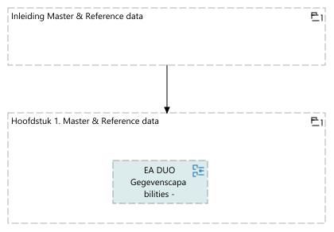

## Rapportage capability Master & Reference data
<figure align="center">
  
  <figcaption><i>Rapportage capability Master & Reference data</i></figcaption>
</figure>

<table>
  <thead>
    <tr>
      <th colspan="1" width="20%">Element</th>
      <th rowspan="2" width="40%">Definitie</th>
      <th rowspan="2" width="40%">Omschrijving</th>
    </tr>
  </thead>
  <tbody>
    <tr><td></td><td></td></tr>
    <tr valign="top")>
      <td colspan="1">Inleiding Master & Reference data 
(grouping)</td>
      <td>
Master &amp; Reference data gaat over het identificieren van je belangrijkste "kern" gegevens, en je referentie gegevens en het bereiken van een single-point-of truth op gebied van deze gegevens. 

Impliciet doet DUO al heel veel aan masterdata middels onze registers maar denk hierbij ook aan de BAP.

De aanleiding voor het opstellen komt vanuit verschillende initatieven:

<ul>
<li>Er wordt gewerkt aan een CMDB om onze applicatie gegevens centraal ter beschikking kunnen stellen. De neiging bestaat om hier gegevens voor rapportage doeleinden aan te willen toevoegen die elders al aanwezig zijn.</li>
<li>De BAP wordt doorontwikkeld</li>
<li>Het is een vereiste voor semantische interoperabiliteit.</li>
<li>Men wil de postcode gegevens onder centraal beheer brengen.</li>
</ul>

Om dit goed aan te sturen is het belangrijk om het vermogen voor het organiseren van je Master &amp; Reference data onder architectuur te brengen.
</td>
    </tr>
    <tr valign="top")>
      <td colspan="1">Hoofdstuk 1. Master & Reference data 
(grouping)</td>
      <td>
De view hieronder is een eerste opzet. Het heeft niet de klassieke opzet van Masterdata Management waar je de organisatie vooral richt op kerngegevens, en deze gegevens in grote mate uit meerdere bronnen komen. Omdat DUO veel single point of truth heeft is het vooral zaak om hier duidelijkheid over te scheppen en te voorkomen dat dit vervuilt doordat gegevens teveel worden gekopieerd. Het gaat er om dat de juiste principes worden toegepast.

Echter er zijn wel gegevens die in meerdere bronnen staan, en daar ook ontstaan. In dit geval kan het wel nodig zijn om een systematiek op te zetten voor het verkrijgen van zogeheten 'golden records'.

De kern van deze view is het toekennen van de status 'gezaghebbende bron' en het daarnaast bieden van diensten die nodig zijn waar deze nog niet aanwezig is. 

Het duidelijk hebben van welke bron gezaghebbend is vergroot het vertrouwen in de gegevens, maar ook het gevoel van eigenaarschap bij de bronhouder. Het vergroot de interoperabliiteit van gegevens en het ondersteunt de governance.
</td>
    </tr>
  </tbody>
</table>

