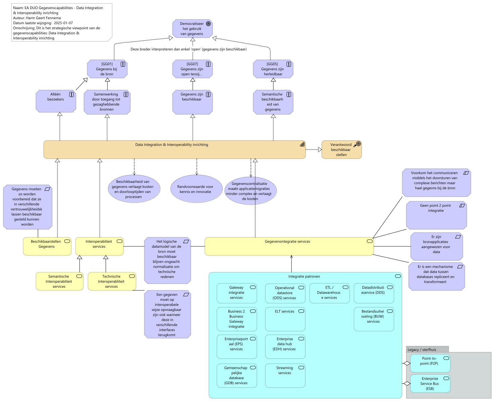

# Rapportage capability Integration & Interoperability

Report generated at: 2025-02-04  15:02:49

---
## Inhoudsopgave

* [Integration & Interoperability inrichting](#integration-&-interoperability-inrichting)
  * [Inleiding Integration & Interoperability](#inleiding-integration-&-interoperability)
  * [Hoofdstuk 1. Integration & Interoperability](#hoofdstuk-1-integration-&-interoperability)
    * [EA DUO Gegevenscapabilities - Data Integration & Interoperability inrichting](#ea-duo-gegevenscapabilities--data-integration-&-interoperability-inrichting)

---

## Integration & Interoperability inrichting

### Inleiding Integration & Interoperability

Integration & interoperability gaat over beschikbaarheid van gegevens, Het gaat hier niet om gegevens in de blote kont maar om het beschikbaar hebben van gegevens met daarbij de juiste context / betekenis. 

-	Op dit moment (begin 2025) loopt er al een tijd project GABI met daar in een data distributie platform en een meta data platform inclusief presentatie. Dit project heeft al PSA's en een PRSA.

-	Daarnaast wordt team gegevensmagazijn (GGM) omgedoopt tot team gegevensintegratie (GGI) onder de business unit Gegevensdiensten. Vanuit de techniek wordt deze domeinarchitectuur doorontwikkeld. Dit is mede ingegeven door de migratie van DB2 naar Postgress waar een andere oplossing nodig was voor het gegevensmagazijn die de primaire appicaties verbind.

-	Tot slot wordt er een PSA door de CIO domeinarchitect gegevens opgesteld met betrekkeing tot gegevensintegratie.

Al deze initiatieven raken Integration & Interoperability, en wat mist is dus eigenlijk strategische sturing aan deze initiatieven. De aanleiding voor het nu opzetten van deze capability is daarmee ook om de samenhang en volledigheid van Integration & Interoperability over deze intiatieven onder architectuur te brengen.
### Hoofdstuk 1. Integration & Interoperability

In de onderstaande view worden de services m.b.t. Integration & Interoperability beschreven. Er is hier een natuurlijke opdeling in het toewijzen van integratiepatronen om gegevens te kunnen delen en het hierbij bereiken van het vereiste vermogen van verschillende ogransiatieonderdelen en systemen om  naadloos samen te kunnen werken met de brongegevens.
#### EA DUO Gegevenscapabilities - Data Integration & Interoperability inrichting

<figure align="center">
  
  <figcaption><i>EA DUO Gegevenscapabilities - Data Integration & Interoperability inrichting</i></figcaption>
</figure>

<table>
  <thead>
    <tr>
      <th colspan="2" width="20%">Element</th>
      <th rowspan="2" width="40%">Definitie</th>
      <th rowspan="2" width="40%">Omschrijving</th>
    </tr>
  </thead>
  <tbody>
    <tr><td></td><td></td><td></td></tr>
    <tr valign="top")>
      <td colspan="2">Democratiseer het gebruik van gegevens 
(goal)</td>
      <td>
Datademocratie (Data-anarchie, -monarchie, -aristocratie) is de hoogste volwassenheidsfase van gegevens beschikbaarstelling. Het komt er op neer dat iedereen toegang heeft tot de data én deze kan begrijpen. Hierdoor ontstaat een gelijk speelveld voor iedereen in de business om op basis van feiten en data bij te dragen aan de ontwikkeling van het bedrijf.  Een hoog niveau van beschikbaarstelling is een belangrijke randvoorwaarde voor innovatie en kennis. Met meer kennis bevorder je de betrokkenheid van je medewerkers en vergroot je de slagkracht van de organisatie.
</td>
    </tr>
    <tr valign="top")>
      <td colspan="2">[GG01] Gegevens bij de bron 
(principle)</td>
      <td>
Zie properties.
</td>
      <td>
Dit is een principe om de gegevens zo goed mogelijk in overeenstemming te brengen en te houden met de werkelijkheid. 
</td>
    </tr>
    <tr valign="top")>
      <td colspan="2">[GG07] Gegevens zijn open tenzij… 
(principle)</td>
      <td>
Zie properties.
</td>
      <td>
In veranderprojecten wordt het grote publiek standaard als stakeholder meegenomen in de projectdefinitie. Een project is niet af zonder open gegevens product.
</td>
    </tr>
    <tr valign="top")>
      <td colspan="2">[GG05]  Gegevens zijn  herleidbaar 
(principle)</td>
      <td>
Zie properties.
</td>
      <td>
DUO wil achteraf het spoor kunnen laten zien hoe gegevens van een natuurlijk of niet-natuurlijk persoon door de organisatie zijn gestroomd en naar buiten, inclusief vragen als wanneer, aan wie en waarom.
</td>
    </tr>
    <tr valign="top")>
      <td colspan="2">Alléén bezoekers 
(principle)</td>
      <td>
Het gegevensmodel met de bijbehorende gegevens heeft een langere levenscyclus dan de applicatie. Daarmee staat het gegevensmodel centraal en zijn applicaties de bezoekers die verwerken (mogelijk wat wegschrijven).
</td>
    </tr>
    <tr valign="top")>
      <td colspan="2">Samenwerking door toegang tot gezaghebbende bronnen 
(principle)</td>
      <td>
Gegevens worden opgehaald bij de gezaghebbende bron
</td>
    </tr>
    <tr valign="top")>
      <td colspan="2">Gegevens zijn beschikbaar 
(principle)</td>
      <td>
Gegevens die worden ingewonnen en beheerd zijn per definitie benaderbaar geïmplementeerd en in verschillende dataclassificaties opvraagbaar volgens de DUO standaard processen zodat deze voor elk proces met doelbinding benut kan worden.
</td>
    </tr>
    <tr valign="top")>
      <td colspan="2">Semantische beschikbaarheid van gegevens 
(principle)</td>
      <td>
Ingewonnen en beheerde gegevens moeten niet enkel technisch(syntax) beschikbaar zijn maar ook qua semantiek. Dit houdt in dat de betekenis en de context van de gegevens beschikbaar en opvraagbaar zijn geïmplementeerd.
</td>
    </tr>
    <tr valign="top")>
      <td colspan="2">Data Integration & Interoperability inrichting 
(capability)</td>
      <td>
Het vermogen om de flow en consolidatie van gegevens tussen eenheden systemen en partijen te managen. 
Interoperabiliteit is het vermogen om samen te werken. Dit gebeurt typisch langs de lijn van standaarden als de samenwerkende partners er voor kiezen of toe worden aangezet om een standaard te volgen.
</td>
      <td>
Bron: DAMA DMBOK2
Doel is om 
1)    Gegevens veilig (compliant) en binnen het gestelde tijdsframe door de organisatie te laten stromen. 
2)    Kosten en complexiteit en het aantal te beheren oplossingen te reduceren door gedeelde modellen en interfaces te ontwikkelen en toe te wijzen
3)    Ondersteunen van onder andere: Analytics, BI, Master data management en operationele efficiency
</td>
    </tr>
    <tr valign="top")>
      <td colspan="2">Verantwoord beschikbaar stellen 
(course-of-action)</td>
      <td></td>
    </tr>
    <tr valign="top")>
      <td colspan="2">Gegevens moeten zo worden voorbereid dat ze in verschillende vertrouwelijkheidsklassen beschikbaar gesteld kunnen worden 
(requirement)</td>
      <td></td>
    </tr>
    <tr valign="top")>
      <td colspan="2">Beschikbaarheid van gegevens verlaagt kosten en doorlooptijden van processen 
(value)</td>
      <td></td>
    </tr>
    <tr valign="top")>
      <td colspan="2">Randvoorwaarde voor kennis en innovatie 
(value)</td>
      <td></td>
    </tr>
    <tr valign="top")>
      <td colspan="2">Gegevenscentralisatie maakt applicatiemigraties minder complex en verlaagt de kosten 
(value)</td>
      <td></td>
    </tr>
    <tr valign="top")>
      <td colspan="2">Voorkom het communiceren middels het doorsturen van complexe berichten maar haal gegevns bij de bron 
(constraint)</td>
      <td>
 Slecht schaalbaar/beheersbaar (elke extra applicatie leidt potentieel tot veel extra koppelvlakken) 
 Aanpassingen vragen relatief veel kennis van andere applicaties 
 Vaak toch maatwerk of complexe oplossingen nodig, bijvoorbeeld gebaseerd op bestandsuitwisseling 
</td>
    </tr>
    <tr valign="top")>
      <td colspan="2">Geen point 2 point integratie 
(constraint)</td>
      <td>
 Slecht schaalbaar/beheersbaar (elke extra applicatie leidt potentieel tot veel extra koppelvlakken) 
 Aanpassingen vragen relatief veel kennis van andere applicaties 
 Vaak toch maatwerk of complexe oplossingen nodig, bijvoorbeeld gebaseerd op bestandsuitwisseling 
</td>
    </tr>
    <tr valign="top")>
      <td colspan="2">Beschikbaarstellen Gegevens 
(business-service)</td>
      <td>
Het beschikbaar hebben staan van gegevens voor toegang, volgens de interoperabiliteitsprincipes . Dit gaat om technische beschikbaarheid en beschikbaarheid van de daarbij horende betekenis (metadata, modellen, vocabulair etc.)
</td>
    </tr>
    <tr valign="top")>
      <td colspan="2">Interoperabliteit services 
(business-service)</td>
      <td>
Deze service draagt er zorg voor dat gegevens op dezelfde wijze te bevragen en te interpreteren zijn door systemen en gebruikers.
</td>
    </tr>
    <tr valign="top")>
      <td colspan="2">Gegevensintegratie services 
(business-service)</td>
      <td>
Het vermogen om datapatronen te kiezen, en datastores volgens bepaalde integratiepatronen in te richten voor het juist beschikbaar stellen van gegevens voor OLTP en OLAP processen.
</td>
    </tr>
    <tr valign="top")>
      <td colspan="2">Semantische Interoperabliteit services 
(business-service)</td>
      <td>
Deze service levert dat de beschikbaar gestelde gegevens op dezelfde wijze geïnterpreteerd kunnen worden door alle partijen. Dit door het beschikbaar stellen van de juiste vocabulair en ontologie/ taxanomie.

Semantische interoperabiliteit richt zich op het begrijpen en de interpretatie van de betekenis van gegevens, zodat systemen of componenten écht kunnen begrijpen wat ze uitwisselen. Zo moet bijvoorbeeld bekend zijn welke betekenis er wordt gegeven aan de invoer van gegevens?

Bron Surf
</td>
    </tr>
    <tr valign="top")>
      <td colspan="2">Technische Interoperabliteit services 
(business-service)</td>
      <td>
Ook wel syntactische interoperabiliteit genoemd.
Deze service levert dat de gegevens vanuit verschillende systemen volgens dezelfde standaarden en koppelvlakken uitwisselbaar zijn. Dit bestaat onder andere uit syntax, gevenstype en protocollen.  Syntactische Interoprabiliteit is een voorwaarde voor semantische interoperabiliteit. 

Systemen moeten in staat zijn om gegevens en informatie op een begrijpelijke manier uit te wisselen. Dit bereik je door ervoor te zorgen dat dezelfde technische specificaties worden gedeeld, onder andere via het definiëren van interfaces, veilige communicatieprotocollen, interconnectiediensten, data-integratiediensten, datapresentatie en –uitwisseling.

Bron: Surf
</td>
    </tr>
    <tr valign="top")>
      <td colspan="2">Het logische datamodel van de bron moet beschikbaar blijven ongeacht normalisatie om technische redenen 
(requirement)</td>
      <td></td>
    </tr>
    <tr valign="top")>
      <td colspan="2">Er zijn bronapplicaties aangewezen voor data 
(requirement)</td>
      <td>
Rationale - Anders is er een grote kans op inconsistenties in de data 
Implicaties - Voor alle data is aangewezen welke applicatie de bronapplicatie is
</td>
    </tr>
    <tr valign="top")>
      <td colspan="2">Een gegeven moet op interoperabele wijze opvraagbaar zijn ook wanneer deze in verschillende interfaces terugkomt 
(requirement)</td>
      <td></td>
    </tr>
    <tr valign="top")>
      <td colspan="2">Integratie patronen 
(application-service)</td>
      <td></td>
    </tr>
    <tr valign="top")>
      <td colspan="1"></td>
      <td colspan="1">Gateway integratie services 
(application-service)</td>
      <td>
Dit is een verdere optimalisatie van de point-to-point architectuur waarbij de applicaties van elkaar 
ontkoppeld worden door een gateway. Een dergelijke gateway is vooral een technische component die 
ervoor zorgt dat applicaties niet direct aan elkaar verbonden zijn. Hierdoor kunnen de fysieke locaties van 
applicaties eenvoudiger wijzigen. Bron ArchiXL

Voordelen: 
 Applicaties zijn technisch meer van elkaar ontkoppeld 
 Overbelasting van applicaties wordt voorkomen 
 Applicaties worden ontlast van API key management en authenticatie 
Nadelen: 
 Applicaties blijven functioneel nog aan elkaar gekoppeld 
 Vraag inrichting van API management infrastructuur (API gateway) 
</td>
    </tr>
    <tr valign="top")>
      <td colspan="1"></td>
      <td colspan="1">Operational datastore (ODS) services 
(application-service)</td>
      <td>
Deze vorm van applicatie-integratie kenmerkt zich door het gebruik van een operational datastore (ODS). 
Een ODS is een separate database die kopieën bevat van data uit andere databases, en die die data met 
hoge beschikbaarheid ontsluit [2]. De ODS wordt veelal gevuld met datareplicatietechnologie, waarbij data 
uit verschillende bronnen met elkaar gecombineerd worden tot één integrale dataverzameling. Bron ArchiXL

Soms wordt gebruik gemaakt van traditionele ETL.

Voordelen: 
 Op één plaats toegang tot data uit meerdere bronapplicaties 
 Biedt veelal een hogere beschikbaarheid, capaciteit en responstijd dan bronapplicaties 
 Ontkoppelt doelapplicaties van bronapplicaties 
Nadelen: 
 Vereist duplicatie van validatie- en bedrijfslogica 
 Wordt complex bij schrijven van data
</td>
    </tr>
    <tr valign="top")>
      <td colspan="1"></td>
      <td colspan="1">ETL / Datawarehouse services 
(application-service)</td>
      <td>
Deze vorm van applicatie-integratie kenmerkt zich door het gebruik van een apart component dat data uit 
de ene applicatie extraheert, daarop transformaties uitvoert, en het resultaat vervolgens laadt in een 
andere database (van een doelapplicatie). Deze vorm van integratie is vooral bekend vanwege de 
softwareproducten die gebruikt worden om data uit een operationele applicatie te verplaatsen naar een 
datawarehouse. Het is echter breder toepasbaar en ook inzetbaar tussen databases van individuele 
applicaties. Veelal wordt de ETL-procedure op gezette tijdstippen gestart, maar dat ook naar aanleiding van 
specifieke gebeurtenissen. Belangrijke eigenschappen van ETL zijn dat het minimaal verstorend werkt op de bronapplicatie omdat de 
data daar ongewijzigd uit wordt geëxtraheerd en alle transformaties buiten die bronapplicatie worden 
uitgevoerd, en dat de transformaties declaratief worden gedefinieerd. Daardoor blijft een en ander goed 
beheersbaar. Ook zijn grote datavolumes geen probleem. Bron ArchiXL

Voordelen: 
 Weinig impact op applicatie doordat transformaties buiten de applicatie zijn gedefinieerd 
 Goed beheersbaar door separate, declaratieve definitie van extractie- en transformatieprocedures 
 Veel en geavanceerde tooling beschikbaar 
 Kan zeer grote datavolumes aan 
Nadelen: 
 Levert meestal geen realtime-integratie 
</td>
    </tr>
    <tr valign="top")>
      <td colspan="1"></td>
      <td colspan="1">Datadistributieservice (DDS) 
(application-service)</td>
      <td>
Deze vorm van applicatie-integratie kenmerkt zich door het gebruik van een datadistributiemechanisme. Deze bewaakt de distributie van data die in verschillende bronapplicaties wordt beheerd. Zodra de data wijzigt zorgt het mechanisme ervoor dat alle afnemers (doelapplicaties) de wijzigingen ontvangen. Het is daardoor voor de applicaties net alsof alle data lokaal staat, met andere woorden: het applicatieblikveld is minimaal. Bron ArchiXL

Voordelen: 
 Belegt integratieproblematiek op één plaats, buiten de applicaties 
 Biedt een hogere beschikbaarheid door een (technische) kopie te maken van data 
 Biedt hoge performance en schaalbaarheid 
Nadelen: 
 Biedt geen oplossing voor “on-demand” informatiebehoefte 
 Moeilijk te realiseren bij gesloten applicaties (zoals pakketapplicaties en clouddiensten) 
 Er zijn relatief minder standaardproducten voor beschikbaar
</td>
    </tr>
    <tr valign="top")>
      <td colspan="1"></td>
      <td colspan="1">Business 2 Business Gateway integratie services 
(application-service)</td>
      <td>
Deze vorm van applicatie-integratie kenmerkt zich door het gebruik van een apart component als tussenstation bij het uitwisselen van data met de “buitenwereld”. Dat wordt ook wel een Business-to Business Gateway genoemd [1]. De belangrijkste redenen voor het inzetten van zo’n gateway is beveiliging en het aansluiten op specifieke uitwisselstandaarden. De gateway voorkomt dat externe applicaties rechtstreeks contact hebben met interne applicaties. Specifieke uitwisselstandaarden zijn vaak zo specifiek dat standaard integratiemiddleware deze niet ondersteunt. Bron ArchiXL

Voordelen: 
 Hogere veiligheid door ontkoppeling van interne en externe applicaties 
 Ondersteuning specifieke (B2B) uitwisselstandaarden 
 Kan problemen door te zware belasting verkleinen door data tijdelijk te bewaren 
Nadelen: 
 Extra component in de architectuur 
 Ondersteunt geen ad-hoc-bevragingen doordat het koppelvlak voorgedefinieerd is 
</td>
    </tr>
    <tr valign="top")>
      <td colspan="1"></td>
      <td colspan="1">ELT services 
(application-service)</td>
      <td>
Deze vorm van applicatie-integratie kenmerkt zich door het gebruik van een apart component dat data uit de ene applicatie extraheert zonder op voorhand de structuur van de gegevens te kennen. De gegevens worden als zogeheten 'documents' weggeschreven. (Schema on write).
Deze vorm van integratie is vooral bekend vanwege de softwareproducten die gebruikt worden om data uit een operationele applicatie te verplaatsen naar een 
Data Lake vaak om tegemoed te komen aan Big Data behoftes van Data Science projecten of search engines.

Voordelen: 
 Weinig impact op applicatie doordat transformaties buiten de applicatie zijn gedefinieerd 
 Goed beheersbaar 
 Veel en geavanceerde tooling beschikbaar 
 Kan zeer grote datavolumes aan 
Nadelen: 
 Gegevens worden zonder structuur opgeslagen en daarmee is de beheersing op datakwaliteit minimaal
 Groot risico dat de metadatering en de structuur van de gegevens van lage kwaliteit is waardoor er een onbruikbaar dataswamp kan ontstaan.
</td>
    </tr>
    <tr valign="top")>
      <td colspan="1"></td>
      <td colspan="1">Bestandsuitwisseling (BUW)  services 
(application-service)</td>
      <td>
Deze vorm van applicatie-integratie kenmerkt zich door het bestaan van een fysiek bestand als 
overdrachtsmiddel voor de uit te wisselen data. Deze vorm werd en wordt veelal gekozen als point-topointintegratie niet mogelijk is, bijvoorbeeld omdat de ene applicatie geen bruikbaar koppelvlak biedt. Bij bestandsuitwisseling exporteert de initiërende applicatie een bestand en zet dat op een afgesproken 
locatie neer, zodat dat bestand vervolgens door de andere applicatie wordt ingelezen en verwerkt. 
Een voordeel van deze integratievorm is dat zeer grote hoeveelheden data overgedragen kunnen worden 
en dat de wederzijdse afhankelijkheid minimaal is. Het applicatieblikveld beperkt zich tot de applicatie zelf 
en de fileshare die als uitwisselpunt fungeert. Bron: ArchiXL

Voordelen: 
 Kan zeer grote datavolumes aan 
 Minimale wederzijdse afhankelijkheid 
Nadelen: 
 Vraagt een fileserver als tussenstation 
 Beperkte mogelijkheden voor afhandelen uitzonderingssituaties 
 Slecht schaalbaar/beheerbaar (bij n applicaties ontstaan 2n
 koppelvlakken) 
 Slecht herbruikbaar door ontbreken van standaardisatie 
</td>
    </tr>
    <tr valign="top")>
      <td colspan="1"></td>
      <td colspan="1">Enterpriseportaal (EPS)  services 
(application-service)</td>
      <td>
Deze vorm van applicatie-integratie kenmerkt zich door het gebruik van een portaalplatform voor het 
beschikbaar stellen van data en functionaliteit. Belangrijk is dat door het inzetten van een enterpriseportaal 
gebruikers de beleving hebben van één geïntegreerde applicatie, terwijl de applicaties op de achtergrond 
helemaal niet geïntegreerd hoeven te zijn. Ook het portaal ervoor zorgen dat alles er op eenzelfde manier 
uit ziet (één look-and-feel). Bron: ArchiXL

Voordelen: 
 Geïntegreerde gebruikerservaring, met één look-and-feel 
 Ontkoppeling van portaal en achterliggende applicaties en daarmee hogere beschikbaarheid en 
veiligheid 
 Ontkoppeling maakt het mogelijk dat portalen een hogere beschikbaarheid hebben dan de 
achterliggende interne applicaties 
 Ontkoppeling voorkomt problemen met onder andere beschikbaarheid van interne applicaties als 
gevolg van zware belasting door portaalgebruikers. 
Nadelen: 
 Extra component in de architectuur 
</td>
    </tr>
    <tr valign="top")>
      <td colspan="1"></td>
      <td colspan="1">Enterprise data hub (EDH) services 
(application-service)</td>
      <td>
Deze vorm van applicatie-integratie is een doorontwikkeling van de operational data store. Het kan naast 
actuele data ook historie bevatten en het kan ook ongestructureerde data bevatten. Er is typisch meer 
functionaliteit aan gekoppeld voor het beschikbaar stellen en delen van de data. Denk ondermeer aan API’s 
voor het ontsluiten van de data, een search engine voor het zoeken in de data maar ook meer aandacht 
voor de beveiliging van de data. Het gebruik is vaak ook breder dan dat van een ODS. Bron ArchiXL

Voordelen: 
 Op één plaats toegang tot data uit meerdere bronnen (gestructureerd en ongestructureerd) 
 Biedt veelal een hogere beschikbaarheid, capaciteit en responstijd dan bronapplicaties 
 Ontkoppelt doelapplicaties van bronapplicaties 
 Sneller toegang tot data (hogere actualiteit) 

Nadelen: 
 Vraagt kennis van nieuwere technologie die mogelijk nog niet aanwezig is 
 Vereist duplicatie van validatie- en bedrijfslogica 
 Wordt complex bij schrijven van data 
</td>
    </tr>
    <tr valign="top")>
      <td colspan="1"></td>
      <td colspan="1">Gemeenschappelijke database (GDB) services 
(application-service)</td>
      <td>
Deze vorm van applicatie-integratie kenmerkt zich door de aanwezigheid van een database die door twee 
of meer applicaties gebruikt wordt. Er is daarom niet zozeer sprake van overdracht van data maar van 
gemeenschappelijk gebruik van data. Deze integratievorm wordt al zeer lang toegepast en is relatief 
eenvoudig te realiseren. Dat is dan ook meteen het belangrijkste voordeel, samen met het feit dat de 
koppeling niet beperkt is tot twee applicaties; in beginsel kunnen oneindig veel applicaties op de 
gemeenschappelijke database aansluiten, als het databaseplatform dat tenminste aankan. Bron: ArchiXL

In dit patroon moet de applicatiedatabase wel decentraal worden beheerd maar staat de data van het gegevensmodel met de domein/inhoudelijke data centraal.

Voordelen: 
 Vaak eenvoudig realiseerbaar 
 Kan meerdere applicaties tegelijk koppelen 
Nadelen: 
 Grote wederzijdse afhankelijkheid tussen applicaties 
 Vereist duplicatie van validatie- en bedrijfslogica 
 Slecht beheerbaar doordat wijzigingen tegelijk doorgevoerd moeten worden 
</td>
    </tr>
    <tr valign="top")>
      <td colspan="1"></td>
      <td colspan="1">Streaming services 
(application-service)</td>
      <td>
Streaming is een integatiepatroon dat specifiek is gericht op event-oriëntatie (afhandelen van 
gebeurtenissen). Het maakt gebruik van middleware die hier specifiek voor is geoptimaliseerd. Een event 
stream broker beheert de registers van abonnementhouders en routeert gebeurtenismeldingen naar de 
abonnementhouders. Bron: ArchiXL.

Streaming gaat soms ook om bronnen die de gegevens zelf niet of beperkt vasthouden.

Voordelen: 
 Afhankelijkheden worden beperkt; applicaties zijn alleen afhankelijk van gebeurtenissen 
 Rijke mogelijkheden om de events ook in andere vormen en op andere locaties beschikbaar te stellen 
 Geoptimaliseerd op hoge volumes 
Nadelen: 
 Relatief complexe infrastructuur die ook veel expertise vraagt en een investering vraagt 
 Vraagt een andere manier van denken dan meer traditionele integratiepatronen 
 Past maar op een deel van de integratiescenario’s
</td>
    </tr>
    <tr valign="top")>
      <td colspan="2">Er is een mechanisme dat data tussen databases repliceert en transformeert  
(requirement)</td>
      <td>
Rationale - Replicatie (of virtualisatie) is nodig om applicaties over actuele data te laten beschikken 

<ul>
<li>Transformatie is nodig wanneer datamodellen van twee databases verschillen 
Implicaties - Er is inzicht in welke data door welke applicaties nodig is </li>
<li>Er is inzicht in de verschillen tussen datamodellen in databases </li>
<li>Er is een datadistributiemechanisme aanwezig dat ook een bouwsteen voor transformatie omvat</li>
</ul>

Bron: ArchiXL
</td>
    </tr>
    <tr valign="top")>
      <td colspan="2">Legacy / sterfhuis 
(diagram-model-group)</td>
      <td></td>
    </tr>
    <tr valign="top")>
      <td colspan="1"></td>
      <td colspan="1">Point-to-point (P2P)  
(application-service)</td>
      <td>
Deze basisvorm van applicatie-integratie kenmerkt zich doordat applicaties direct met elkaar in verbinding 
staan. Daarmee worden externe afhankelijkheden van integratiemiddleware vermeden. Keerzijde is dat 
koppelen alleen werkt als de applicaties elkaar verstaan qua protocol en formaat en ook op alle andere 
eisen compatibel met elkaar zijn.

bron ArchiXL

Voordelen: 
 Eenvoudige architectuur 
 Snelle responsetijd door directe koppeling 
 Geen afhankelijkheid van derde componenten zoals integratiemiddleware 

Nadelen: 
 Slecht schaalbaar/beheersbaar (elke extra applicatie leidt potentieel tot veel extra koppelvlakken) 
 Aanpassingen vragen relatief veel kennis van andere applicaties 
 Vaak toch maatwerk of complexe oplossingen nodig, bijvoorbeeld gebaseerd op bestandsuitwisseling
</td>
    </tr>
    <tr valign="top")>
      <td colspan="1"></td>
      <td colspan="1">Enterprise Service Bus (ESB) 
(application-service)</td>
      <td>
Deze vorm van applicatie-integratie kenmerkt zich door het gebruik van een zogenoemde Enterprise 
Service Bus (ESB) als tussenstation voor data-uitwisseling. Data-uitwisseling via een ESB verloopt altijd op 
basis van berichten. Het wordt in veel gevallen vooral gebruikt om service-oriëntatie te ondersteunen.

bron ArchiXL

Voordelen: 
 Ontkoppelt applicaties op het gebied van beschikbaarheid, bereikbaarheid en uitwisselformaat en 
protocol 
 Biedt voorzieningen voor sturing en monitoring 
 Breed scala aan integratiemogelijkheden door beschikbaarheid van adapters 

Nadelen: 
 Relatief complexe infrastructuur die ook veel expertise vraagt en een investering vraagt 
 Creëert de afhankelijkheid van een centraal component (en vaak ook een centrale afdeling), waardoor 
het minder goed past op agile ontwikkeling 
 Kennis over applicatie-integratie komt in ESB die daardoor lastiger te beheren wordt 
</td>
    </tr>
  </tbody>
</table>

