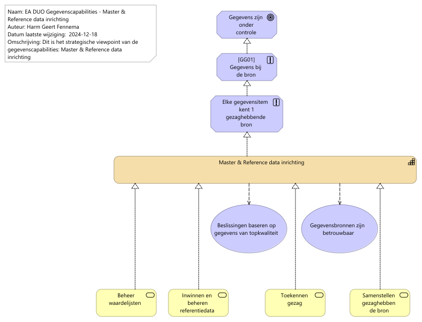

# Rapportage capability Master & Reference data

Report generated at: 2025-02-04  15:02:56

---
## Inhoudsopgave

* [Master & Reference data inrichting](#master-&-reference-data-inrichting)
  * [Inleiding Master & Reference data](#inleiding-master-&-reference-data)
  * [Hoofdstuk 1. Master & Reference data](#hoofdstuk-1-master-&-reference-data)
    * [EA DUO Gegevenscapabilities - Master & Reference data inrichting](#ea-duo-gegevenscapabilities--master-&-reference-data-inrichting)

---

## Master & Reference data inrichting

### Inleiding Master & Reference data

Master & Reference data gaat over het identificieren van je belangrijkste "kern" gegevens, en je referentie gegevens en het bereiken van een single-point-of truth op gebied van deze gegevens. 

Impliciet doet DUO al heel veel aan masterdata middels onze registers maar denk hierbij ook aan de BAP.

De aanleiding voor het opstellen komt vanuit verschillende initatieven:
- Er wordt gewerkt aan een CMDB om onze applicatie gegevens centraal ter beschikking kunnen stellen. De neiging bestaat om hier gegevens voor rapportage doeleinden aan te willen toevoegen die elders al aanwezig zijn.
- De BAP wordt doorontwikkeld
- Het is een vereiste voor semantische interoperabiliteit.
- Men wil de postcode gegevens onder centraal beheer brengen.

Om dit goed aan te sturen is het belangrijk om het vermogen voor het organiseren van je Master & Reference data onder architectuur te brengen.
### Hoofdstuk 1. Master & Reference data

De view hieronder is een eerste opzet. Het heeft niet de klassieke opzet van Masterdata Management waar je de organisatie vooral richt op kerngegevens, en deze gegevens in grote mate uit meerdere bronnen komen. Omdat DUO veel single point of truth heeft is het vooral zaak om hier duidelijkheid over te scheppen en te voorkomen dat dit vervuilt doordat gegevens teveel worden gekopieerd. Het gaat er om dat de juiste principes worden toegepast.

Echter er zijn wel gegevens die in meerdere bronnen staan, en daar ook ontstaan. In dit geval kan het wel nodig zijn om een systematiek op te zetten voor het verkrijgen van zogeheten 'golden records'.

De kern van deze view is het toekennen van de status 'gezaghebbende bron' en het daarnaast bieden van diensten die nodig zijn waar deze nog niet aanwezig is. 

Het duidelijk hebben van welke bron gezaghebbend is vergroot het vertrouwen in de gegevens, maar ook het gevoel van eigenaarschap bij de bronhouder. Het vergroot de interoperabliiteit van gegevens en het ondersteunt de governance.
#### EA DUO Gegevenscapabilities - Master & Reference data inrichting

Zie properties.
<figure align="center">
  
  <figcaption><i>EA DUO Gegevenscapabilities - Master & Reference data inrichting</i></figcaption>
</figure>

<table>
  <thead>
    <tr>
      <th colspan="1" width="20%">Element</th>
      <th rowspan="2" width="40%">Definitie</th>
      <th rowspan="2" width="40%">Omschrijving</th>
    </tr>
  </thead>
  <tbody>
    <tr><td></td><td></td></tr>
    <tr valign="top")>
      <td colspan="1">Gegevens zijn onder controle 
(goal)</td>
      <td></td>
    </tr>
    <tr valign="top")>
      <td colspan="1">[GG01] Gegevens bij de bron 
(principle)</td>
      <td>
Zie properties.
</td>
      <td>
Dit is een principe om de gegevens zo goed mogelijk in overeenstemming te brengen en te houden met de werkelijkheid. 
</td>
    </tr>
    <tr valign="top")>
      <td colspan="1">Elke gegevensitem kent 1 gezaghebbende bron 
(principle)</td>
      <td></td>
    </tr>
    <tr valign="top")>
      <td colspan="1">Master & Reference data inrichting 
(capability)</td>
      <td>
Het vermogen om over domeinen heen kerngegevens te gebruiken als referentie -en materdata te identificeren, eenduidig te beheren en breed beschikbaar te stellen. 

Bron: DAMA DMBOK2
</td>
      <td>
DUO heeft het vermogen om kerngegevens (masterdata) en referentiegegevens te identificeren, golden records te realiseren, enkelvoudig te beheren en breed beschikbaar te maken. Het managen van het golden record voor de kerngegevens geldt voor de gehele levenscylcus.

Zo kan DUO: 
•    Vertrouwen geven in de compleetheid, actualiteit en consistentie van gedeelde kerngegevens over de verschillende organisatie onderdelen heen
•    Beter de gegevenskwaliteit van herbruikbare kerngegevens beheren
•    Data redundantie en onnodige (en onnodig complexe ) gegevensintegratie voorkomen
•    Risico’s verminderen geassocieerd met inconsistente gegevens
</td>
    </tr>
    <tr valign="top")>
      <td colspan="1">Beslissingen baseren op gegevens van topkwaliteit 
(value)</td>
      <td></td>
    </tr>
    <tr valign="top")>
      <td colspan="1">Gegevensbronnen zijn betrouwbaar 
(value)</td>
      <td></td>
    </tr>
    <tr valign="top")>
      <td colspan="1">Beheer waardelijsten 
(business-service)</td>
      <td>
Waardelijsten, vooral als die in meerdere systemen, bij één of meer gegevensobjecten worden gebruikt zien wij ook als een vorm van masterdata. Deze moeten ook worden beheerd en erkend worden als gezaghebbend. Omdat waardelijsten net als metadata op meerdere plekken hergebruikt kunnen worden is het voor de lange termijn beter deze centraal te beheeren.
</td>
    </tr>
    <tr valign="top")>
      <td colspan="1">Inwinnen en beheren referentiedata 
(business-service)</td>
      <td>
Waar bij masterdata en intern te gebruiken waardelijsten het gaat om reeds bestaande gegevens moeten referentiegegevens van extern worden ingewonnen en onderhouden.
</td>
    </tr>
    <tr valign="top")>
      <td colspan="1">Toekennen gezag 
(business-service)</td>
      <td>
Om duidelijkheid te scheppen en eenduidigheid van gegevens binnen DUO is het van belang om gegevensobjecten toe te kennen aan gezaghebbende bronnen, of reeds bestaande bronnen een gezaghebbende status toe te kennen. Dit betekent dat deze gegevens altijd uit deze bron gehaald moeten worden en bij technisch noodzakelijke kopieslagen dat deze geautomatiseerd de bron moeten volgen. Het gegevensprincipe is gegevens bij de bron. Meestal zal het hier gaan om het system of record.
Bij het erkennen dat een bron binnen DUO (ook wanneer dit ingewonnen gegevens zijn) een gezaghebbende interne bron is, dan is het van belang dat deze aan datakwaliteits eisen voldoet en deze bron onder controle wordt gebracht.
</td>
    </tr>
    <tr valign="top")>
      <td colspan="1">Samenstellen gezaghebbende bron 
(business-service)</td>
      <td>
Wanneer een gegevensitem verdeeld is over meerdere bronnen en er geen gezaghebbend bronsysteem / system of record is aan te wijzen waar het gewenste data kwaliteit niveau behaald kan worden dan kan er een samengestelde gezaghebbende bron worden opgezet.
Hier kan dan volledigheid worden bereikt, en worden zogeheten golden records gecreëerd. 
Dit patroon is complexer en latiger te onderhouden. Lry op dat mogelijk ook de synchorisatie met de systems(let op meervoud) of record gesynchroniseerd moet worden. Er is namelijk niet één system of record die de waarheid heeft.
</td>
    </tr>
  </tbody>
</table>

