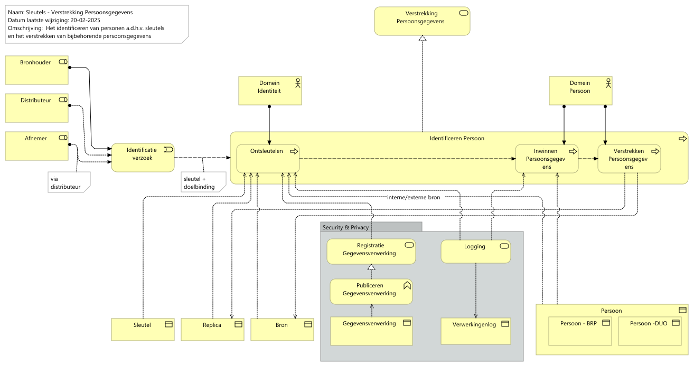

# Rapportage capability Security & Privacy - Sleutelkast

Report generated at: 2025-02-21  10:16:08

---
## Inhoudsopgave

* [Rapportage capability Security & Privacy - Sleutelkast](#rapportage-capability-security-&-privacy--sleutelkast)
  * [Sleutels - Toekenning Identiteit Uitgangspunten, bespreekpunten en vragen](#sleutels--toekenning-identiteit-uitgangspunten-bespreekpunten-en-vragen)
    * [Sleutels - Toekenning Identiteit](#sleutels--toekenning-identiteit)
  * [Sleutels - Verstrekking Persoonsgegevens Uitgangspunten, bespreekpunten en vragen](#sleutels--verstrekking-persoonsgegevens-uitgangspunten-bespreekpunten-en-vragen)
    * [Sleutels - Verstrekking Persoonsgegevens](#sleutels--verstrekking-persoonsgegevens)
  * [Sleutels - Verstrekking Gegevens Uitgangspunten, bespreekpunten en vragen](#sleutels--verstrekking-gegevens-uitgangspunten-bespreekpunten-en-vragen)
    * [Sleutels - Verstrekking Gegevens](#sleutels--verstrekking-gegevens)

---

## Rapportage capability Security & Privacy - Sleutelkast

### Sleutels - Toekenning Identiteit Uitgangspunten, bespreekpunten en vragen

Uitgangspunten, bespreekpunten en vragen

- De service *Toekenning identiteit* komt overeen met de service *creatie en registratie van sleutels* uit de Sleutelkast repository. Volgens de stijlgids is de naamconventie van een Business service De naam van een zakelijke dienst is bij voorkeur een werkwoord dat eindigt op “-ing” (gerundium), dus dit is mij voorstel voor de naam.

- View beperkt zich tot het afgeven van sleutels. In de situatie dat er behalve (taak)sleutels ook persoonsgegervens vastgelegd worden is het uitgangspunt dat domein Persoon naast de persoonsgegevens de sleutel distribueert. (Actor Registreren Identiteit wordt dan Domein Persoon)

- "De vraag in dat geval wordt dan: in welke administratie worden welke persoonsgegevens opgeslagen:
DUO identiteit admin - wat verschil met persoons?
DUO persoon admin
DUO opgave admin"

#### Sleutels - Toekenning Identiteit

De view *Sleutels - Toekenning Identiteit* beschrijft het proces en bijbehorende administraties nodig om sleutels te administreren. Met deze sleutels kan een persoon geïdentificeerd worden ten behoeve van bepaalde (wettelijke) taakuitvoering.

> Scenario: Een burger wil een dienst afnemen (bv studiefinanciering aanvragen). Hiervoor moet deze als persoon geïdentificeerd zijn binnen DUO. De burger identificeert zich met een externe sleutel (bijvoorbeeld BSN). 

De service *Toekenning Identiteit* levert de volgende resultaten:
•	*Taak specifieke sleutel* waarmee de burger binnen de context van de gevraagde dienstverlening geïdentificeerd kan worden
•	*Taak specifieke sleutel* gekoppeld aan *DUO identiteit sleutel* zodat gegevens uit meerdere bronnen (bv inschrijving) gekoppeld kunnen worden (zonder persoonsgegevens te hoeven gebruiken). Als er nog geen *DUO identiteit sleutel* bestaat wordt deze aangemaakt.
•	*DUO identiteit sleutel* gekoppeld aan *DUO Persoons Administratie sleutel* zodat (identificerende) persoonsgegevens opgehaald kunnen worden uit de (externe of interne) bron.

Persoonsgegevens worden beheerd bij de bron (volgen het gegevensprincipe *GG001 Gegevens bij de Bron*). Bij de uitvoering van de wettelijke taak wordt gebruik gemaakt van *Taak specifieke sleutels*. De minimale set aan persoonsgegevens kunnen op basis van deze sleutel opgehaald worden uit bijbehorende externe of interne bron.

Dit proces maakt gebruik van de service *Registratie Gegevensverwerking* (specifiek de bedrijfsfunctie *Publiceren Gegevensverwerking*) om te bepalen welke persoonsgegevens verwerkt mogen worden bij de uitvoer van de (wettelijke) taak en welk type *Taak specifieke sleutel* toegepast moet worden.

**Buiten scope** van deze view: Aanvragen van burgers zonder externe sleutel (zoals BSN).

<figure align="center">
  
  <figcaption><i>Sleutels - Toekenning Identiteit</i></figcaption>
</figure>

<table>
  <thead>
    <tr>
      <th colspan="2" width="20%">Element</th>
      <th rowspan="2" width="40%">Definitie</th>
      <th rowspan="2" width="40%">Omschrijving</th>
    </tr>
  </thead>
  <tbody>
    <tr><td></td><td></td><td></td></tr>
    <tr valign="top")>
      <td colspan="2">Toekenning Identiteit 
(business-service)</td>
      <td>
Proces dat digitale identiteiten tot stand brengt (en onderhoudt/actualiseert) voor entiteiten

De digitale identiteit van een natuurlijk persoon kent een vaste levenscyclus. Dit betekent dat een digitale identiteit gecreëerd wordt maar ook kan wijzigen of verwijderd worden.
Het identiteitenbeheer wordt ondersteund door een identiteitsbeheervoorziening (Ook wel identiteitsmanagementsysteem (IDMS) genoemd) waarin de digitale identiteiten worden opgeslagen met de nodige attributen. Een digitale identiteit binnen een IDMS moet uniek identificeerbaar zijn en bevat dus voldoende informatie om deze van anderen te kunnen onderscheiden.

Bron: ROSA

https://rosa.wikixl.nl/index.php/Id-432a8475d2b1468f872876e993940fa8
</td>
    </tr>
    <tr valign="top")>
      <td colspan="2">Domein Identiteit 
(business-actor)</td>
      <td>
Domein identiteit is verantwoordelijk voor het beschikbaar stellen van persoonsgegevens binnen de DUO administratie (tbv gebruik binnen DUO of de keten) 
</td>
    </tr>
    <tr valign="top")>
      <td colspan="2">Bronhouder 
(business-role)</td>
      <td>
Bron Informatiemanagement: rolbeschrijvingen gegevensmanagement 17-1-2017

Omschrijving 

De bronhouder is verantwoordelijk voor het inwinnen, actueel houden, opslaan en ter beschikking stellen van de juiste gegevens in een registratie. Onder meer naar aanleiding van ontvangen meldingen is de bronhouder verantwoordelijk voor het borgen van de kwaliteit van de gegevens.

Doel 

<pre><code>- Dubbele inwinning van bestaande bestanden voorkomen;
- Efficiënt gebruik van gegevensbestanden mogelijk maken
- Inzetten van moderne technieken;
- Werkpakketten optimaal in de keten zetten.
</code></pre>

Hoofdtaken 

<pre><code>- Ontwikkelen en beheren van de voorzieningen nodig om de gegevensmanagement taken uit te kunnen voeren;
- Assembleren van de bestanden tot een DUO dekkend geheel;
- Assembleren van de eigen objecten met die van andere bronhouders;
- Afhandelen van de meldingen van gerede twijfel volgens onderling afgesproken procedures. De bronhouder bepaalt of de twijfel aanleiding is om de dienstverlening op te schorten;
- Realiseren en bijhouden van de gegevensbestanden;
- Transitie van gesloten naar ontsloten gegevensbestanden uitvoeren;
- Aanleveren van gegevens aan afnemers;
- Inwinnen, verwerken, afhandelen en verwerken van terugmeldingen;
- Uitvoeren van kwaliteitscontroles
</code></pre>

Contact met

<pre><code>- Domeinarchitect
- Distributeur
- Gegevensmakelaar
- Afnemer
- Functionaris voor de gegevensbescherming
</code></pre>

Resultaten 

<pre><code>- Stabiele, betrouwbare, beheerde gegevensverzamelingen;
- In het geval van verrijking en toevoeging blijft de verantwoordelijkheid voor de kwaliteit van de toegevoegde gegevens bij de bronhouder van de toegevoegde gegevens;
- Gegarandeerde en vastgestelde kwaliteit van de gegevens op basis van BIR, Wbp en afgesproken service levels;
- Generalisatie, transformatie, selectie op de gegevens vinden uitsluitend plaats in overleg met de bronhouder.
</code></pre></td>
    </tr>
    <tr valign="top")>
      <td colspan="2">Nieuw Persoon 
(business-event)</td>
      <td>
Het administreren van de identiteit van een burger ten behoeve van de uitvoer van een (m.n. wettelijke) taak.
</td>
    </tr>
    <tr valign="top")>
      <td colspan="2">Administreren Identiteit 
(business-process)</td>
      <td>
Het administreren van de identiteit van een burger.

Aan de hand van deze identiteit kunnen gegevens op persoonsniveau geïntegreerd worden en de persoonsgegevens opgehaald worden t.b.v. de uitvoer van de wettelijke taak.
</td>
    </tr>
    <tr valign="top")>
      <td colspan="1"></td>
      <td colspan="1">Toekennen Identiteit 
(business-process)</td>
      <td>
Op basis van de grondslag van de verwerking wordt de identiteit van een persoon vastgelegd aan de hand van een aantal gekoppelde sleutels:

<ul>
<li>DUO Persoons Administratie sleutel</li>
<li>DUO identiteit sleutel</li>
<li>Taak specifieke sleutel  </li>
</ul></td>
    </tr>
    <tr valign="top")>
      <td colspan="1"></td>
      <td colspan="1">Registreren Identiteit 
(business-process)</td>
      <td>
Van een persoon wordt  de Taak specifieke sleutel vastgelegd in de bron   
</td>
    </tr>
    <tr valign="top")>
      <td colspan="2">Sleutel 
(business-object)</td>
      <td>
Aan de hand van verschillende typen sleutels wordt de de identiteit van een persoon vastgelegd.

Elke persoon wordt geïdentificeerd door meerdere sleutels:

<ul>
<li><em>Taak specifieke sleutel</em> waarmee de burger binnen de wettelijke context van de gevraagde dienstverlening geïdentificeerd kan worden.</li>
<li><em>DUO identiteit sleutel</em> zodat gegevens uit meerdere bronnen (bv inschrijving) gekoppeld kunnen worden (zonder persoonsgegevens te hoeven gebruiken). </li>
<li><em>DUO Persoons Administratie sleutel</em> zodat (identificerende) persoonsgegevens opgehaald kunnen worden uit de (externe of interne) bron.</li>
</ul></td>
    </tr>
    <tr valign="top")>
      <td colspan="2">Bron 
(business-object)</td>
      <td>
Een bron bevat alle gegevens die nodig zijn voor de uitvoer van een wettelijke taak
</td>
    </tr>
    <tr valign="top")>
      <td colspan="2">Security & Privacy 
(diagram-model-group)</td>
      <td></td>
    </tr>
    <tr valign="top")>
      <td colspan="1"></td>
      <td colspan="1">Registratie Gegevensverwerking 
(business-service)</td>
      <td>
De registratie Gegevensverwerking biedt de mogelijkheid om dienstverlening van DUO en de daarbij verwerkt gegevens te registreren en te publiceren. In deze registratie staan de vastgestelde dienstverlening en daarbij behorende gegevensverwerkingen.
</td>
    </tr>
    <tr valign="top")>
      <td colspan="1"></td>
      <td colspan="1">Publiceren Gegevensverwerking 
(business-function)</td>
      <td>
Publiceren Gegevensverwerking geeft inzicht in de actuele gegevensverwerking van DUO en de daarbij verwerkte gegevens.
</td>
    </tr>
    <tr valign="top")>
      <td colspan="1"></td>
      <td colspan="1">Gegevensverwerking 
(business-object)</td>
      <td>
Tijdelijke tekst (tekst properties is leidend) 
De administratie <em>Gegevensverwerking</em> beschrijft de overeengekomen gegevensverwerkingen aan de hand van de volgende kenmerken. Deze kenmerken worden vastgelegd bij dit gegevensobject dan wel opgehaald uit gekoppelde administraties <em>Gegevensmodel</em>, <em>Dienstverantwoordelijke</em> en <em>contract</em>.

|Nr    |Kenmerk    |Kar.   |Omschrijving|
|--    |-------    |----   |------------|
|V01    |Naam   |1..1   |De naam van de verwerking. Dit is het uniek zelfstandig naamwoord (enkelvoud) eventueel aangevuld met een of enkele verbijzonderende woorden.|
|V02    |Definitie  |1..1   |Korte omschrijving van de verwerking. Dit zijn één of meer volwaardige zinnen die de verwerking beschrijven en/of toelichten.| 
|V03    |Doelbinding    |1..1   |Een aanduiding van het legitieme doel waarvoor de gegevens zijn verzameld. Dit is een binnen DUO beheerde referentielijst.|
|V04    |Dienstverantwoordelijke (link) |1..1   |Diegene die binnen DUO verantwoordelijk is voor de afgesproken dienstverlening / verwerking. Dit is een binnen DUO beheerde referentie naar de verschillende rollen en teams (niet herleidbaar naar individuele medewerkers) die betrokken zijn bij gegevensverwerking. <strong>Business perspectief</strong>: SCOPAFIJTH aspecten dienstverlening, in het bijzonder Procesbeschrijving en het Begrippenkader, <strong>Applicatie perspectief</strong>: inrichting en beheer applicaties tbv de gevraagde dienstverlening, in het bijzonder Functionele Ontwerpen en Logische datamodellen &amp; <strong>Technisch perspectief</strong>: inrichting en beheer technische inrichting tbv levering van de gevraagde dienstverlening, in het bijzonder systemen, databases en infrastructuur. <strong>NB</strong>: Deze term is breder dan de termen Bronhouder (geldt ook voor Distributeur en Informatieleverancier (interne Afnemer)) en Gegevenseigenaar (meer aspecten dan alleen eigendom).|
|V05    |Contract (link)    |0..1   |Overeenkomst die dienstverlening DUO beschrijft aan afnemer.|
|V06    |Gegevensmodel (link)   |n..m   |De gegevens die verwerkt worden.| 
|V07    |Begindatum |1..1   |De datum dat de verwerking van kracht wordt.
|V08    |Einddatum  |1..1   |De datum dat de verwerking van vervalt of herzien moet worden.|
|V09    |Categorisatie AVG  |1..1   |De aanduiding of de gegevens persoonsgegevens (P) niet-persoonsgegevens (NP) of bijzondere/strafrechtelijk persoonsgegevens (BSP) bevat.|
|V10a    |Classificatie Beschikbaarheid (BIO)    |1..1   |Beschikbaarheid is de mate waarin het aanwezig is en klaar voor gebruik of inzage door geautoriseerde entiteiten (personen, processen, systemen). Zie DUO-voorschrift classificatie.|
|V10b    |Classificatie Integriteit (BIO)    |1..1   |Integriteit is de mate waarin het niet, of alleen door geautoriseerde entiteiten (personen, processen, systemen), is/kan worden gewijzigd of vernietigd. Zie DUO-voorschrift classificatie.|
|V10c    |Classificatie Vertrouwelijk-heid (BIO) |1..1   |Vertrouwelijkheid van een informatieobject is de mate waarin het alleen toegankelijk en te interpreteren of kopiëren is voor geautoriseerde entiteiten (personen, processen, systemen) binnen een specifieke gebruikscontext. Zie DUO-voorschrift classificatie.|
|V11    |Rubricering ja/nee |1..1   |Geheimhouding is geboden vanwege het belang van de Staat, zijn bondgenoten of één of meer ministeries.
|V12    |Archiverings-kenmerk |1..1 |Dit kenmerk verwijst naar een entry in de Generieke Selectielijst OCW: https://www.nationaalarchief.nl/archiveren/kennisbank/generieke-selectielijst-onderwijs-cultuur-en-wetenschap-ocw|
</td>
      <td>
De administratie <em>Gegevensverwerking</em> beschrijft de overeengekomen gegevensverwerkingen aan de hand van de volgende kenmerken. Deze kenmerken worden vastgelegd bij dit gegevensobject dan wel opgehaald uit gekoppelde administraties <em>Gegevensmodel</em>, <em>Dienstverantwoordelijke</em> en <em>contract</em>.

|Nr    |Kenmerk    |Kar.   |Omschrijving|
|--    |-------    |----   |------------|
|V01    |Naam   |1..1   |De naam van de verwerking. Dit is het uniek zelfstandig naamwoord (enkelvoud) eventueel aangevuld met een of enkele verbijzonderende woorden.|
|V02    |Definitie  |1..1   |Korte omschrijving van de verwerking. Dit zijn één of meer volwaardige zinnen die de verwerking beschrijven en/of toelichten.| 
|V03    |Doelbinding    |1..1   |Een aanduiding van het legitieme doel waarvoor de gegevens zijn verzameld. Dit is een binnen DUO beheerde referentielijst.|
|V04    |Dienstverantwoordelijke (link) |1..1   |Diegene die binnen DUO verantwoordelijk is voor de afgesproken dienstverlening / verwerking. Dit is een binnen DUO beheerde referentie naar de verschillende rollen en teams (niet herleidbaar naar individuele medewerkers) die betrokken zijn bij gegevensverwerking. <strong>Business perspectief</strong>: SCOPAFIJTH aspecten dienstverlening, in het bijzonder Procesbeschrijving en het Begrippenkader, <strong>Applicatie perspectief</strong>: inrichting en beheer applicaties tbv de gevraagde dienstverlening, in het bijzonder Functionele Ontwerpen en Logische datamodellen &amp; <strong>Technisch perspectief</strong>: inrichting en beheer technische inrichting tbv levering van de gevraagde dienstverlening, in het bijzonder systemen, databases en infrastructuur. <strong>NB</strong>: Deze term is breder dan de termen Bronhouder (geldt ook voor Distributeur en Informatieleverancier (interne Afnemer)) en Gegevenseigenaar (meer aspecten dan alleen eigendom).|
|V05    |Contract (link)    |0..1   |Overeenkomst die dienstverlening DUO beschrijft aan afnemer.|
|V06    |Gegevensmodel (link)   |n..m   |De gegevens die verwerkt worden.| 
|V07    |Begindatum |1..1   |De datum dat de verwerking van kracht wordt.
|V08    |Einddatum  |1..1   |De datum dat de verwerking van vervalt of herzien moet worden.|
|V09    |Categorisatie AVG  |1..1   |De aanduiding of de gegevens persoonsgegevens (P) niet-persoonsgegevens (NP) of bijzondere/strafrechtelijk persoonsgegevens (BSP) bevat.|
|V10a    |Classificatie Beschikbaarheid (BIO)    |1..1   |Beschikbaarheid is de mate waarin het aanwezig is en klaar voor gebruik of inzage door geautoriseerde entiteiten (personen, processen, systemen). Zie DUO-voorschrift classificatie.|
|V10b    |Classificatie Integriteit (BIO)    |1..1   |Integriteit is de mate waarin het niet, of alleen door geautoriseerde entiteiten (personen, processen, systemen), is/kan worden gewijzigd of vernietigd. Zie DUO-voorschrift classificatie.|
|V10c    |Classificatie Vertrouwelijk-heid (BIO) |1..1   |Vertrouwelijkheid van een informatieobject is de mate waarin het alleen toegankelijk en te interpreteren of kopiëren is voor geautoriseerde entiteiten (personen, processen, systemen) binnen een specifieke gebruikscontext. Zie DUO-voorschrift classificatie.|
|V11    |Rubricering ja/nee |1..1   |Geheimhouding is geboden vanwege het belang van de Staat, zijn bondgenoten of één of meer ministeries.
|V12    |Archiverings-kenmerk |1..1 |Dit kenmerk verwijst naar een entry in de Generieke Selectielijst OCW: https://www.nationaalarchief.nl/archiveren/kennisbank/generieke-selectielijst-onderwijs-cultuur-en-wetenschap-ocw|
</td>
    </tr>
  </tbody>
</table>

### Sleutels - Verstrekking Persoonsgegevens Uitgangspunten, bespreekpunten en vragen

Uitgangspunten, bespreekpunten en vragen

- De service Verstrekking persoonsgegevens komt overeen met de service levering gegevens op basis van sleutels uit de Sleutelkast repository. Levering is een specifieke vorm van verstrekken, daarnaast kennen we beschikbaar stellen

- View beschrijft zowel het ontsleutelen als het verstrekken van persoonsgegevens. Een minimale variant van dit proces is dat alleen een Taak specifieke sleutel verstrekt wordt.
Ontsleutelen gaat uit van 3 sleutelkasten: 1 bij domein Identiteit, 1 bij de distributeur en 1 bij de (interne) afnemer. Uitgangspunt is dat elke rol de eigen sleutelkast beheerd en daarmee een rol heeft in het vaststellen van de digitale identiteit.

- Raadplegen persoonsgegevens wordt gelogd. Pseudonieme persoonsgegevens zijn persoonsgegevens conform de AVG. Uitgangspunt is daarom dat het ontsleutelen van persoonsgebonden sleutels ook gelogd moet worden

- Buiten scope: ad hoc verzoeken tot ontsleutelen

#### Sleutels - Verstrekking Persoonsgegevens

De service *Verstrekking persoonsgegevens* beschrijft het proces en bijbehorende administraties nodig om, op basis van sleutels en doelbinding, personen te identificeren en de daarbij behorende persoonsgegevens te verstrekken.

Op basis van een opgegeven sleutel wordt de *DUO identiteit sleutel* opgehaald. 

Verschillende rollen dragen verschillende sleutels aan
- Bronhouder: *Taak specifieke sleutel*
- Distributeur: *Permananent pseudoniem* (afgegeven door Domein Identiteit)
- Afnemer (intern): *Permananent pseudoniem* (afgegeven door Distributeur)
- Afnemer (extern): *Permananent- of Tijdelijk pseudoniem* (afgegeven door Afnemer (intern))

De *Afnemer* (intern) zet de sleutel van de *Afnemer* (extern) om in een *Permananent pseudoniem* (afnemer), de distributeur zet deze vervolgens om een *Permananent pseudoniem* (distributeur). 

Dit proces maakt gebruik van de service *Registratie Gegevensverwerkingen* (specifiek de bedrijfsfunctie *Publiceren Gegevensverwerking*) om te bepalen welke persoonsgegevens verstrekt mogen worden op basis van de aangeleverde sleutel (en de daarbij behorende doelbinding).

Deze persoonsgegevens worden opgehaald bij de externe of interne bron en verstrekt aan de aanvrager.

Het verstrekken (raadplegen) van persoonsgegevens wordt gelogd. Pseudonieme persoonsgegevens zijn persoonsgegevens conform de AVG. Uitgangspunt is daarom dat het ontsleutelen van persoonsgebonden sleutels ook gelogd moet worden.

<figure align="center">
  
  <figcaption><i>Sleutels - Verstrekking Persoonsgegevens</i></figcaption>
</figure>

<table>
  <thead>
    <tr>
      <th colspan="2" width="20%">Element</th>
      <th rowspan="2" width="40%">Definitie</th>
      <th rowspan="2" width="40%">Omschrijving</th>
    </tr>
  </thead>
  <tbody>
    <tr><td></td><td></td><td></td></tr>
    <tr valign="top")>
      <td colspan="2">Verstrekking Persoonsgegevens 
(business-service)</td>
      <td>
Het verstrekken van persoonsgegevens die nodig zijn voor de uitvoer van de (wettelijke) taak.
</td>
    </tr>
    <tr valign="top")>
      <td colspan="2">Bronhouder 
(business-role)</td>
      <td>
Bron Informatiemanagement: rolbeschrijvingen gegevensmanagement 17-1-2017

Omschrijving 

De bronhouder is verantwoordelijk voor het inwinnen, actueel houden, opslaan en ter beschikking stellen van de juiste gegevens in een registratie. Onder meer naar aanleiding van ontvangen meldingen is de bronhouder verantwoordelijk voor het borgen van de kwaliteit van de gegevens.

Doel 

<pre><code>- Dubbele inwinning van bestaande bestanden voorkomen;
- Efficiënt gebruik van gegevensbestanden mogelijk maken
- Inzetten van moderne technieken;
- Werkpakketten optimaal in de keten zetten.
</code></pre>

Hoofdtaken 

<pre><code>- Ontwikkelen en beheren van de voorzieningen nodig om de gegevensmanagement taken uit te kunnen voeren;
- Assembleren van de bestanden tot een DUO dekkend geheel;
- Assembleren van de eigen objecten met die van andere bronhouders;
- Afhandelen van de meldingen van gerede twijfel volgens onderling afgesproken procedures. De bronhouder bepaalt of de twijfel aanleiding is om de dienstverlening op te schorten;
- Realiseren en bijhouden van de gegevensbestanden;
- Transitie van gesloten naar ontsloten gegevensbestanden uitvoeren;
- Aanleveren van gegevens aan afnemers;
- Inwinnen, verwerken, afhandelen en verwerken van terugmeldingen;
- Uitvoeren van kwaliteitscontroles
</code></pre>

Contact met

<pre><code>- Domeinarchitect
- Distributeur
- Gegevensmakelaar
- Afnemer
- Functionaris voor de gegevensbescherming
</code></pre>

Resultaten 

<pre><code>- Stabiele, betrouwbare, beheerde gegevensverzamelingen;
- In het geval van verrijking en toevoeging blijft de verantwoordelijkheid voor de kwaliteit van de toegevoegde gegevens bij de bronhouder van de toegevoegde gegevens;
- Gegarandeerde en vastgestelde kwaliteit van de gegevens op basis van BIR, Wbp en afgesproken service levels;
- Generalisatie, transformatie, selectie op de gegevens vinden uitsluitend plaats in overleg met de bronhouder.
</code></pre></td>
    </tr>
    <tr valign="top")>
      <td colspan="2">Distributeur 
(business-role)</td>
      <td>
Bron Informatiemanagement: rolbeschrijvingen gegevensmanagement 17-1-2017

Omschrijving 

De distributeur ontvangt gegevens van bronhouders en stuurt deze, direct of via generieke voorzieningen zoals gegevensknooppunten, door naar afnemers. De distributeur is verantwoordelijk voor de vastlegging van de feitelijke distributie van een gegeven, bijvoorbeeld ten behoeve van het werk van de auditor. 

Doel 

Het leveren van gegevens aan interne en externe afnemers conform het GLO. 

Hoofdtaken 

<pre><code>- Onderhouden van contacten  en het maken van afspraken met afnemers voor producten, diensten en incidenten;
- Beheren contracten met afnemers;
- Voorlichten over gebruiks- en terugmeld verplichtingen;
- Informatie verstrekken over de beschikbaarheid en kwaliteit van de gegevensset;
- Borgen kwaliteit proces van verstrekken van producten en diensten;
- Verstrekken van gegevens aan afnemers;
- Inlichten van de regisseur over het gebruik van gegevens uit de registraties;
- Onderhouden producten- en dienstencatalogus;
- Accepteren (functioneel) van nieuwe software en releases;
- Doorgeven wensen afnemers aan de registerbeheerder centraal en decentraal ;
- Ondersteunen afnemers
</code></pre>

Contact met

<pre><code>- Bronhouder
- Register beheerder centraal en decentraal  
- Afnemer
</code></pre>

Resultaten 

Volledig en juist en tijdig leveren van gegevens aan interne en externe afnemers.  

Competenties

De distributeur ontvangt gegevens van bronhouders en stuurt deze, direct of via generieke voorzieningen zoals gegevensknooppunten, door naar afnemers. De distributeur is verantwoordelijk voor de vastlegging van de feitelijke distributie van een gegeven, bijvoorbeeld ten behoeve van het werk van de auditor. 
</td>
    </tr>
    <tr valign="top")>
      <td colspan="2">Domein Identiteit 
(business-actor)</td>
      <td>
Domein identiteit is verantwoordelijk voor het beschikbaar stellen van persoonsgegevens binnen de DUO administratie (tbv gebruik binnen DUO of de keten) 
</td>
    </tr>
    <tr valign="top")>
      <td colspan="2">Domein Persoon 
(business-actor)</td>
      <td>
Domein Persoon beheert de persoonsgegevens die nodig zijn voor de uitvoer van één of meer wettelijke taken. De daadwerkelijke persoonsgegevens kunnen direct ontsloten worden uit een externe bron (zoals de BRP) of, als dat voor gewenste dienstverlening noodzakelijk is, uit een duplicaat van die bron. 
</td>
    </tr>
    <tr valign="top")>
      <td colspan="2">Afnemer 
(business-role)</td>
      <td>
Bron Informatiemanagement: rolbeschrijvingen gegevensmanagement 17-1-2017

Omschrijving
Een afnemer is een overheidsorganisatie of private partij die geautoriseerd is om gegevens van DUO af te nemen voor gebruik in de eigen processen. Afname vindt plaats via de distributeur. Bij gerede twijfel over de kwaliteit van de gegevens melden afnemers dit via de distributeur bij de bronhouder.

Doel
Het daadwerkelijk, correct gebruiken van gegevens uit de registraties van ketenpartners zodat invulling gegeven wordt aan het principe “eenmalig vastleggen, meermalen gebruiken”.

Hoofdtaken
 Het afnemen van gegevens en deze conform doelbinding aanwenden voor gebruik in de informatieverzorgende processen binnen de eigen organisatie.
 Bij de bronhouder terug melden van gerede twijfel aan de juistheid van de afgenomen gegevens.

Contact met
 Distributeur
 Functionaris voor de gegevensbescherming
 Gegevensmakelaar
 Bronhouder
 Domeinarchitect

Resultaten
Hergebruik van gegevens door deze herhaald toe te passen binnen de processen van de organisatie.

Competenties
Bij wet aangewezen organisatie die op basis van doelbinding gebruik kan maken van de specifieke gegevens die benodigd zijn om het (beleids) doel te realiseren.
</td>
    </tr>
    <tr valign="top")>
      <td colspan="2">Identificatie verzoek 
(business-event)</td>
      <td>
Verzoek om ten behoeve van een bepaald doel (adhv meegegeven sleutel)  persoonsgegevens te verstrekken.
</td>
    </tr>
    <tr valign="top")>
      <td colspan="2">Identificeren Persoon 
(business-process)</td>
      <td>
Het bepalen van de digitale identiteit van een persoon en het ophalen van de persoonsgegevens die nodig zijn voor de uitvoer van de (wettelijke) taak.
</td>
    </tr>
    <tr valign="top")>
      <td colspan="1"></td>
      <td colspan="1">Ontsleutelen 
(business-process)</td>
      <td>
Op basis van een opgegeven sleutel wordt de <em>DUO identiteit sleutel</em> opgehaald. 

Verschillende rollen dragen verschillende sleutels aan

<ul>
<li>Bronhouder: <em>Taak specifieke sleutel</em></li>
<li>Distributeur: <em>Permananent pseudoniem</em> (afgegeven door Domein Identiteit)</li>
<li>Afnemer (intern): <em>Permananent pseudoniem</em> (afgegeven door Distributeur)</li>
<li>Afnemer (extern): <em>Permananent- of Tijdelijk pseudoniem</em> (afgegeven door Afnemer (intern))</li>
</ul>

De <em>Afnemer</em> (intern) zet de sleutel van de <em>Afnemer</em> (extern) om in een <em>Permananent pseudoniem</em> (afnemer), de distributeur zet deze vervolgens om een <em>Permananent pseudoniem</em> (distributeur). 
</td>
    </tr>
    <tr valign="top")>
      <td colspan="1"></td>
      <td colspan="1">Inwinnen Persoonsgegevens 
(business-process)</td>
      <td>
Ten behoeve van de uitvoer van een wettelijke taak of bedrijfsvoering worden die persoonsgegevens opgehaald die nooodzakelijk zijn voor de gedefinieerde verwerking (met  bijbehorende doelbinding).
</td>
    </tr>
    <tr valign="top")>
      <td colspan="1"></td>
      <td colspan="1">Verstrekken Persoonsgegevens 
(business-process)</td>
      <td>
De bij de doelbinding behorende persoonsgegevens worden verstrekt.
</td>
    </tr>
    <tr valign="top")>
      <td colspan="2">Sleutel 
(business-object)</td>
      <td>
Aan de hand van verschillende typen sleutels wordt de de identiteit van een persoon vastgelegd.

Elke persoon wordt geïdentificeerd door meerdere sleutels:

<ul>
<li><em>Taak specifieke sleutel</em> waarmee de burger binnen de wettelijke context van de gevraagde dienstverlening geïdentificeerd kan worden.</li>
<li><em>DUO identiteit sleutel</em> zodat gegevens uit meerdere bronnen (bv inschrijving) gekoppeld kunnen worden (zonder persoonsgegevens te hoeven gebruiken). </li>
<li><em>DUO Persoons Administratie sleutel</em> zodat (identificerende) persoonsgegevens opgehaald kunnen worden uit de (externe of interne) bron.</li>
</ul></td>
    </tr>
    <tr valign="top")>
      <td colspan="2">Replica 
(business-object)</td>
      <td>
Een tastbare of virtuele weerslag van gegevens uit in- en externe bronnen ten behoeve van gegevensdistributie en gegevensverstrekking
</td>
    </tr>
    <tr valign="top")>
      <td colspan="2">Bron 
(business-object)</td>
      <td>
Een bron bevat alle gegevens die nodig zijn voor de uitvoer van een wettelijke taak
</td>
    </tr>
    <tr valign="top")>
      <td colspan="2">Security & Privacy 
(diagram-model-group)</td>
      <td></td>
    </tr>
    <tr valign="top")>
      <td colspan="1"></td>
      <td colspan="1">Registratie Gegevensverwerking 
(business-service)</td>
      <td>
De registratie Gegevensverwerking biedt de mogelijkheid om dienstverlening van DUO en de daarbij verwerkt gegevens te registreren en te publiceren. In deze registratie staan de vastgestelde dienstverlening en daarbij behorende gegevensverwerkingen.
</td>
    </tr>
    <tr valign="top")>
      <td colspan="1"></td>
      <td colspan="1">Logging 
(business-service)</td>
      <td>
Het gebruik van logging in architectuur is belangrijk voor het monitoren, debuggen, diagnosticeren en beveiligen van een systeem. Het kan helpen bij het identificeren van problemen, het volgen van gebeurtenissen en het verkrijgen van inzicht in de werking van het systeem.
</td>
    </tr>
    <tr valign="top")>
      <td colspan="1"></td>
      <td colspan="1">Publiceren Gegevensverwerking 
(business-function)</td>
      <td>
Publiceren Gegevensverwerking geeft inzicht in de actuele gegevensverwerking van DUO en de daarbij verwerkte gegevens.
</td>
    </tr>
    <tr valign="top")>
      <td colspan="1"></td>
      <td colspan="1">Gegevensverwerking 
(business-object)</td>
      <td>
Tijdelijke tekst (tekst properties is leidend) 
De administratie <em>Gegevensverwerking</em> beschrijft de overeengekomen gegevensverwerkingen aan de hand van de volgende kenmerken. Deze kenmerken worden vastgelegd bij dit gegevensobject dan wel opgehaald uit gekoppelde administraties <em>Gegevensmodel</em>, <em>Dienstverantwoordelijke</em> en <em>contract</em>.

|Nr    |Kenmerk    |Kar.   |Omschrijving|
|--    |-------    |----   |------------|
|V01    |Naam   |1..1   |De naam van de verwerking. Dit is het uniek zelfstandig naamwoord (enkelvoud) eventueel aangevuld met een of enkele verbijzonderende woorden.|
|V02    |Definitie  |1..1   |Korte omschrijving van de verwerking. Dit zijn één of meer volwaardige zinnen die de verwerking beschrijven en/of toelichten.| 
|V03    |Doelbinding    |1..1   |Een aanduiding van het legitieme doel waarvoor de gegevens zijn verzameld. Dit is een binnen DUO beheerde referentielijst.|
|V04    |Dienstverantwoordelijke (link) |1..1   |Diegene die binnen DUO verantwoordelijk is voor de afgesproken dienstverlening / verwerking. Dit is een binnen DUO beheerde referentie naar de verschillende rollen en teams (niet herleidbaar naar individuele medewerkers) die betrokken zijn bij gegevensverwerking. <strong>Business perspectief</strong>: SCOPAFIJTH aspecten dienstverlening, in het bijzonder Procesbeschrijving en het Begrippenkader, <strong>Applicatie perspectief</strong>: inrichting en beheer applicaties tbv de gevraagde dienstverlening, in het bijzonder Functionele Ontwerpen en Logische datamodellen &amp; <strong>Technisch perspectief</strong>: inrichting en beheer technische inrichting tbv levering van de gevraagde dienstverlening, in het bijzonder systemen, databases en infrastructuur. <strong>NB</strong>: Deze term is breder dan de termen Bronhouder (geldt ook voor Distributeur en Informatieleverancier (interne Afnemer)) en Gegevenseigenaar (meer aspecten dan alleen eigendom).|
|V05    |Contract (link)    |0..1   |Overeenkomst die dienstverlening DUO beschrijft aan afnemer.|
|V06    |Gegevensmodel (link)   |n..m   |De gegevens die verwerkt worden.| 
|V07    |Begindatum |1..1   |De datum dat de verwerking van kracht wordt.
|V08    |Einddatum  |1..1   |De datum dat de verwerking van vervalt of herzien moet worden.|
|V09    |Categorisatie AVG  |1..1   |De aanduiding of de gegevens persoonsgegevens (P) niet-persoonsgegevens (NP) of bijzondere/strafrechtelijk persoonsgegevens (BSP) bevat.|
|V10a    |Classificatie Beschikbaarheid (BIO)    |1..1   |Beschikbaarheid is de mate waarin het aanwezig is en klaar voor gebruik of inzage door geautoriseerde entiteiten (personen, processen, systemen). Zie DUO-voorschrift classificatie.|
|V10b    |Classificatie Integriteit (BIO)    |1..1   |Integriteit is de mate waarin het niet, of alleen door geautoriseerde entiteiten (personen, processen, systemen), is/kan worden gewijzigd of vernietigd. Zie DUO-voorschrift classificatie.|
|V10c    |Classificatie Vertrouwelijk-heid (BIO) |1..1   |Vertrouwelijkheid van een informatieobject is de mate waarin het alleen toegankelijk en te interpreteren of kopiëren is voor geautoriseerde entiteiten (personen, processen, systemen) binnen een specifieke gebruikscontext. Zie DUO-voorschrift classificatie.|
|V11    |Rubricering ja/nee |1..1   |Geheimhouding is geboden vanwege het belang van de Staat, zijn bondgenoten of één of meer ministeries.
|V12    |Archiverings-kenmerk |1..1 |Dit kenmerk verwijst naar een entry in de Generieke Selectielijst OCW: https://www.nationaalarchief.nl/archiveren/kennisbank/generieke-selectielijst-onderwijs-cultuur-en-wetenschap-ocw|
</td>
      <td>
De administratie <em>Gegevensverwerking</em> beschrijft de overeengekomen gegevensverwerkingen aan de hand van de volgende kenmerken. Deze kenmerken worden vastgelegd bij dit gegevensobject dan wel opgehaald uit gekoppelde administraties <em>Gegevensmodel</em>, <em>Dienstverantwoordelijke</em> en <em>contract</em>.

|Nr    |Kenmerk    |Kar.   |Omschrijving|
|--    |-------    |----   |------------|
|V01    |Naam   |1..1   |De naam van de verwerking. Dit is het uniek zelfstandig naamwoord (enkelvoud) eventueel aangevuld met een of enkele verbijzonderende woorden.|
|V02    |Definitie  |1..1   |Korte omschrijving van de verwerking. Dit zijn één of meer volwaardige zinnen die de verwerking beschrijven en/of toelichten.| 
|V03    |Doelbinding    |1..1   |Een aanduiding van het legitieme doel waarvoor de gegevens zijn verzameld. Dit is een binnen DUO beheerde referentielijst.|
|V04    |Dienstverantwoordelijke (link) |1..1   |Diegene die binnen DUO verantwoordelijk is voor de afgesproken dienstverlening / verwerking. Dit is een binnen DUO beheerde referentie naar de verschillende rollen en teams (niet herleidbaar naar individuele medewerkers) die betrokken zijn bij gegevensverwerking. <strong>Business perspectief</strong>: SCOPAFIJTH aspecten dienstverlening, in het bijzonder Procesbeschrijving en het Begrippenkader, <strong>Applicatie perspectief</strong>: inrichting en beheer applicaties tbv de gevraagde dienstverlening, in het bijzonder Functionele Ontwerpen en Logische datamodellen &amp; <strong>Technisch perspectief</strong>: inrichting en beheer technische inrichting tbv levering van de gevraagde dienstverlening, in het bijzonder systemen, databases en infrastructuur. <strong>NB</strong>: Deze term is breder dan de termen Bronhouder (geldt ook voor Distributeur en Informatieleverancier (interne Afnemer)) en Gegevenseigenaar (meer aspecten dan alleen eigendom).|
|V05    |Contract (link)    |0..1   |Overeenkomst die dienstverlening DUO beschrijft aan afnemer.|
|V06    |Gegevensmodel (link)   |n..m   |De gegevens die verwerkt worden.| 
|V07    |Begindatum |1..1   |De datum dat de verwerking van kracht wordt.
|V08    |Einddatum  |1..1   |De datum dat de verwerking van vervalt of herzien moet worden.|
|V09    |Categorisatie AVG  |1..1   |De aanduiding of de gegevens persoonsgegevens (P) niet-persoonsgegevens (NP) of bijzondere/strafrechtelijk persoonsgegevens (BSP) bevat.|
|V10a    |Classificatie Beschikbaarheid (BIO)    |1..1   |Beschikbaarheid is de mate waarin het aanwezig is en klaar voor gebruik of inzage door geautoriseerde entiteiten (personen, processen, systemen). Zie DUO-voorschrift classificatie.|
|V10b    |Classificatie Integriteit (BIO)    |1..1   |Integriteit is de mate waarin het niet, of alleen door geautoriseerde entiteiten (personen, processen, systemen), is/kan worden gewijzigd of vernietigd. Zie DUO-voorschrift classificatie.|
|V10c    |Classificatie Vertrouwelijk-heid (BIO) |1..1   |Vertrouwelijkheid van een informatieobject is de mate waarin het alleen toegankelijk en te interpreteren of kopiëren is voor geautoriseerde entiteiten (personen, processen, systemen) binnen een specifieke gebruikscontext. Zie DUO-voorschrift classificatie.|
|V11    |Rubricering ja/nee |1..1   |Geheimhouding is geboden vanwege het belang van de Staat, zijn bondgenoten of één of meer ministeries.
|V12    |Archiverings-kenmerk |1..1 |Dit kenmerk verwijst naar een entry in de Generieke Selectielijst OCW: https://www.nationaalarchief.nl/archiveren/kennisbank/generieke-selectielijst-onderwijs-cultuur-en-wetenschap-ocw|
</td>
    </tr>
    <tr valign="top")>
      <td colspan="1"></td>
      <td colspan="1">Verwerkingenlog 
(business-object)</td>
      <td>
De vastlegging van een verwerking in een logregistratie om de verwerking van objectgegevens te kunnen duiden.

Op het moment dat vanwege een bepaalde verwerkingsactiviteit persoonsgegevens worden verwerkt (aanmaken, raadplegen, wijzigen of verwijderen), dient deze verwerking vastgelegd te worden in een verwerkingenlog.  

N.B. Dit niet te verwarren met het register van verwerkingsactiviteiten (Gegevensverwerkingsregister)
</td>
    </tr>
    <tr valign="top")>
      <td colspan="2">Persoon 
(business-object)</td>
      <td>
Administratie van persoonsgegevens. 

Persoonsgegevens worden beheerd bij de bron (volgen het gegevensprincipe GG001 Gegevens bij de Bron) 

Om dienstverlening te kunnen borgen kan het nodig zijn om persoonsgegevens uit een externe born (bijvoorbeeld uit de BRP) te dupliceren en binnen DUO op te slaan. 

Voor de processen en systemen die hier binnen DUO gebruik van maken is het niet relevant waar deze gegevens beheerd worden en hoe deze ontsloten worden mits ze voldoen aan de gestelde (non functionele) requirements. 
</td>
    </tr>
    <tr valign="top")>
      <td colspan="1"></td>
      <td colspan="1">Persoon - BRP 
(business-object)</td>
      <td>
Administratie van identificerende persoonsgegevens

BRP:
-Ingezetenen
-Niet Ingezetenen (RNI)
</td>
    </tr>
    <tr valign="top")>
      <td colspan="1"></td>
      <td colspan="1">Persoon -DUO 
(business-object)</td>
      <td>
Administratie van persoonsgegevens binnen DUO
</td>
    </tr>
  </tbody>
</table>

### Sleutels - Verstrekking Gegevens Uitgangspunten, bespreekpunten en vragen

Uitgangspunten, bespreekpunten en vragen

- De service Verstrekking Gegevens komt overeen met de service integratie naar gebruiksgegevens uit de Sleutelkast repository. Deze view beschrijft het proces van de sleutels en persoonsgegevens die komen uit respectievelijk Toekenning Identiteit en Verstrekken Persoonsgegevens.

#### Sleutels - Verstrekking Gegevens

De service *Verstrekking Gegevens* verzorgt de verstrekking van integrale sets van gegevens. Doelbinding bepaalt hierbij welke gegevens voor welke afnemer voor welke periode verstrekt worden.

Hiervoor worden gegevens uit meerdere bronnen ten behoeve van distributie van gegevens geïntegreerd. 

De *Distributeur* haalt een *Permanent pseudoniem* sleutel op die is afgeleid van de *DUO identiteit sleutel* voor de *Taak specifieke sleutels* uit de bronsystemen. Deze *Permanent pseudoniem* sleutels worden opgeslagen als *Sleutel distributeur*.

Op basis van een afgesproken verwerking (obv van een bijbehorende doelbinding) wordt een set gegevens samengesteld die verstrekt wordt aan de afnemer.

Hierbij wordt gebruikt gemaakt van de service *Toekenning Identiteit* om te bepalen welk type sleutel aangemaakt moet worden voor de afnemer.

Welke gegevens voor welke afnemer voor welke periode verstrekt worden wordt bepaald m.b.v. *Registratie Gegevensverwerking*.

Als er persoonsgegevens verstrekt moeten worden worden deze opgehaald d.m.v. *Verstrekking Persoonsgegevens*.
<figure align="center">
  
  <figcaption><i>Sleutels - Verstrekking Gegevens</i></figcaption>
</figure>

<table>
  <thead>
    <tr>
      <th colspan="2" width="20%">Element</th>
      <th rowspan="2" width="40%">Definitie</th>
      <th rowspan="2" width="40%">Omschrijving</th>
    </tr>
  </thead>
  <tbody>
    <tr><td></td><td></td><td></td></tr>
    <tr valign="top")>
      <td colspan="2">Verstrekking Gegevens 
(business-service)</td>
      <td>
Verstrekking van integrale set van gegegevens. Doelbinding bepaalt hierbij welke gegevens voor welke afnemer voor welke periode verstrekt worden. 
</td>
    </tr>
    <tr valign="top")>
      <td colspan="2">Distributeur 
(business-role)</td>
      <td>
Bron Informatiemanagement: rolbeschrijvingen gegevensmanagement 17-1-2017

Omschrijving 

De distributeur ontvangt gegevens van bronhouders en stuurt deze, direct of via generieke voorzieningen zoals gegevensknooppunten, door naar afnemers. De distributeur is verantwoordelijk voor de vastlegging van de feitelijke distributie van een gegeven, bijvoorbeeld ten behoeve van het werk van de auditor. 

Doel 

Het leveren van gegevens aan interne en externe afnemers conform het GLO. 

Hoofdtaken 

<pre><code>- Onderhouden van contacten  en het maken van afspraken met afnemers voor producten, diensten en incidenten;
- Beheren contracten met afnemers;
- Voorlichten over gebruiks- en terugmeld verplichtingen;
- Informatie verstrekken over de beschikbaarheid en kwaliteit van de gegevensset;
- Borgen kwaliteit proces van verstrekken van producten en diensten;
- Verstrekken van gegevens aan afnemers;
- Inlichten van de regisseur over het gebruik van gegevens uit de registraties;
- Onderhouden producten- en dienstencatalogus;
- Accepteren (functioneel) van nieuwe software en releases;
- Doorgeven wensen afnemers aan de registerbeheerder centraal en decentraal ;
- Ondersteunen afnemers
</code></pre>

Contact met

<pre><code>- Bronhouder
- Register beheerder centraal en decentraal  
- Afnemer
</code></pre>

Resultaten 

Volledig en juist en tijdig leveren van gegevens aan interne en externe afnemers.  

Competenties

De distributeur ontvangt gegevens van bronhouders en stuurt deze, direct of via generieke voorzieningen zoals gegevensknooppunten, door naar afnemers. De distributeur is verantwoordelijk voor de vastlegging van de feitelijke distributie van een gegeven, bijvoorbeeld ten behoeve van het werk van de auditor. 
</td>
    </tr>
    <tr valign="top")>
      <td colspan="2">Geplande Verstrekking 
(business-event)</td>
      <td>
Gegevens worden verstrekt conform afspraak. Het doel bepaalt voor welke periode (moment) en welke afnemer(s). 
</td>
    </tr>
    <tr valign="top")>
      <td colspan="2">Verstrekken Gegevens 
(business-process)</td>
      <td>
Integreren van gegevens uit meerdere bronnen ten behoeve van distributie van gegevens. Welke gegevens verstrekt worden is afhankelijk van doelbinding. Gegevens worden voor een bepaalde (groep) afnemer(s) en periode verstrekt.
</td>
    </tr>
    <tr valign="top")>
      <td colspan="1"></td>
      <td colspan="1">Inlezen Brongegevens 
(business-process)</td>
      <td>
De in de bronsystemen opgeslagen gegevens, inclusief de <em>Taak specifieke sleutels</em>, worden ingelezen.
</td>
    </tr>
    <tr valign="top")>
      <td colspan="1"></td>
      <td colspan="1">Ophalen Permanent pseudoniem  
(business-process)</td>
      <td>
De distributeur haalt een <em>Permanent pseudoniem</em> sleutel op die is afgeleid van de <em>DUO identiteit sleutel</em> voor de <em>Taak specifieke sleutels</em> uit de bronsystemen.

Deze <em>Permanent pseudoniem</em> sleutels worden opgeslagen als <em>Sleutel distributeur</em>. 
</td>
    </tr>
    <tr valign="top")>
      <td colspan="1"></td>
      <td colspan="1">Samenstellen Gegevensset 
(business-process)</td>
      <td>
Op basis van een afgesproken verwerking (obv van een bijbehorende doelbinding) wordt een set gegevens samengesteld die verstrekt wordt aan de afnemer.

Dit proces maakt gebruikt van de service <em>Toekenning Identiteit</em> om te bepalen welk type sleutel aangemaakt moet worden voor de afnemer.

Welke gegevens voor welke afnemer voor welke periode verstrekt worden wordt bepaald m.b.v. <em>Registratie Gegevensverwerking</em>.

Als er persoonsgegevens verstrekt moeten worden worden deze opgehaald d.m.v. <em>Verstrekking Persoonsgegevens</em>. 
</td>
    </tr>
    <tr valign="top")>
      <td colspan="2">Toekenning Identiteit 
(business-service)</td>
      <td>
Proces dat digitale identiteiten tot stand brengt (en onderhoudt/actualiseert) voor entiteiten

De digitale identiteit van een natuurlijk persoon kent een vaste levenscyclus. Dit betekent dat een digitale identiteit gecreëerd wordt maar ook kan wijzigen of verwijderd worden.
Het identiteitenbeheer wordt ondersteund door een identiteitsbeheervoorziening (Ook wel identiteitsmanagementsysteem (IDMS) genoemd) waarin de digitale identiteiten worden opgeslagen met de nodige attributen. Een digitale identiteit binnen een IDMS moet uniek identificeerbaar zijn en bevat dus voldoende informatie om deze van anderen te kunnen onderscheiden.

Bron: ROSA

https://rosa.wikixl.nl/index.php/Id-432a8475d2b1468f872876e993940fa8
</td>
    </tr>
    <tr valign="top")>
      <td colspan="2">Security & Privacy 
(diagram-model-group)</td>
      <td></td>
    </tr>
    <tr valign="top")>
      <td colspan="1"></td>
      <td colspan="1">Registratie Gegevensverwerking 
(business-service)</td>
      <td>
De registratie Gegevensverwerking biedt de mogelijkheid om dienstverlening van DUO en de daarbij verwerkt gegevens te registreren en te publiceren. In deze registratie staan de vastgestelde dienstverlening en daarbij behorende gegevensverwerkingen.
</td>
    </tr>
    <tr valign="top")>
      <td colspan="1"></td>
      <td colspan="1">Publiceren Gegevensverwerking 
(business-function)</td>
      <td>
Publiceren Gegevensverwerking geeft inzicht in de actuele gegevensverwerking van DUO en de daarbij verwerkte gegevens.
</td>
    </tr>
    <tr valign="top")>
      <td colspan="1"></td>
      <td colspan="1">Gegevensverwerking 
(business-object)</td>
      <td>
Tijdelijke tekst (tekst properties is leidend) 
De administratie <em>Gegevensverwerking</em> beschrijft de overeengekomen gegevensverwerkingen aan de hand van de volgende kenmerken. Deze kenmerken worden vastgelegd bij dit gegevensobject dan wel opgehaald uit gekoppelde administraties <em>Gegevensmodel</em>, <em>Dienstverantwoordelijke</em> en <em>contract</em>.

|Nr    |Kenmerk    |Kar.   |Omschrijving|
|--    |-------    |----   |------------|
|V01    |Naam   |1..1   |De naam van de verwerking. Dit is het uniek zelfstandig naamwoord (enkelvoud) eventueel aangevuld met een of enkele verbijzonderende woorden.|
|V02    |Definitie  |1..1   |Korte omschrijving van de verwerking. Dit zijn één of meer volwaardige zinnen die de verwerking beschrijven en/of toelichten.| 
|V03    |Doelbinding    |1..1   |Een aanduiding van het legitieme doel waarvoor de gegevens zijn verzameld. Dit is een binnen DUO beheerde referentielijst.|
|V04    |Dienstverantwoordelijke (link) |1..1   |Diegene die binnen DUO verantwoordelijk is voor de afgesproken dienstverlening / verwerking. Dit is een binnen DUO beheerde referentie naar de verschillende rollen en teams (niet herleidbaar naar individuele medewerkers) die betrokken zijn bij gegevensverwerking. <strong>Business perspectief</strong>: SCOPAFIJTH aspecten dienstverlening, in het bijzonder Procesbeschrijving en het Begrippenkader, <strong>Applicatie perspectief</strong>: inrichting en beheer applicaties tbv de gevraagde dienstverlening, in het bijzonder Functionele Ontwerpen en Logische datamodellen &amp; <strong>Technisch perspectief</strong>: inrichting en beheer technische inrichting tbv levering van de gevraagde dienstverlening, in het bijzonder systemen, databases en infrastructuur. <strong>NB</strong>: Deze term is breder dan de termen Bronhouder (geldt ook voor Distributeur en Informatieleverancier (interne Afnemer)) en Gegevenseigenaar (meer aspecten dan alleen eigendom).|
|V05    |Contract (link)    |0..1   |Overeenkomst die dienstverlening DUO beschrijft aan afnemer.|
|V06    |Gegevensmodel (link)   |n..m   |De gegevens die verwerkt worden.| 
|V07    |Begindatum |1..1   |De datum dat de verwerking van kracht wordt.
|V08    |Einddatum  |1..1   |De datum dat de verwerking van vervalt of herzien moet worden.|
|V09    |Categorisatie AVG  |1..1   |De aanduiding of de gegevens persoonsgegevens (P) niet-persoonsgegevens (NP) of bijzondere/strafrechtelijk persoonsgegevens (BSP) bevat.|
|V10a    |Classificatie Beschikbaarheid (BIO)    |1..1   |Beschikbaarheid is de mate waarin het aanwezig is en klaar voor gebruik of inzage door geautoriseerde entiteiten (personen, processen, systemen). Zie DUO-voorschrift classificatie.|
|V10b    |Classificatie Integriteit (BIO)    |1..1   |Integriteit is de mate waarin het niet, of alleen door geautoriseerde entiteiten (personen, processen, systemen), is/kan worden gewijzigd of vernietigd. Zie DUO-voorschrift classificatie.|
|V10c    |Classificatie Vertrouwelijk-heid (BIO) |1..1   |Vertrouwelijkheid van een informatieobject is de mate waarin het alleen toegankelijk en te interpreteren of kopiëren is voor geautoriseerde entiteiten (personen, processen, systemen) binnen een specifieke gebruikscontext. Zie DUO-voorschrift classificatie.|
|V11    |Rubricering ja/nee |1..1   |Geheimhouding is geboden vanwege het belang van de Staat, zijn bondgenoten of één of meer ministeries.
|V12    |Archiverings-kenmerk |1..1 |Dit kenmerk verwijst naar een entry in de Generieke Selectielijst OCW: https://www.nationaalarchief.nl/archiveren/kennisbank/generieke-selectielijst-onderwijs-cultuur-en-wetenschap-ocw|
</td>
      <td>
De administratie <em>Gegevensverwerking</em> beschrijft de overeengekomen gegevensverwerkingen aan de hand van de volgende kenmerken. Deze kenmerken worden vastgelegd bij dit gegevensobject dan wel opgehaald uit gekoppelde administraties <em>Gegevensmodel</em>, <em>Dienstverantwoordelijke</em> en <em>contract</em>.

|Nr    |Kenmerk    |Kar.   |Omschrijving|
|--    |-------    |----   |------------|
|V01    |Naam   |1..1   |De naam van de verwerking. Dit is het uniek zelfstandig naamwoord (enkelvoud) eventueel aangevuld met een of enkele verbijzonderende woorden.|
|V02    |Definitie  |1..1   |Korte omschrijving van de verwerking. Dit zijn één of meer volwaardige zinnen die de verwerking beschrijven en/of toelichten.| 
|V03    |Doelbinding    |1..1   |Een aanduiding van het legitieme doel waarvoor de gegevens zijn verzameld. Dit is een binnen DUO beheerde referentielijst.|
|V04    |Dienstverantwoordelijke (link) |1..1   |Diegene die binnen DUO verantwoordelijk is voor de afgesproken dienstverlening / verwerking. Dit is een binnen DUO beheerde referentie naar de verschillende rollen en teams (niet herleidbaar naar individuele medewerkers) die betrokken zijn bij gegevensverwerking. <strong>Business perspectief</strong>: SCOPAFIJTH aspecten dienstverlening, in het bijzonder Procesbeschrijving en het Begrippenkader, <strong>Applicatie perspectief</strong>: inrichting en beheer applicaties tbv de gevraagde dienstverlening, in het bijzonder Functionele Ontwerpen en Logische datamodellen &amp; <strong>Technisch perspectief</strong>: inrichting en beheer technische inrichting tbv levering van de gevraagde dienstverlening, in het bijzonder systemen, databases en infrastructuur. <strong>NB</strong>: Deze term is breder dan de termen Bronhouder (geldt ook voor Distributeur en Informatieleverancier (interne Afnemer)) en Gegevenseigenaar (meer aspecten dan alleen eigendom).|
|V05    |Contract (link)    |0..1   |Overeenkomst die dienstverlening DUO beschrijft aan afnemer.|
|V06    |Gegevensmodel (link)   |n..m   |De gegevens die verwerkt worden.| 
|V07    |Begindatum |1..1   |De datum dat de verwerking van kracht wordt.
|V08    |Einddatum  |1..1   |De datum dat de verwerking van vervalt of herzien moet worden.|
|V09    |Categorisatie AVG  |1..1   |De aanduiding of de gegevens persoonsgegevens (P) niet-persoonsgegevens (NP) of bijzondere/strafrechtelijk persoonsgegevens (BSP) bevat.|
|V10a    |Classificatie Beschikbaarheid (BIO)    |1..1   |Beschikbaarheid is de mate waarin het aanwezig is en klaar voor gebruik of inzage door geautoriseerde entiteiten (personen, processen, systemen). Zie DUO-voorschrift classificatie.|
|V10b    |Classificatie Integriteit (BIO)    |1..1   |Integriteit is de mate waarin het niet, of alleen door geautoriseerde entiteiten (personen, processen, systemen), is/kan worden gewijzigd of vernietigd. Zie DUO-voorschrift classificatie.|
|V10c    |Classificatie Vertrouwelijk-heid (BIO) |1..1   |Vertrouwelijkheid van een informatieobject is de mate waarin het alleen toegankelijk en te interpreteren of kopiëren is voor geautoriseerde entiteiten (personen, processen, systemen) binnen een specifieke gebruikscontext. Zie DUO-voorschrift classificatie.|
|V11    |Rubricering ja/nee |1..1   |Geheimhouding is geboden vanwege het belang van de Staat, zijn bondgenoten of één of meer ministeries.
|V12    |Archiverings-kenmerk |1..1 |Dit kenmerk verwijst naar een entry in de Generieke Selectielijst OCW: https://www.nationaalarchief.nl/archiveren/kennisbank/generieke-selectielijst-onderwijs-cultuur-en-wetenschap-ocw|
</td>
    </tr>
    <tr valign="top")>
      <td colspan="2">Verstrekking Persoonsgegevens 
(business-service)</td>
      <td>
Het verstrekken van persoonsgegevens die nodig zijn voor de uitvoer van de (wettelijke) taak.
</td>
    </tr>
    <tr valign="top")>
      <td colspan="2">Bron 
(business-object)</td>
      <td>
Een bron bevat alle gegevens die nodig zijn voor de uitvoer van een wettelijke taak
</td>
    </tr>
    <tr valign="top")>
      <td colspan="2">Replica 
(business-object)</td>
      <td>
Een tastbare of virtuele weerslag van gegevens uit in- en externe bronnen ten behoeve van gegevensdistributie en gegevensverstrekking
</td>
    </tr>
    <tr valign="top")>
      <td colspan="2">Sleutel 
(business-object)</td>
      <td>
Aan de hand van verschillende typen sleutels wordt de de identiteit van een persoon vastgelegd.

Elke persoon wordt geïdentificeerd door meerdere sleutels:

<ul>
<li><em>Taak specifieke sleutel</em> waarmee de burger binnen de wettelijke context van de gevraagde dienstverlening geïdentificeerd kan worden.</li>
<li><em>DUO identiteit sleutel</em> zodat gegevens uit meerdere bronnen (bv inschrijving) gekoppeld kunnen worden (zonder persoonsgegevens te hoeven gebruiken). </li>
<li><em>DUO Persoons Administratie sleutel</em> zodat (identificerende) persoonsgegevens opgehaald kunnen worden uit de (externe of interne) bron.</li>
</ul></td>
    </tr>
    <tr valign="top")>
      <td colspan="2">Sleutel distributeur 
(business-object)</td>
      <td>
Aan de hand van verschillende typen sleutels wordt de de identiteit van een persoon voor en bepaalde gegevensset vastgelegd.

De doelbinding bepaalt hierbij welke type sleutel voor welke afnemer voor welke periode aangemaakt worden. 
</td>
    </tr>
  </tbody>
</table>

